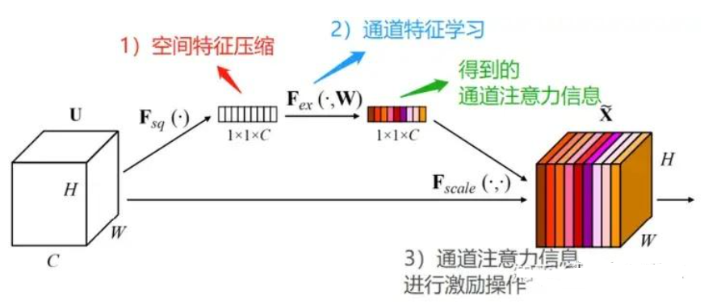
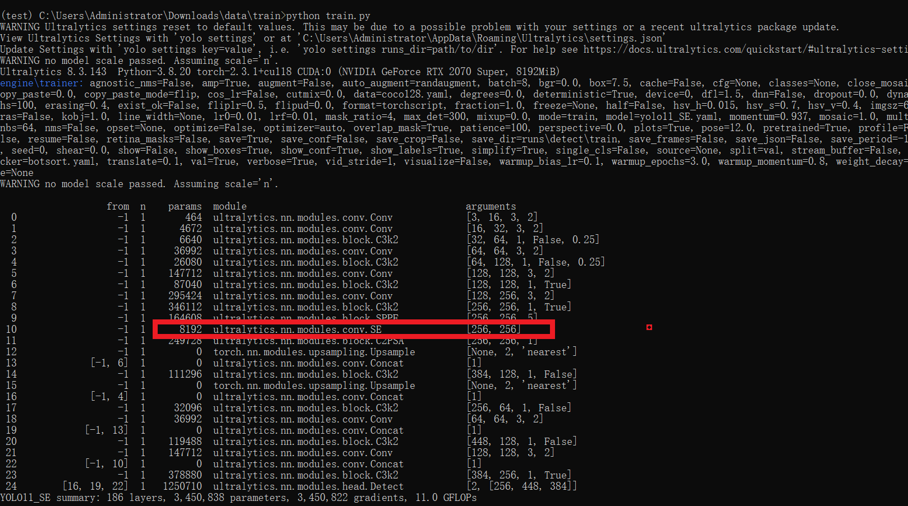

# [yolov11改进系列]基于yolov11添加SE注意力机制python源码+训练源码+改进原理+改进流程

> FL1623863129 已于 2025-05-24 22:01:25 修改 阅读量862 收藏 29 点赞数 30 公开
> 文章链接：https://blog.csdn.net/FL1623863129/article/details/148184883

【SE注意力机制介绍】

SENet是2017年ImageNet比赛的冠军，2018年CVPR引用量第一。论文链接:[SENet](Squeeze-and-Excitation Networks)。SE的主要思想是通过对输入特征进行压缩和激励，来提高模型的表现能力。具体来说，SE注意力机制包括两个步骤：挤压（Squeeze)、激励（Excitation）。在Squeeze步骤中，通过全局平均池化操作将输入特征图压缩成一个向量，然后通过一个全连接层将其映射到一个较小的向量。在Excitation步骤中，使用一个sigmoid函数将这个向量中的每个元素压缩到0到1之间，并将其与原始输入特征图相乘，得到加权后的特征图SE注意力模块是一种通道注意力模块，SE模块能对输入特征图进行通道特征加强，且不改变输入特征图的大小。

 

在还没进行SE模块之前,特征图的维度为H*W*C

1. 先对特征图进行空间特征压缩，在空间维度上实现全局平均池化，得到1*1*C的特征图

2. 通过FC全连接层学习，得到具有通道注意力的特征图，它的维度还是1*1*C

3. 将通道注意力1*1*C的特征图、原始输入H*W*C的特征图，进行逐通道乘以权重系数，最终输出具有通道注意力的特征图

【yolov11框架介绍】

2024 年 9 月 30 日，Ultralytics在其活动 YOLOVision 中正式发布了 YOLOv11。YOLOv11 是 YOLO 的最新版本，由美国和西班牙的 Ultralytics 团队开发。YOLO 是一种用于基于图像的人工智能的计算机模

#### Ultralytics YOLO11 概述

YOLO11 是Ultralytics YOLO 系列实时物体检测器的最新版本，以尖端的精度、速度和效率重新定义了可能性。基于先前 YOLO 版本的令人印象深刻的进步，YOLO11 在架构和训练方法方面引入了重大改进，使其成为各种计算机视觉任务的多功能选择。


#### Key Features 主要特点

- 增强的特征提取：YOLO11采用改进的主干和颈部架构，增强了特征提取能力，以实现更精确的目标检测和复杂任务性能。

- 针对效率和速度进行优化：YOLO11 引入了精致的架构设计和优化的训练管道，提供更快的处理速度并保持准确性和性能之间的最佳平衡。

- 使用更少的参数获得更高的精度：随着模型设计的进步，YOLO11m 在 COCO 数据集上实现了更高的平均精度(mAP)，同时使用的参数比 YOLOv8m 少 22%，从而在不影响精度的情况下提高计算效率。

- 跨环境适应性：YOLO11可以无缝部署在各种环境中，包括边缘设备、云平台以及支持NVIDIA [GPU](https://cloud.tencent.com/product/gpu?from_column=20065&from=20065) 的系统，确保最大的灵活性。

- 支持的任务范围广泛：无论是对象检测、实例分割、图像分类、姿态估计还是定向对象检测 (OBB)，YOLO11 旨在应对各种计算机视觉挑战。


##### 与之前的版本相比，Ultralytics YOLO11 有哪些关键改进？

Ultralytics YOLO11 与其前身相比引入了多项重大进步。主要改进包括：

- 增强的特征提取：YOLO11采用改进的主干和颈部架构，增强了特征提取能力，以实现更精确的目标检测。

- 优化的效率和速度：精细的架构设计和优化的训练管道可提供更快的处理速度，同时保持准确性和性能之间的平衡。

- 使用更少的参数获得更高的精度：YOLO11m 在 COCO 数据集上实现了更高的平均精度(mAP)，参数比 YOLOv8m 少 22%，从而在不影响精度的情况下提高计算效率。

- 跨环境适应性：YOLO11可以跨各种环境部署，包括边缘设备、云平台和支持NVIDIA GPU的系统。

- 支持的任务范围广泛：YOLO11 支持多种计算机视觉任务，例如对象检测、实例分割、图像分类、姿态估计和定向对象检测 (OBB)

【测试环境】

windows10 x64

ultralytics==8.3.143

torch==2.3.1

【改进流程】

##### 1. SE注意力机制代码（核心模块源码请参考改进步骤.docx）

##### 2. 文件修改步骤

**步骤一：修改conv.py文件** 

1. 定位文件：在项目目录中找到 `ultralytics/nn/modules/conv.py` 

2. 执行修改：

   - 在模块导出列表 `__all__` 中添加 `"SE"` 标识符

   - 在文件末尾位置插入完整的SE注意力机制实现代码

**步骤二：修改__init__.py文件** 

1. 定位文件：在项目目录中找到 `ultralytics/nn/modules/__init__.py` 

2. 执行修改：

   - 在导入语句中添加 `SE` 类引用

   - 在模块导出列表 `__all__` 中同步添加 `"SE"` 标识符

**步骤三：修改tasks.py文件** 

1. 定位文件：在项目目录中找到 `ultralytics/nn/tasks.py` 

2. 执行修改：

   - 在模型解析函数 `parse_model` 中添加SE模块处理逻辑

   - 具体位置可通过搜索 `def parse_model` 函数快速定位

**步骤四：创建模型配置文件** 

1. 新建文件：在模型配置目录中创建 `yolo11_SE.yaml` 

2. 文件配置：

   - 复制标准yolo11.yaml文件内容

   - 在网络结构定义部分插入SE模块配置

   - 保持其他训练参数与原始配置一致

##### 3. 验证集成

使用新建的yaml配置文件启动训练任务：

```cobol
from ultralytics import YOLO
 
if __name__ == '__main__':
    model = YOLO('yolo11_SE.yaml')  # build from YAML and transfer weights
        # Train the model
    results = model.train(data='coco128.yaml',epochs=100, imgsz=640, batch=8, device=0, workers=1, save=True,resume=False)
```


成功集成后，训练日志中将显示SE模块的初始化信息，表明注意力机制已正确加载到模型中。

 

注：实际操作时请根据项目具体目录结构调整文件路径，并确保SE模块的通道数配置与上下文网络层匹配。

【训练说明】

第一步：首先安装好yolov11必要模块，可以参考yolov11框架安装流程，然后卸载官方版本pip uninstall ultralytics，最后安装改进的源码pip install .
第二步：将自己数据集按照dataset文件夹摆放，要求文件夹名字都不要改变
第三步：打开train.py修改必要的参数，最后执行python train.py即可训练

【提供文件】

```cobol
├── [官方版]ultralytics-8.3.143.zip
├── train/
│   ├── coco128.yaml
│   ├── dataset/
│   │   ├── train/
│   │   │   ├── images/
│   │   │   │   ├── firc_pic_1.jpg
│   │   │   │   ├── firc_pic_10.jpg
│   │   │   │   ├── firc_pic_11.jpg
│   │   │   │   ├── firc_pic_12.jpg
│   │   │   │   ├── firc_pic_13.jpg
│   │   │   ├── labels/
│   │   │   │   ├── classes.txt
│   │   │   │   ├── firc_pic_1.txt
│   │   │   │   ├── firc_pic_10.txt
│   │   │   │   ├── firc_pic_11.txt
│   │   │   │   ├── firc_pic_12.txt
│   │   │   │   ├── firc_pic_13.txt
│   │   │   └── labels.cache
│   │   └── val/
│   │       ├── images/
│   │       │   ├── firc_pic_100.jpg
│   │       │   ├── firc_pic_81.jpg
│   │       │   ├── firc_pic_82.jpg
│   │       │   ├── firc_pic_83.jpg
│   │       │   ├── firc_pic_84.jpg
│   │       ├── labels/
│   │       │   ├── firc_pic_100.txt
│   │       │   ├── firc_pic_81.txt
│   │       │   ├── firc_pic_82.txt
│   │       │   ├── firc_pic_83.txt
│   │       │   ├── firc_pic_84.txt
 
│   │       └── labels.cache
│   ├── train.py
│   ├── yolo11_SE.yaml
│   └── 训练说明.txt
├── 【改进】ultralytics-8.3.143.zip
├── 改进原理.docx
└── 改进流程.docx
```

【常见问题汇总】
问：为什么我训练的模型epoch显示的map都是0?
回答：由于源码改进过，因此不能直接从官方模型微调，而是从头训练，这样学习特征能力会很弱，需要训练很多epoch才能出现效果。此外由于改进的源码框架并不一定能够保证会超过官方精度，而且也有可能会存在远远不如官方效果，甚至精度会很低。这说明改进的框架并不能取得很好效果。所以说对于框架改进只是提供一种可行方案，至于改进后能不能取得很好map还需要结合实际训练情况确认，当然也不排除数据集存在问题，比如数据集比较单一，样本分布不均衡，泛化场景少，标注框不太贴合标注质量差，检测目标很小等等原因
【重要声明】
我们只提供改进框架一种方案，并不保证能够取得很好训练精度，甚至超过官方模型精度。因为改进框架，实际是一种比较复杂流程，包括框架原理可行性，训练数据集是否合适，训练需要反正验证以及同类框架训练结果参数比较，这个是十分复杂且漫长的过程。