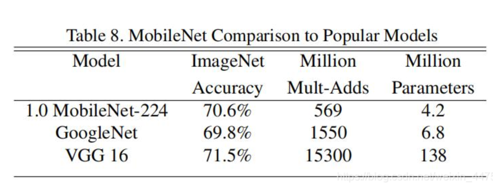

# [yolov11改进系列]使用轻量级骨干网络MobileNetV1替换backbone的python源码+训练源码

> FL1623863129 已于 2025-05-25 11:05:26 修改 阅读量650 收藏 10 点赞数 12 公开
> 文章链接：https://blog.csdn.net/FL1623863129/article/details/148200268

【MobileNetV1介绍】

## 1.MobileNetV1的介绍

---

传统卷积神经网络， 内存需求大、 运算量大导致无法在移动设备以及嵌入式设备上运行.VGG16的权重大小有450M，而ResNet中152层的模型，其权重模型644M，这么大的内存需求是明显无法在嵌入式设备上进行运行的。而网络应该服务于生活，所以轻量级网络的很重要的。


MobileNet网络是由google团队在2017年提出的，专注于移动端或者嵌入式设备中的轻量级CNN网络。相比传统卷积神经网络，在准确率小幅降低的前提下大大减少模型参数与运算量。(相比VGG16准确率减少了0.9%，但模型参数只有VGG的1/32)


**MobileNet_v1的亮点：** 

- Depthwise Convolution( 大大减少运算量和参数数量)

- 增加超参数 增加超参数α 、β

（其中α是控制卷积层卷积核个数的超参数，β是控制输入图像的大小）


## 2.MobileNetV1的结构

---

传统的卷积


- 卷积核channel=输入特征矩阵channel

- 输出特征矩阵channel=卷积核个数

**1）DW卷积（Depthwise Conv）** 


- 卷积核channel=1

- 输入特征矩阵channel=卷积核个数=输出特征矩阵channel

也就是DW卷积中的每一个卷积核，只会和输入特征矩阵的一个channel进行卷积计算，所以输出的特征矩阵就等于输入的特征矩阵。


**2）PW卷积（Pointwise Conv）** 


其实PW卷积和普通的卷积类似，只是采用了1x1的卷积核，输出的特征矩阵channel的个数与使用的卷积核数相等，而输入特征矩阵的channel的个数与卷积核的channel数相等。所以其就是一个普通的卷积。


一般来说，以上的PW卷积与DW卷积是放在一起操作的，共同组成深度可分卷积操作。


**3）深度可分卷积操作（Depthwise Separable Conv）** 

深度可分卷积操作是有两步分组成，一部分是DW卷积（Depthwise Conv），另外一部分是PW卷积（Pointwise Conv）


两者的计算量对比：

- DSC：Dk * Dk * M * Df * Df + M * N * Df * Df

- 普通：Dk * Dk * M * N * Df * Df

理论上普通卷积计算量是 DW+PW 的8到9倍


## 3.MobileNetV1的性能统计

---

- Multiply-Add计算量



- α-Width Multiplier（卷积核个数的倍率）


- β-Resolution Multiplier（图像尺寸的大小）


## 4.MobileNetV1的pytorch实现

---

**MobileNetV1模型结构** 


【yolov11框架介绍】

2024 年 9 月 30 日，Ultralytics 在其活动 YOLOVision 中正式发布了 YOLOv11。YOLOv11 是 YOLO 的最新版本，由美国和西班牙的 Ultralytics 团队开发。YOLO 是一种用于基于图像的人工智能的计算机模

#### Ultralytics YOLO11 概述

YOLO11 是Ultralytics YOLO 系列实时物体检测器的最新版本，以尖端的精度、速度和效率重新定义了可能性。基于先前 YOLO 版本的令人印象深刻的进步，YOLO11 在架构和训练方法方面引入了重大改进，使其成为各种计算机视觉任务的多功能选择。


#### Key Features 主要特点

- 增强的特征提取：YOLO11采用改进的主干和颈部架构，增强了特征提取能力，以实现更精确的目标检测和复杂任务性能。

- 针对效率和速度进行优化：YOLO11 引入了精致的架构设计和优化的训练管道，提供更快的处理速度并保持准确性和性能之间的最佳平衡。

- 使用更少的参数获得更高的精度：随着模型设计的进步，YOLO11m 在 COCO 数据集上实现了更高的平均精度(mAP)，同时使用的参数比 YOLOv8m 少 22%，从而在不影响精度的情况下提高计算效率。

- 跨环境适应性：YOLO11可以无缝部署在各种环境中，包括边缘设备、云平台以及支持NVIDIA [GPU](https://cloud.tencent.com/product/gpu?from_column=20065&from=20065) 的系统，确保最大的灵活性。

- 支持的任务范围广泛：无论是对象检测、实例分割、图像分类、姿态估计还是定向对象检测 (OBB)，YOLO11 旨在应对各种计算机视觉挑战。

 

​​

##### 与之前的版本相比，Ultralytics YOLO11 有哪些关键改进？

Ultralytics YOLO11 与其前身相比引入了多项重大进步。主要改进包括：

- 增强的特征提取：YOLO11采用改进的主干和颈部架构，增强了特征提取能力，以实现更精确的目标检测。

- 优化的效率和速度：精细的架构设计和优化的训练管道可提供更快的处理速度，同时保持准确性和性能之间的平衡。

- 使用更少的参数获得更高的精度：YOLO11m 在 COCO 数据集上实现了更高的平均精度(mAP)，参数比 YOLOv8m 少 22%，从而在不影响精度的情况下提高计算效率。

- 跨环境适应性：YOLO11可以跨各种环境部署，包括边缘设备、云平台和支持NVIDIA GPU的系统。

- 支持的任务范围广泛：YOLO11 支持多种计算机视觉任务，例如对象检测、实例分割、图像分类、姿态估计和定向对象检测 (OBB)

【测试环境】

windows10 x64

ultralytics==8.3.0

torch==2.3.1

【改进流程】

##### 1. 新增MoileNetV1.py实现骨干网络（代码太多，核心模块源码请参考改进步骤.docx）

##### 2. 文件修改步骤

**修改tasks.py文件** 

**创建模型配置文件** 

yolo11-MobileNetV1.yaml内容如下：

```cobol
# Ultralytics YOLO 🚀, AGPL-3.0 license
# YOLO11 object detection model with P3-P5 outputs. For Usage examples see https://docs.ultralytics.com/tasks/detect
 
# Parameters
nc: 2 # number of classes
scales: # model compound scaling constants, i.e. 'model=yolo11n.yaml' will call yolo11.yaml with scale 'n'
  # [depth, width, max_channels]
  n: [0.50, 0.25, 1024] # summary: 319 layers, 2624080 parameters, 2624064 gradients, 6.6 GFLOPs
  s: [0.50, 0.50, 1024] # summary: 319 layers, 9458752 parameters, 9458736 gradients, 21.7 GFLOPs
  m: [0.50, 1.00, 512] # summary: 409 layers, 20114688 parameters, 20114672 gradients, 68.5 GFLOPs
  l: [1.00, 1.00, 512] # summary: 631 layers, 25372160 parameters, 25372144 gradients, 87.6 GFLOPs
  x: [1.00, 1.50, 512] # summary: 631 layers, 56966176 parameters, 56966160 gradients, 196.0 GFLOPs
 
# 我提供了三个版本分别是对应YOLOv8n v8s v8m。 MobileNetV1_n, MobileNetV1_s, MobileNetV1_m
# YOLO11n backbone
backbone:
  # [from, repeats, module, args]
  - [-1, 1, MobileNetV1_n, []] # 0-4 P1/2 这里是四层
  - [-1, 1, SPPF, [1024, 5]] # 5
  - [-1, 2, C2PSA, [1024]] # 6
 
# YOLO11n head
head:
  - [-1, 1, nn.Upsample, [None, 2, "nearest"]]
  - [[-1, 3], 1, Concat, [1]] # cat backbone P4
  - [-1, 2, C3k2, [512, False]] # 9
 
  - [-1, 1, nn.Upsample, [None, 2, "nearest"]]
  - [[-1, 2], 1, Concat, [1]] # cat backbone P3
  - [-1, 2, C3k2, [256, False]] # 12 (P3/8-small)
 
  - [-1, 1, Conv, [256, 3, 2]]
  - [[-1, 9], 1, Concat, [1]] # cat head P4
  - [-1, 2, C3k2, [512, False]] # 15 (P4/16-medium)
 
  - [-1, 1, Conv, [512, 3, 2]]
  - [[-1, 6], 1, Concat, [1]] # cat head P5
  - [-1, 2, C3k2, [1024, True]] # 18 (P5/32-large)
 
  - [[12, 15, 18], 1, Detect, [nc]] # Detect(P3, P4, P5)
```


##### 3. 验证集成

使用新建的yaml配置文件启动训练任务：

```cobol
from ultralytics import YOLO
 
if __name__ == '__main__':
    model = YOLO('yolo11-MobileNetV1.yaml')  # build from YAML and transfer weights
        # Train the model
    results = model.train(data='coco128.yaml',epochs=100, imgsz=640, batch=8, device=0, workers=1, save=True,resume=False)
```

成功集成后，训练日志中将显示MobileNetV1模块的初始化信息，表明注已正确加载到模型中。

<div style="text-align:center;"></div>

【训练说明】

第一步：首先安装好yolov11必要模块，可以参考yolov11框架安装流程，然后卸载官方版本pip uninstall ultralytics，最后安装改进的源码pip install .
第二步：将自己数据集按照dataset文件夹摆放，要求文件夹名字都不要改变
第三步：打开train.py修改必要的参数，最后执行python train.py即可训练

【提供文件】

```cobol
├── [官方源码]ultralytics-8.3.0.zip
├── train/
│   ├── coco128.yaml
│   ├── dataset/
│   │   ├── train/
│   │   │   ├── images/
│   │   │   │   ├── firc_pic_1.jpg
│   │   │   │   ├── firc_pic_10.jpg
│   │   │   │   ├── firc_pic_11.jpg
│   │   │   │   ├── firc_pic_12.jpg
│   │   │   │   ├── firc_pic_13.jpg
│   │   │   ├── labels/
│   │   │   │   ├── classes.txt
│   │   │   │   ├── firc_pic_1.txt
│   │   │   │   ├── firc_pic_10.txt
│   │   │   │   ├── firc_pic_11.txt
│   │   │   │   ├── firc_pic_12.txt
│   │   │   │   ├── firc_pic_13.txt
│   │   │   └── labels.cache
│   │   └── val/
│   │       ├── images/
│   │       │   ├── firc_pic_100.jpg
│   │       │   ├── firc_pic_81.jpg
│   │       │   ├── firc_pic_82.jpg
│   │       │   ├── firc_pic_83.jpg
│   │       │   ├── firc_pic_84.jpg
│   │       ├── labels/
│   │       │   ├── firc_pic_100.txt
│   │       │   ├── firc_pic_81.txt
│   │       │   ├── firc_pic_82.txt
│   │       │   ├── firc_pic_83.txt
│   │       │   ├── firc_pic_84.txt
 
│   │       └── labels.cache
│   ├── train.py
│   ├── yolo11-MobileNetV1.yaml
│   └── 训练说明.txt
├── 【改进源码】ultralytics-8.3.0.zip
├── 改进原理.docx
└── 改进流程.docx
```

【常见问题汇总】
问：为什么我训练的模型epoch显示的map都是0或者map精度很低?
回答：由于源码改进过，因此不能直接从官方模型微调，而是从头训练，这样学习特征能力会很弱，需要训练很多epoch才能出现效果。此外由于改进的源码框架并不一定能够保证会超过官方精度，而且也有可能会存在远远不如官方效果，甚至精度会很低。这说明改进的框架并不能取得很好效果。所以说对于框架改进只是提供一种可行方案，至于改进后能不能取得很好map还需要结合实际训练情况确认，当然也不排除数据集存在问题，比如数据集比较单一，样本分布不均衡，泛化场景少，标注框不太贴合标注质量差，检测目标很小等等原因
【重要说明】
我们只提供改进框架一种方案，并不保证能够取得很好训练精度，甚至超过官方模型精度。因为改进框架，实际是一种比较复杂流程，包括框架原理可行性，训练数据集是否合适，训练需要反正验证以及同类框架训练结果参数比较，这个是十分复杂且漫长的过程。