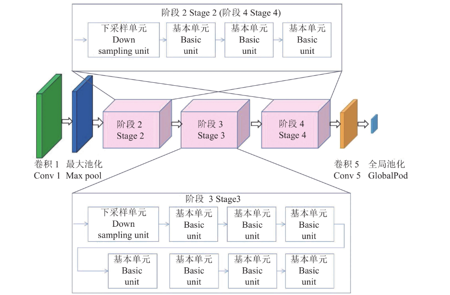

# [yolov11改进系列]基于yolov11的骨干轻量化更换backbone为shufflenetv2网络python源码+训练源码

> FL1623863129 已于 2025-05-25 21:09:02 修改 阅读量1.1k 收藏 26 点赞数 13 公开
> 文章链接：https://blog.csdn.net/FL1623863129/article/details/148204899

[shufflenetv2网络介绍]

ShuffleNetV2是一种专为移动端和嵌入式设备设计的高效轻量级卷积神经网络架构，由旷视科技的研究团队提出。它在保持较高精度的同时，通过优化网络结构显著降低了计算复杂度和内存访问成本，从而在资源受限的设备上实现更快的推理速度。以下是ShuffleNetV2的核心设计思想和技术特点：

 

---

####  **1. 设计原则** 

ShuffleNetV2的设计基于以下四个准则，这些准则直接针对实际推理速度进行优化，而非仅关注理论计算量（FLOPs）：

-  **准则1：输入输出通道数相等时内存访问成本（MAC）最小** 
  当卷积层的输入和输出通道数相等时，内存访问成本最低，从而提升计算效率。

-  **准则2：避免分组卷积的过度使用** 
  分组卷积虽然能减少计算量，但会增加内存访问成本，导致实际推理速度下降。

-  **准则3：减少网络碎片化** 
  网络碎片化（如多分支结构）会降低并行度，尤其是在GPU等并行计算设备上，导致推理速度变慢。

-  **准则4：减少逐元素操作** 
  逐元素操作（如ReLU、Add、Depthwise Conv等）虽然FLOPs低，但内存访问成本高，应尽量减少。

---

####  **2. 核心创新** 

ShuffleNetV2通过以下技术手段优化网络结构：

-  **通道分割（Channel Split）** 
  每个ShuffleNetV2单元的输入通道被分成两部分：一部分直接通过（恒等映射），另一部分通过多个卷积层处理。两部分在通道维度上拼接，保持通道数不变。

-  **通道混洗（Channel Shuffle）** 
  在通道拼接后，通过通道混洗操作增强不同通道组之间的信息交互，提升模型表达能力。

-  **逐点卷积（Pointwise Convolution）的非分组化** 
  在ShuffleNetV2中，逐点卷积不再使用分组卷积，以减少内存访问成本。

-  **简化网络结构** 
  避免使用多分支结构和复杂的残差连接，减少碎片化，提升并行度。

---

####  **3. 网络结构** 

ShuffleNetV2的基本单元分为两种：

-  **普通单元（Normal Unit）** 
  用于特征提取，保持特征图尺寸不变。

-  **降采样单元（Downsampling Unit）** 
  用于降低特征图尺寸，同时增加通道数。

#####  **普通单元结构** ：

1.  **通道分割** ：输入通道被分成两部分（C'和C-C'）。

2.  **恒等映射** ：C'部分直接通过。

3.  **卷积处理** ：C-C'部分依次通过1×1卷积、3×3深度可分离卷积、1×1卷积。

4.  **通道拼接** ：两部分在通道维度上拼接。

5.  **通道混洗** ：增强通道间信息交互。

#####  **降采样单元结构** ：

与普通单元类似，但取消通道分割，直接对输入进行卷积处理，并通过步长为2的卷积实现降采样。

---

####  **4. 性能优势** 

-  **高效性** ：在相同FLOPs下，ShuffleNetV2的推理速度显著快于ShuffleNetV1、MobileNetV2等轻量级网络。

-  **高精度** ：在ImageNet等数据集上，ShuffleNetV2在保持低计算复杂度的同时，实现了较高的分类精度。

-  **灵活性** ：通过调整网络宽度（如ShuffleNetV2 0.5×、1×、1.5×、2×），可以适应不同资源约束的设备。

---

####  **5. 应用场景** 

ShuffleNetV2适用于以下场景：

-  **移动端设备** ：如智能手机、平板电脑等，需要在低功耗下实现实时推理。

-  **嵌入式设备** ：如摄像头、无人机等，计算资源有限但需要高效运行。

-  **边缘计算** ：在资源受限的边缘设备上部署深度学习模型。

---

【yolov11框架介绍】

2024 年 9 月 30 日，Ultralytics 在其活动 YOLOVision 中正式发布了 YOLOv11。YOLOv11 是 YOLO 的最新版本，由美国和西班牙的 Ultralytics 团队开发。YOLO 是一种用于基于图像的人工智能的计算机模

#### Ultralytics YOLO11 概述

YOLO11 是Ultralytics YOLO 系列实时物体检测器的最新版本，以尖端的精度、速度和效率重新定义了可能性。基于先前 YOLO 版本的令人印象深刻的进步，YOLO11 在架构和训练方法方面引入了重大改进，使其成为各种计算机视觉任务的多功能选择。


#### Key Features 主要特点

- 增强的特征提取：YOLO11采用改进的主干和颈部架构，增强了特征提取能力，以实现更精确的目标检测和复杂任务性能。

- 针对效率和速度进行优化：YOLO11 引入了精致的架构设计和优化的训练管道，提供更快的处理速度并保持准确性和性能之间的最佳平衡。

- 使用更少的参数获得更高的精度：随着模型设计的进步，YOLO11m 在 COCO 数据集上实现了更高的平均精度(mAP)，同时使用的参数比 YOLOv8m 少 22%，从而在不影响精度的情况下提高计算效率。

- 跨环境适应性：YOLO11可以无缝部署在各种环境中，包括边缘设备、云平台以及支持NVIDIA [GPU](https://cloud.tencent.com/product/gpu?from_column=20065&from=20065) 的系统，确保最大的灵活性。

- 支持的任务范围广泛：无论是对象检测、实例分割、图像分类、姿态估计还是定向对象检测 (OBB)，YOLO11 旨在应对各种计算机视觉挑战。

 

​

##### 与之前的版本相比，Ultralytics YOLO11 有哪些关键改进？

Ultralytics YOLO11 与其前身相比引入了多项重大进步。主要改进包括：

- 增强的特征提取：YOLO11采用改进的主干和颈部架构，增强了特征提取能力，以实现更精确的目标检测。

- 优化的效率和速度：精细的架构设计和优化的训练管道可提供更快的处理速度，同时保持准确性和性能之间的平衡。

- 使用更少的参数获得更高的精度：YOLO11m 在 COCO 数据集上实现了更高的平均精度(mAP)，参数比 YOLOv8m 少 22%，从而在不影响精度的情况下提高计算效率。

- 跨环境适应性：YOLO11可以跨各种环境部署，包括边缘设备、云平台和支持NVIDIA GPU的系统。

- 支持的任务范围广泛：YOLO11 支持多种计算机视觉任务，例如对象检测、实例分割、图像分类、姿态估计和定向对象检测 (OBB)

【测试环境】

windows10 x64

ultralytics==8.3.0

torch==2.3.1

【改进流程】

##### 1. 新增shuffleNetV2.py实现骨干网络（代码太多，核心模块源码请参考改进步骤.docx）

##### 2. 文件修改步骤

**修改tasks.py文件** 

**创建模型配置文件** 

yolo11-shuffleNetV2.yaml内容如下：

```cobol
# Ultralytics YOLO 🚀, AGPL-3.0 license
# YOLO11 object detection model with P3-P5 outputs. For Usage examples see https://docs.ultralytics.com/tasks/detect
 
# Parameters
nc: 80 # number of classes
scales: # model compound scaling constants, i.e. 'model=yolo11n.yaml' will call yolo11.yaml with scale 'n'
  # [depth, width, max_channels]
  n: [0.50, 0.25, 1024] # summary: 319 layers, 2624080 parameters, 2624064 gradients, 6.6 GFLOPs
  s: [0.50, 0.50, 1024] # summary: 319 layers, 9458752 parameters, 9458736 gradients, 21.7 GFLOPs
  m: [0.50, 1.00, 512] # summary: 409 layers, 20114688 parameters, 20114672 gradients, 68.5 GFLOPs
  l: [1.00, 1.00, 512] # summary: 631 layers, 25372160 parameters, 25372144 gradients, 87.6 GFLOPs
  x: [1.00, 1.50, 512] # summary: 631 layers, 56966176 parameters, 56966160 gradients, 196.0 GFLOPs
 
# 共四个版本  "shufflenetv2_05", "shufflenetv2_10", "shufflenetv2_15", "shufflenetv2_20"
# YOLO11n backbone
backbone:
  # [from, repeats, module, args]
  - [-1, 1, shufflenetv2_05, []] # 0-4 P1/2
#  - [-1, 1, shufflenetv2_10, []] # 0-4 P1/2
#  - [-1, 1, shufflenetv2_15, []] # 0-4 P1/2
#  - [-1, 1, shufflenetv2_20, []] # 0-4 P1/2
  - [-1, 1, SPPF, [1024, 5]] # 5
  - [-1, 2, C2PSA, [1024]] # 6
 
# YOLO11n head
head:
  - [-1, 1, nn.Upsample, [None, 2, "nearest"]]
  - [[-1, 3], 1, Concat, [1]] # cat backbone P4
  - [-1, 2, C3k2, [512, False]] # 9
 
  - [-1, 1, nn.Upsample, [None, 2, "nearest"]]
  - [[-1, 2], 1, Concat, [1]] # cat backbone P3
  - [-1, 2, C3k2, [256, False]] # 12 (P3/8-small)
 
  - [-1, 1, Conv, [256, 3, 2]]
  - [[-1, 9], 1, Concat, [1]] # cat head P4
  - [-1, 2, C3k2, [512, False]] # 15 (P4/16-medium)
 
  - [-1, 1, Conv, [512, 3, 2]]
  - [[-1, 6], 1, Concat, [1]] # cat head P5
  - [-1, 2, C3k2, [1024, True]] # 18 (P5/32-large)
 
  - [[12, 15, 18], 1, Detect, [nc]] # Detect(P3, P4, P5)
```

##### 3. 验证集成

使用新建的yaml配置文件启动训练任务：

```cobol
from ultralytics import YOLO
 
if __name__ == '__main__':
    model = YOLO('yolo11-shuffleNetV2.yaml')  # build from YAML and transfer weights
        # Train the model
    results = model.train(data='coco128.yaml',epochs=100, imgsz=640, batch=8, device=0, workers=1, save=True,resume=False)
```

成功集成后，训练日志中将显示shuffleNetV2模块的初始化信息，表明已正确加载到模型中。

<div style="text-align:center;"></div>

【训练说明】

第一步：首先安装好yolov11必要模块，可以参考yolov11框架安装流程，然后卸载官方版本pip uninstall ultralytics，最后安装改进的源码pip install .
第二步：将自己数据集按照dataset文件夹摆放，要求文件夹名字都不要改变
第三步：分别打开train.py,coco128.yaml和模型参数yaml文件修改必要的参数，最后执行python train.py即可训练

【提供文件】

```cobol
├── [官方源码]ultralytics-8.3.0.zip
├── train/
│   ├── coco128.yaml
│   ├── dataset/
│   │   ├── train/
│   │   │   ├── images/
│   │   │   │   ├── firc_pic_1.jpg
│   │   │   │   ├── firc_pic_10.jpg
│   │   │   │   ├── firc_pic_11.jpg
│   │   │   │   ├── firc_pic_12.jpg
│   │   │   │   ├── firc_pic_13.jpg
│   │   │   ├── labels/
│   │   │   │   ├── classes.txt
│   │   │   │   ├── firc_pic_1.txt
│   │   │   │   ├── firc_pic_10.txt
│   │   │   │   ├── firc_pic_11.txt
│   │   │   │   ├── firc_pic_12.txt
│   │   │   │   ├── firc_pic_13.txt
│   │   │   └── labels.cache
│   │   └── val/
│   │       ├── images/
│   │       │   ├── firc_pic_100.jpg
│   │       │   ├── firc_pic_81.jpg
│   │       │   ├── firc_pic_82.jpg
│   │       │   ├── firc_pic_83.jpg
│   │       │   ├── firc_pic_84.jpg
│   │       ├── labels/
│   │       │   ├── firc_pic_100.txt
│   │       │   ├── firc_pic_81.txt
│   │       │   ├── firc_pic_82.txt
│   │       │   ├── firc_pic_83.txt
│   │       │   ├── firc_pic_84.txt
 
│   │       └── labels.cache
│   ├── train.py
│   ├── yolo11-shuffleNetV2.yaml
│   └── 训练说明.txt
├── [改进源码]ultralytics-8.3.0.zip
├── 改进原理.docx
└── 改进流程.docx
```

【常见问题汇总】
问：为什么我训练的模型epoch显示的map都是0或者map精度很低?
回答：由于源码改进过，因此不能直接从官方模型微调，而是从头训练，这样学习特征能力会很弱，需要训练很多epoch才能出现效果。此外由于改进的源码框架并不一定能够保证会超过官方精度，而且也有可能会存在远远不如官方效果，甚至精度会很低。这说明改进的框架并不能取得很好效果。所以说对于框架改进只是提供一种可行方案，至于改进后能不能取得很好map还需要结合实际训练情况确认，当然也不排除数据集存在问题，比如数据集比较单一，样本分布不均衡，泛化场景少，标注框不太贴合标注质量差，检测目标很小等等原因
【重要说明】
我们只提供改进框架一种方案，并不保证能够取得很好训练精度，甚至超过官方模型精度。因为改进框架，实际是一种比较复杂流程，包括框架原理可行性，训练数据集是否合适，训练需要反正验证以及同类框架训练结果参数比较，这个是十分复杂且漫长的过程。