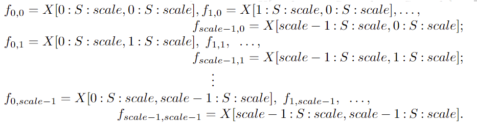
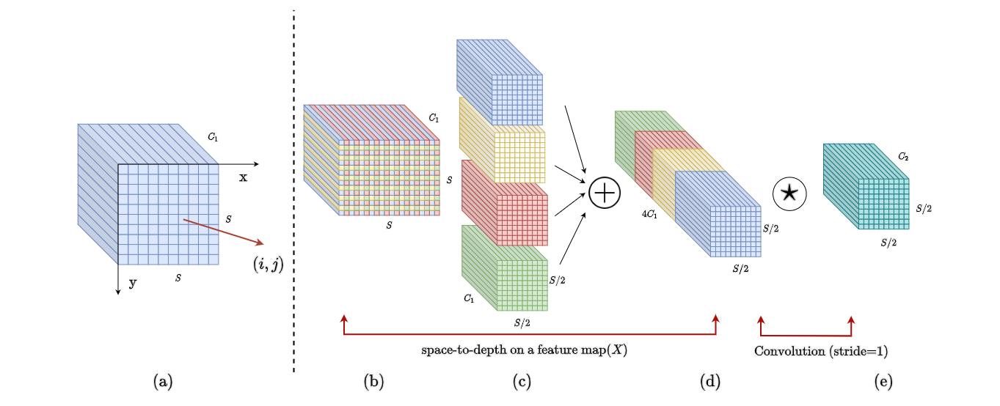
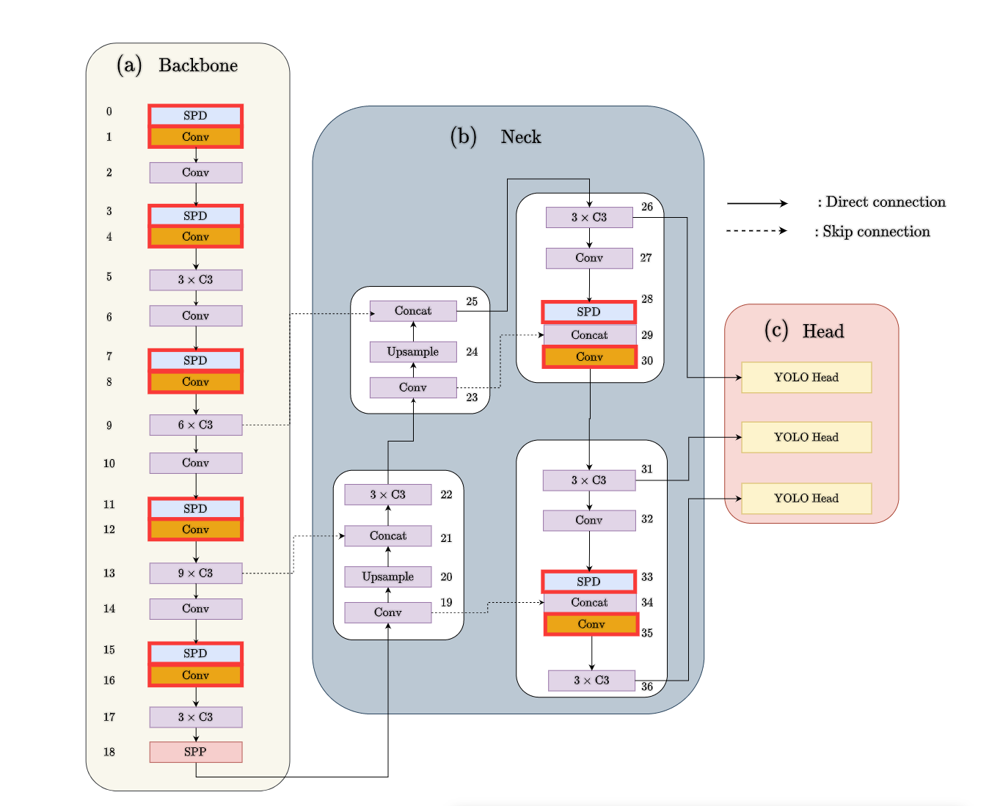
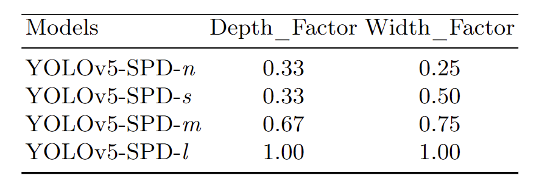
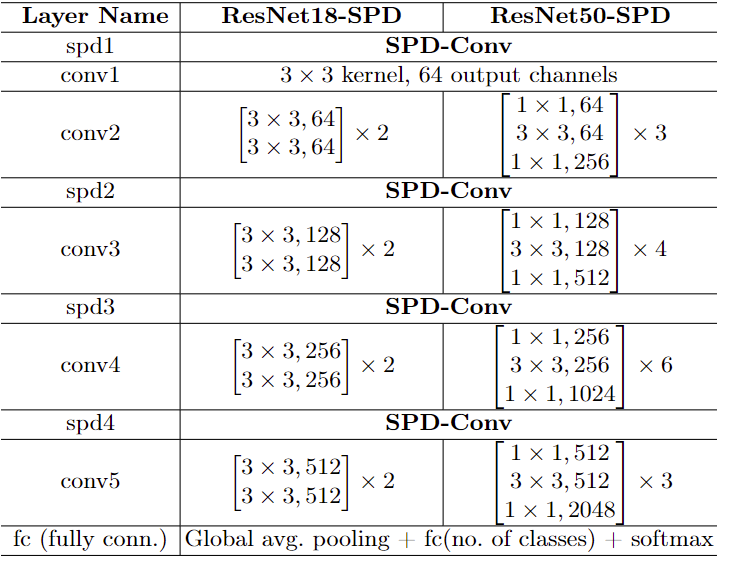
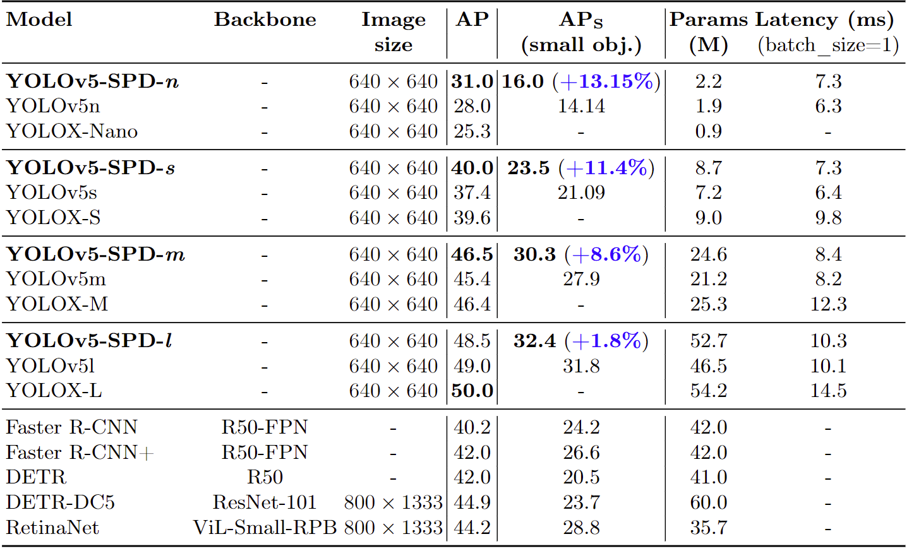
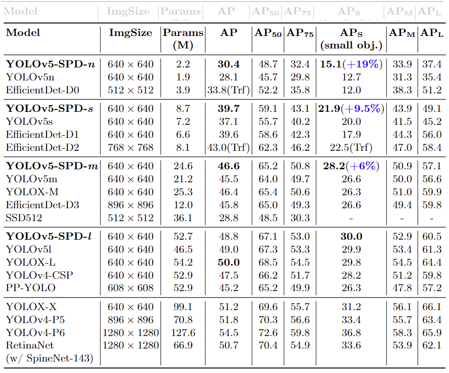
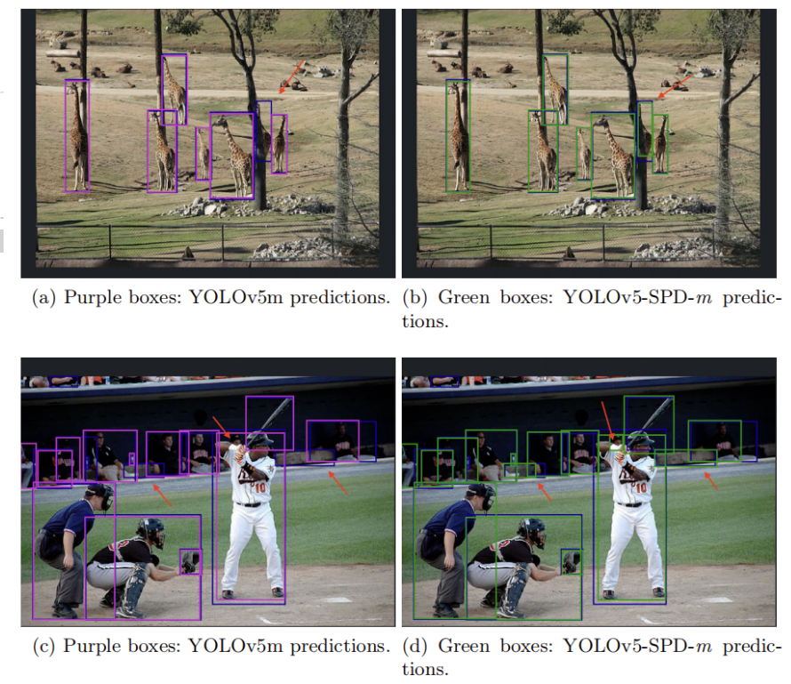

# [yolov11改进系列]基于yolov11引入空间深度转换卷积SPDConv用于低分辨率图像和小物体的python源码+训练源码

> FL1623863129 已于 2025-05-29 09:04:57 修改 阅读量755 收藏 9 点赞数 10 公开
> 文章链接：https://blog.csdn.net/FL1623863129/article/details/148280001

[SPDConv介绍]

## 用于低分辨率图像和小物体的新CNN模块SPD-Conv

## 1 摘要精读

---

卷积神经网络(CNN)在图像分类、目标检测等计算机视觉任务中取得了巨大的成功。然而，在图像分辨率较低或对象较小的更困难的任务中，它们的性能会迅速下降。


这源于现有CNN体系结构中一个有缺陷但却很常见的设计，即使用strided convolution和/或池化层，这导致了细粒度信息的丢失和较低效率的特征表示的学习。为此，我们提出了一种新的CNN模块，称为SPD-Conv，以取代每个strided convolution和每个池化层(从而完全消除了它们)。SPD-Conv由 space-to-depth (SPD)层和non-strided convolution(Conv)层组成，可以应用于大多数CNN架构。


我们在两个最具代表性的计算机视觉任务下解释了这种新的设计：目标检测和图像分类。然后，我们通过将SPD-Conv应用于YOLOv5和ResNet来创建新的CNN架构，实验表明我们的方法显著优于最先进的深度学习模型，特别是在处理低分辨率图像和小对象的更困难的任务时。


## 2 SPD-Conv原理

---


### 2.1 Space-to-depth(SPD)

---


SPD-Conv 由一个SPD层和一个non-strided convolution层组成，SPD组件将（原始）图像转换技术推广到对 CNN 内部和整个CNN中的特征图进行下采样，如下所示

考虑任何大小为S × S × C 1 S × S × C1S×S×C1的中间特征图 X XX，切出一系列子特征图为



一般来说，给定任何（原始）特征图 X XX，子图 f x , y f_{x,y}f

x,y

由 i + x i+xi+x 和 i + y i+yi+y 可按比例整除的所有条目X ( i + y ) X(i+y)X(i+y) 形成。因此，每个子图按比例因子对X XX进行下采样。下图给出了s c a l e = 2 scale=2scale=2时的例子，得到4个子图f 0 , 0 f_{0,0}f

0,0  ,f 1 , 0 f_{1,0}f 1,0 ,f 0 , 1 f_{0,1}f 0,1  , f 1 , 1 f_{1,1}f 1,1  每个都具有形状( S / 2 , S / 2 , C 1 ) (S/2,S/2,C_1)(S/2,S/2,C 1 )并将X XX下采样 2 22 倍。



接下来，沿着通道维度连接这些子特征图，从而获得一个特征图X ′ X'X ′ ，它的空间维度减少了一个比例因子，通道维度增加了一个比例因子2 22。换句话说，SPD将特征图X ( S , S , C 1 ) X(S,S,C_1)X(S,S,C 1 ) 转换为中间特征图X ′ ( S / s a c l e , S / s a c l e , s c a l e 2 C 1 ) X'(S/sacle,S/sacle,scale^2C_1)X ′ (S/sacle,S/sacle,scale 2 C 1 )


### 2.2 Non-strided Convolution

---


在SPD特征变换层之后，添加了一个带有C 2 C_2C 2

滤波器的非跨步（即 stride=1）卷积层，其中C 2 < s c a l e 2 C 1 C_2<scale^2C_1C 2 <scale 2 C 1 ，并进一步变换 X ′ ( S / s a c l e , S / s a c l e , s c a l e 2 C 1 → X ′ ′ ( S / s a c l e , S / s a c l e ,C2)X'(S/sacle,S/sacle,scale^2C_1→X''(S/sacle,S/sacle,C_2)X ′ (S/sacle,S/sacle,scale 2 C 1 →X ′′ (S/sacle,S/sacle,C 2 ) 。


使用非跨步卷积的原因是尽可能地保留所有的判别特征信息。否则，例如，使用 s t r i d e = 3 stride=3stride=3 的 3 × 3 3×33×3 卷积，特征图将“缩小”，但每个像素只采样一次；如果 s t r i d e = 2 stride=2stride=2，将发生不对称采样，其中偶数和奇数行/列的采样时间不同。一般来说，步长大于 1 11 会导致信息的非歧视性丢失，尽管在表面上，它似乎转换了特征图 X ( S , S , C 1 ) → X ′ ′ ( S / s a c l e , S / s a c l e , C 2 ) X(S,S,C_1)→X''(S/sacle,S/sacle,C_2)X(S,S,C 1 )→X ′′ (S/sacle,S/sacle,C 2 )（但没有X ′ X'X ′）

## 3 如何使用SPD-Conv

---

为了解释如何将提出的方法应用到重新设计CNN架构中，使用了2个最具代表性的计算机视觉模型类别：目标检测和图像分类

### 3.1 检测：Yolov5改进方式

---


并且作者将这个模块应用到了YOLOv5中，取得了很好的效果



Fig 4 红框是发生替换的地方

YOLOv5-SPD:将第 3 节中描述的方法应用于YOLOv5并获得 YOLOv5-SPD，只需用 SPD-Conv 替换YOLOv5 s t r i d e − 2 stride-2stride−2 卷积即可。这种替换有 7 77 个实例，因为 YOLOv5 在主干中使用5 55个s t r i d e − 2 stride-2stride−2 卷积层将特征图下采样 25 2525 倍，并在颈部使用2 22个 s t r i d e − 2 stride-2stride−2 卷积层。YOLOv5颈部的每个跨步卷积之后都有一个连接层；这不会改变本文的方法，只是将它保持在 SPD 和 Conv 之间。


与YOLOv5一样，作者也提供了多个版本适配YOLO



可扩展性：YOLOv5-SPD 可以通过与 YOLOv5 相同的方式轻松扩展和缩减来适应不同的应用程序或硬件需求

具体来说，可以简单地调整（1）每个非跨步卷积层中的过滤器数量和/或（2）C3模块的重复次数（如图4所示），以获得不同版本的YOLOv5-SPD


第1个称为宽度缩放：它将原始宽度n w nwnw（通道数）更改为 n w × w i d t h f a c t o r e nw × width_f actorenw×width f actore（四舍五入到最接近的 8 倍数）


第2个称为深度缩放：它将原始深度 n d ndnd（重复 C3 模块的次数；例如，图 4 中的 9 × C 3 9 × C39×C3 中的 9）更改为 n d × d e p t hfactornd×depth_factornd×depth factor这样，通过选择不同的宽度/深度因子，我们得到了YOLOv5-SPD的nano、small、medium和large版本，如表2所示，其中因子值选择与YOLOv5相同，以便在后面的实验中进行比较 .

### 3.2 分类：ResNet改进方式

---


分类 CNN通常从一个由 s t r i d e − 2 stride-2stride−2 卷积和池化层组成的stem单元开始，以将图像分辨率降低4 44倍。一个流行的模型是 ResNet，它赢得了 ILSVRC 2015 挑战。ResNet引入了残差连接，以允许训练高达152 152152 层的网络。它还通过仅使用单个全连接层显着减少了参数的总数。最后使用 softmax层对类预测进行归一化。


ResNet18-SPD 和 ResNet50-SPD 架构



ResNet-18和ResNet-50都使用总共4 44个s t r i d e − 2 stride-2stride−2卷积和一个s t r i d e 2 stride 2stride2的最大池化层，将每个输入图像下采样25 2525倍。应用我们提出的构建块，用SPD-Conv替换了四个跨步卷积；但另一方面，我们只是删除了最大池化层，因为我们的主要目标是低分辨率图像，我们实验中使用的数据集的图像相当小（Tiny ImageNet 中为64 × 64 64 × 6464×64，CIFAR-10中为32 × 32 32 × 3232×32）因此不需要池化, 对于更大的图像，这样的最大池化层仍然可以用SPD-Conv以相同的方式替换

## 4 论文实验结果

---


### 4.1 目标检测

---

MS-COCO 验证数据集的比较（val2017）



MS-COCO测试数据集的比较(test-dev2017)





val2017的目标检测实例。蓝色方框表示 ground truth情况。红色箭头突出了不同之处

【yolov11框架介绍】

2024 年 9 月 30 日，Ultralytics 在其活动 YOLOVision 中正式发布了 YOLOv11。YOLOv11 是 YOLO 的最新版本，由美国和西班牙的 Ultralytics 团队开发。YOLO 是一种用于基于图像的人工智能的计算机模

#### Ultralytics YOLO11 概述

YOLO11 是Ultralytics YOLO 系列实时物体检测器的最新版本，以尖端的精度、速度和效率重新定义了可能性。基于先前 YOLO 版本的令人印象深刻的进步，YOLO11 在架构和训练方法方面引入了重大改进，使其成为各种计算机视觉任务的多功能选择。


#### Key Features 主要特点

- 增强的特征提取：YOLO11采用改进的主干和颈部架构，增强了特征提取能力，以实现更精确的目标检测和复杂任务性能。

- 针对效率和速度进行优化：YOLO11 引入了精致的架构设计和优化的训练管道，提供更快的处理速度并保持准确性和性能之间的最佳平衡。

- 使用更少的参数获得更高的精度：随着模型设计的进步，YOLO11m 在 COCO 数据集上实现了更高的平均精度(mAP)，同时使用的参数比 YOLOv8m 少 22%，从而在不影响精度的情况下提高计算效率。

- 跨环境适应性：YOLO11可以无缝部署在各种环境中，包括边缘设备、云平台以及支持NVIDIA [GPU](https://cloud.tencent.com/product/gpu?from_column=20065&from=20065) 的系统，确保最大的灵活性。

- 支持的任务范围广泛：无论是对象检测、实例分割、图像分类、姿态估计还是定向对象检测 (OBB)，YOLO11 旨在应对各种计算机视觉挑战。

 

​​

##### 与之前的版本相比，Ultralytics YOLO11 有哪些关键改进？

Ultralytics YOLO11 与其前身相比引入了多项重大进步。主要改进包括：

- 增强的特征提取：YOLO11采用改进的主干和颈部架构，增强了特征提取能力，以实现更精确的目标检测。

- 优化的效率和速度：精细的架构设计和优化的训练管道可提供更快的处理速度，同时保持准确性和性能之间的平衡。

- 使用更少的参数获得更高的精度：YOLO11m 在 COCO 数据集上实现了更高的平均精度(mAP)，参数比 YOLOv8m 少 22%，从而在不影响精度的情况下提高计算效率。

- 跨环境适应性：YOLO11可以跨各种环境部署，包括边缘设备、云平台和支持NVIDIA GPU的系统。

- 支持的任务范围广泛：YOLO11 支持多种计算机视觉任务，例如对象检测、实例分割、图像分类、姿态估计和定向对象检测 (OBB)

【测试环境】

windows10 x64

ultralytics==8.3.0

torch==2.3.1

【改进流程】

##### 1. 新增SPDConv.py实现模块（代码太多，核心模块源码请参考改进步骤.docx）然后在同级目录下面创建一个__init___.py文件写代码

from .SPDConv. import *

##### 2. 文件修改步骤

**修改tasks.py文件** 

**创建模型配置文件** 

yolo11-SPDConv.yaml内容如下：

```cobol
# Ultralytics YOLO 🚀, AGPL-3.0 license
# YOLO11 object detection model with P3-P5 outputs. For Usage examples see https://docs.ultralytics.com/tasks/detect
 
# Parameters
nc: 80 # number of classes
scales: # model compound scaling constants, i.e. 'model=yolo11n.yaml' will call yolo11.yaml with scale 'n'
  # [depth, width, max_channels]
  n: [0.50, 0.25, 1024] # summary: 319 layers, 2624080 parameters, 2624064 gradients, 6.6 GFLOPs
  s: [0.50, 0.50, 1024] # summary: 319 layers, 9458752 parameters, 9458736 gradients, 21.7 GFLOPs
  m: [0.50, 1.00, 512] # summary: 409 layers, 20114688 parameters, 20114672 gradients, 68.5 GFLOPs
  l: [1.00, 1.00, 512] # summary: 631 layers, 25372160 parameters, 25372144 gradients, 87.6 GFLOPs
  x: [1.00, 1.50, 512] # summary: 631 layers, 56966176 parameters, 56966160 gradients, 196.0 GFLOPs
 
# YOLO11n backbone
backbone:
  # [from, repeats, module, args]
  - [-1, 1, Conv, [64, 3, 2]] # 0-P1/2
  - [-1, 1, SPDConv, [128]] # 1-P2/4
  - [-1, 2, C3k2, [256, False, 0.25]]
  - [-1, 1, SPDConv, [256]] # 3-P3/8
  - [-1, 2, C3k2, [512, False, 0.25]]
  - [-1, 1, SPDConv, [512]] # 5-P4/16
  - [-1, 2, C3k2, [512, True]]
  - [-1, 1, SPDConv, [1024]] # 7-P5/32
  - [-1, 2, C3k2, [1024, True]]
  - [-1, 1, SPPF, [1024, 5]] # 9
  - [-1, 2, C2PSA, [1024]] # 10
 
# YOLO11n head
head:
  - [-1, 1, nn.Upsample, [None, 2, "nearest"]]
  - [[-1, 6], 1, Concat, [1]] # cat backbone P4
  - [-1, 2, C3k2, [512, False]] # 13
 
  - [-1, 1, nn.Upsample, [None, 2, "nearest"]]
  - [[-1, 4], 1, Concat, [1]] # cat backbone P3
  - [-1, 2, C3k2, [256, False]] # 16 (P3/8-small)
 
  - [-1, 1, SPDConv, [256]]
  - [[-1, 13], 1, Concat, [1]] # cat head P4
  - [-1, 2, C3k2, [512, False]] # 19 (P4/16-medium)
 
  - [-1, 1, SPDConv, [512]]
  - [[-1, 10], 1, Concat, [1]] # cat head P5
  - [-1, 2, C3k2, [1024, True]] # 22 (P5/32-large)
 
  - [[16, 19, 22], 1, Detect, [nc]] # Detect(P3, P4, P5)
```

##### 3. 验证集成

使用新建的yaml配置文件启动训练任务：

```cobol
from ultralytics import YOLO
 
if __name__ == '__main__':
    model = YOLO('yolo11-SPDConv..yaml')  # build from YAML and transfer weights
        # Train the model
    results = model.train(data='coco128.yaml',epochs=100, imgsz=640, batch=8, device=0, workers=1, save=True,resume=False)
```

成功集成后，训练日志中将显示SPDConv模块的初始化信息，表明已正确加载到模型中。

<div style="text-align:center;">​</div>

【训练说明】

第一步：首先安装好yolov11必要模块，可以参考yolov11框架安装流程，然后卸载官方版本pip uninstall ultralytics，最后安装改进的源码pip install .
第二步：将自己数据集按照dataset文件夹摆放，要求文件夹名字都不要改变
第三步：分别打开train.py,coco128.yaml和模型参数yaml文件修改必要的参数，最后执行python train.py即可训练

【提供文件】

```cobol
├── [官方源码]ultralytics-8.3.0.zip
├── train/
│   ├── coco128.yaml
│   ├── dataset/
│   │   ├── train/
│   │   │   ├── images/
│   │   │   │   ├── firc_pic_1.jpg
│   │   │   │   ├── firc_pic_10.jpg
│   │   │   │   ├── firc_pic_11.jpg
│   │   │   │   ├── firc_pic_12.jpg
│   │   │   │   ├── firc_pic_13.jpg
│   │   │   ├── labels/
│   │   │   │   ├── classes.txt
│   │   │   │   ├── firc_pic_1.txt
│   │   │   │   ├── firc_pic_10.txt
│   │   │   │   ├── firc_pic_11.txt
│   │   │   │   ├── firc_pic_12.txt
│   │   │   │   ├── firc_pic_13.txt
│   │   └── val/
│   │       ├── images/
│   │       │   ├── firc_pic_100.jpg
│   │       │   ├── firc_pic_81.jpg
│   │       │   ├── firc_pic_82.jpg
│   │       │   ├── firc_pic_83.jpg
│   │       │   ├── firc_pic_84.jpg
│   │       ├── labels/
│   │       │   ├── firc_pic_100.txt
│   │       │   ├── firc_pic_81.txt
│   │       │   ├── firc_pic_82.txt
│   │       │   ├── firc_pic_83.txt
│   │       │   ├── firc_pic_84.txt
│   ├── train.py
│   ├── yolo11-SPDConv.yaml
│   └── 训练说明.txt
├── [改进源码]ultralytics-8.3.0.zip
├── 改进原理.docx
└── 改进流程.docx
```

【常见问题汇总】
问：为什么我训练的模型epoch显示的map都是0或者map精度很低?
回答：由于源码改进过，因此不能直接从官方模型微调，而是从头训练，这样学习特征能力会很弱，需要训练很多epoch才能出现效果。此外由于改进的源码框架并不一定能够保证会超过官方精度，而且也有可能会存在远远不如官方效果，甚至精度会很低。这说明改进的框架并不能取得很好效果。所以说对于框架改进只是提供一种可行方案，至于改进后能不能取得很好map还需要结合实际训练情况确认，当然也不排除数据集存在问题，比如数据集比较单一，样本分布不均衡，泛化场景少，标注框不太贴合标注质量差，检测目标很小等等原因
【重要说明】
我们只提供改进框架一种方案，并不保证能够取得很好训练精度，甚至超过官方模型精度。因为改进框架，实际是一种比较复杂流程，包括框架原理可行性，训练数据集是否合适，训练需要反正验证以及同类框架训练结果参数比较，这个是十分复杂且漫长的过程。