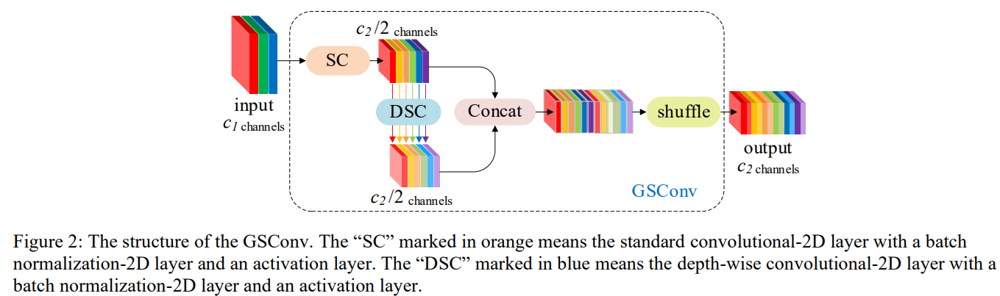
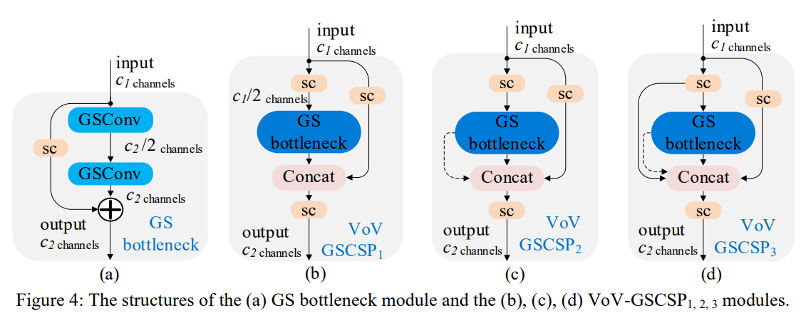
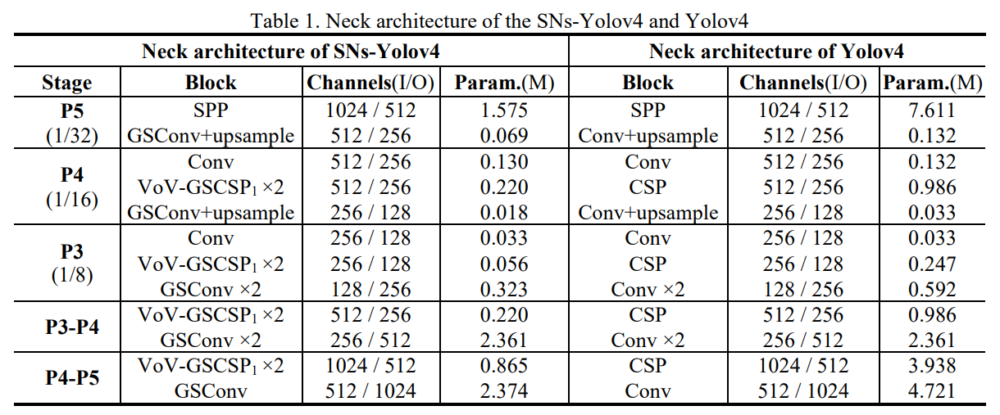
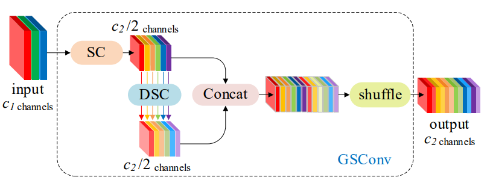
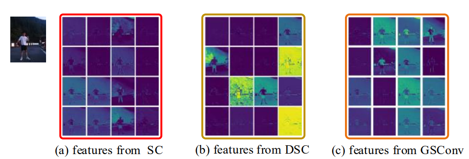
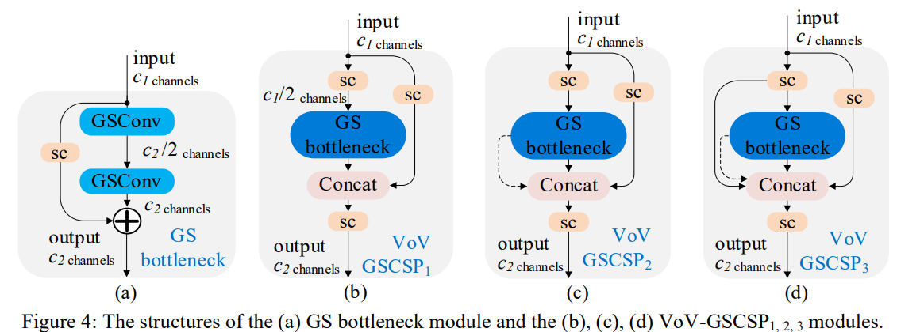
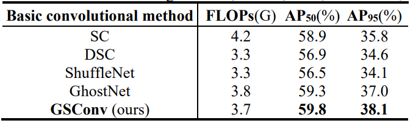

# [yolov11改进系列]基于yolov11引入混合标准卷积与深度可分离卷积GSConv用于轻量化网络的python源码+训练源码

> FL1623863129 于 2025-05-28 14:11:39 发布 阅读量974 收藏 10 点赞数 8 公开
> 文章链接：https://blog.csdn.net/FL1623863129/article/details/148282956

[GSConv介绍]

摘要
实时目标检测在工业和研究领域至关重要。传统轻量化模型依赖深度可分离卷积(DSC)但牺牲精度，而大模型难以满足边缘设备实时性需求。本文提出新型轻量卷积技术GSConv，通过混合标准卷积(SC)与DSC的特征输出，在保持精度的同时显著降低计算成本。基于GSConv进一步设计「瘦颈」(Slim-Neck, SNs)架构，通过20+组对比实验验证其优越性：在Tesla T4上以~100FPS实现SODA10M数据集70.9% AP50，达到SOTA性能。

方法

 

​ **GSConv混合策略** ​：主分支采用3x3 SC捕捉通道关联，辅助分支采用5x5 DSC提取空间特征，通过均匀混洗(shuffle)融合两类特征。

 

​ **VoV-GSCSP模块** ​：基于GSConv设计跨阶段部分网络，三种结构中以VoV-GSCSP1性价比最高。

 

1. ​ **瘦颈架构(SNs)​** ​：仅在颈部使用GSConv，主干保留SC，平衡精度与速度。

2. ​ **注意力机制优化** ​：在主干末端插入CA模块，头部入口嵌入SPPF。

3. ​ **损失函数与激活函数** ​：采用EIoU提升边框回归精度，Mish激活函数增强非线性。

​ **对应图表** ​：

 

特征可视化对比：

 

VoV-GSCSP设计：

 

创新点
​GSConv技术​：首创SC与 DSC的特征混洗机制，以50%计算量实现接近SC的表示能力。
​硬件友好设计​：支持线性运算混洗作为转置操作的替代方案，适配边缘设备。
​颈部轻量化范式​：首次提出「仅瘦颈」设计，相比全模型轻量化提升6.3% AP50。
​工程优化组合​：验证EIoU+Mish在轻量化模型中的最佳实践。
GSConv核心作用
​特征融合​：通过混洗打破DSC的通道隔离，保留空间-通道关联。
​计算优化​：FLOPs仅为SC的50%，参数量减少36%。
​扩展性强​：支持大核(17x17)辅助分支扩展感受野。
​精度保障​：在WiderPerson上使轻量化模型AP50提升14.3%。
​对应图表​：

不同卷积方法对比：

 

### 总结

GSConv通过优雅的混合策略解决了轻量化卷积的表示瓶颈，SNs架构将其优势聚焦于检测器颈部。实验表明该方法在边缘设备上实现精度与速度的帕累托最优，为实时检测提供新范式。未来可扩展至 `低光检测、遥感图像` 等场景。

【yolov11框架介绍】

2024 年 9 月 30 日，Ultralytics在其活动 YOLOVision 中正式发布了 YOLOv11。YOLOv11 是 YOLO 的最新版本，由美国和西班牙的 Ultralytics 团队开发。YOLO 是一种用于基于图像的人工智能的计算机模

#### Ultralytics YOLO11 概述

YOLO11 是Ultralytics YOLO 系列实时物体检测器的最新版本，以尖端的精度、速度和效率重新定义了可能性。基于先前 YOLO 版本的令人印象深刻的进步，YOLO11 在架构和训练方法方面引入了重大改进，使其成为各种计算机视觉任务的多功能选择。


#### Key Features 主要特点

- 增强的特征提取：YOLO11采用改进的主干和颈部架构，增强了特征提取能力，以实现更精确的目标检测和复杂任务性能。

- 针对效率和速度进行优化：YOLO11 引入了精致的架构设计和优化的训练管道，提供更快的处理速度并保持准确性和性能之间的最佳平衡。

- 使用更少的参数获得更高的精度：随着模型设计的进步，YOLO11m 在 COCO 数据集上实现了更高的平均精度(mAP)，同时使用的参数比 YOLOv8m 少 22%，从而在不影响精度的情况下提高计算效率。

- 跨环境适应性：YOLO11可以无缝部署在各种环境中，包括边缘设备、云平台以及支持NVIDIA [GPU](https://cloud.tencent.com/product/gpu?from_column=20065&from=20065) 的系统，确保最大的灵活性。

- 支持的任务范围广泛：无论是对象检测、实例分割、图像分类、姿态估计还是定向对象检测 (OBB)，YOLO11 旨在应对各种计算机视觉挑战。

 

​​

##### 与之前的版本相比，Ultralytics YOLO11 有哪些关键改进？

Ultralytics YOLO11 与其前身相比引入了多项重大进步。主要改进包括：

- 增强的特征提取：YOLO11采用改进的主干和颈部架构，增强了特征提取能力，以实现更精确的目标检测。

- 优化的效率和速度：精细的架构设计和优化的训练管道可提供更快的处理速度，同时保持准确性和性能之间的平衡。

- 使用更少的参数获得更高的精度：YOLO11m 在 COCO 数据集上实现了更高的平均精度(mAP)，参数比 YOLOv8m 少 22%，从而在不影响精度的情况下提高计算效率。

- 跨环境适应性：YOLO11可以跨各种环境部署，包括边缘设备、云平台和支持NVIDIA GPU的系统。

- 支持的任务范围广泛：YOLO11 支持多种计算机视觉任务，例如对象检测、实例分割、图像分类、姿态估计和定向对象检测 (OBB)

【测试环境】

windows10 x64

ultralytics==8.3.0

torch==2.3.1

【改进流程】

##### 1. 新增GSConv.py实现模块（代码太多，核心模块源码请参考改进步骤.docx）然后在同级目录下面创建一个__init___.py文件写代码

from .GSConv. import *

##### 2. 文件修改步骤

**修改tasks.py文件** 

**创建模型配置文件** 

yolo11-GSConv..yaml内容如下：

```cobol
# Ultralytics YOLO 🚀, AGPL-3.0 license
# YOLO11 object detection model with P3-P5 outputs. For Usage examples see https://docs.ultralytics.com/tasks/detect
 
# Parameters
nc: 80 # number of classes
scales: # model compound scaling constants, i.e. 'model=yolo11n.yaml' will call yolo11.yaml with scale 'n'
  # [depth, width, max_channels]
  n: [0.50, 0.25, 1024] # summary: 319 layers, 2624080 parameters, 2624064 gradients, 6.6 GFLOPs
  s: [0.50, 0.50, 1024] # summary: 319 layers, 9458752 parameters, 9458736 gradients, 21.7 GFLOPs
  m: [0.50, 1.00, 512] # summary: 409 layers, 20114688 parameters, 20114672 gradients, 68.5 GFLOPs
  l: [1.00, 1.00, 512] # summary: 631 layers, 25372160 parameters, 25372144 gradients, 87.6 GFLOPs
  x: [1.00, 1.50, 512] # summary: 631 layers, 56966176 parameters, 56966160 gradients, 196.0 GFLOPs
 
# YOLO11n backbone
backbone:
  # [from, repeats, module, args]
  - [-1, 1, Conv, [64, 3, 2]] # 0-P1/2
  - [-1, 1, Conv, [128, 3, 2]] # 1-P2/4
  - [-1, 2, C3k2, [256, False, 0.25]]
  - [-1, 1, Conv, [256, 3, 2]] # 3-P3/8
  - [-1, 2, C3k2, [512, False, 0.25]]
  - [-1, 1, Conv, [512, 3, 2]] # 5-P4/16
  - [-1, 2, C3k2, [512, True]]
  - [-1, 1, Conv, [1024, 3, 2]] # 7-P5/32
  - [-1, 2, C3k2, [1024, True]]
  - [-1, 1, SPPF, [1024, 5]] # 9
  - [-1, 2, C2PSA, [1024]] # 10
 
# YOLO11n head
head:
  - [-1, 1, nn.Upsample, [None, 2, "nearest"]]
  - [[-1, 6], 1, Concat, [1]] # cat backbone P4
  - [-1, 2, C3k2, [512, False]] # 13
 
  - [-1, 1, nn.Upsample, [None, 2, "nearest"]]
  - [[-1, 4], 1, Concat, [1]] # cat backbone P3
  - [-1, 2, C3k2, [256, False]] # 16 (P3/8-small)
 
  - [-1, 1, GSConv, [256, 3, 2]]
  - [[-1, 13], 1, Concat, [1]] # cat head P4
  - [-1, 2, C3k2, [512, False]] # 19 (P4/16-medium)
 
  - [-1, 1, GSConv, [512, 3, 2]]
  - [[-1, 10], 1, Concat, [1]] # cat head P5
  - [-1, 2, C3k2, [1024, True]] # 22 (P5/32-large)
 
  - [[16, 19, 22], 1, Detect, [nc]] # Detect(P3, P4, P5)
```

##### 3. 验证集成

使用新建的yaml配置文件启动训练任务：

```cobol
from ultralytics import YOLO
 
if __name__ == '__main__':
    model = YOLO('yolo11-GSConv..yaml')  # build from YAML and transfer weights
        # Train the model
    results = model.train(data='coco128.yaml',epochs=100, imgsz=640, batch=8, device=0, workers=1, save=True,resume=False)
```

成功集成后，训练日志中将显示GSConv.模块的初始化信息，表明已正确加载到模型中。

<div style="text-align:center;">​</div>

【训练说明】

第一步：首先安装好yolov11必要模块，可以参考yolov11框架安装流程，然后卸载官方版本pip uninstall ultralytics，最后安装改进的源码pip install .
第二步：将自己数据集按照dataset文件夹摆放，要求文件夹名字都不要改变
第三步：分别打开train.py,coco128.yaml和模型参数yaml文件修改必要的参数，最后执行python train.py即可训练

【提供文件】

```cobol
├── [官方源码]ultralytics-8.3.0.zip
├── train/
│   ├── coco128.yaml
│   ├── dataset/
│   │   ├── train/
│   │   │   ├── images/
│   │   │   │   ├── firc_pic_1.jpg
│   │   │   │   ├── firc_pic_10.jpg
│   │   │   │   ├── firc_pic_11.jpg
│   │   │   │   ├── firc_pic_12.jpg
│   │   │   │   ├── firc_pic_13.jpg
│   │   │   ├── labels/
│   │   │   │   ├── classes.txt
│   │   │   │   ├── firc_pic_1.txt
│   │   │   │   ├── firc_pic_10.txt
│   │   │   │   ├── firc_pic_11.txt
│   │   │   │   ├── firc_pic_12.txt
│   │   │   │   ├── firc_pic_13.txt
│   │   └── val/
│   │       ├── images/
│   │       │   ├── firc_pic_100.jpg
│   │       │   ├── firc_pic_81.jpg
│   │       │   ├── firc_pic_82.jpg
│   │       │   ├── firc_pic_83.jpg
│   │       │   ├── firc_pic_84.jpg
│   │       ├── labels/
│   │       │   ├── firc_pic_100.txt
│   │       │   ├── firc_pic_81.txt
│   │       │   ├── firc_pic_82.txt
│   │       │   ├── firc_pic_83.txt
│   │       │   ├── firc_pic_84.txt
│   ├── train.py
│   ├── yolo11-GSConv..yaml
│   └── 训练说明.txt
├── [改进源码]ultralytics-8.3.0.zip
├── 改进原理.docx
└── 改进流程.docx
```

【常见问题汇总】
问：为什么我训练的模型epoch显示的map都是0或者map精度很低?
回答：由于源码改进过，因此不能直接从官方模型微调，而是从头训练，这样学习特征能力会很弱，需要训练很多epoch才能出现效果。此外由于改进的源码框架并不一定能够保证会超过官方精度，而且也有可能会存在远远不如官方效果，甚至精度会很低。这说明改进的框架并不能取得很好效果。所以说对于框架改进只是提供一种可行方案，至于改进后能不能取得很好map还需要结合实际训练情况确认，当然也不排除数据集存在问题，比如数据集比较单一，样本分布不均衡，泛化场景少，标注框不太贴合标注质量差，检测目标很小等等原因
【重要说明】
我们只提供改进框架一种方案，并不保证能够取得很好训练精度，甚至超过官方模型精度。因为改进框架，实际是一种比较复杂流程，包括框架原理可行性，训练数据集是否合适，训练需要反正验证以及同类框架训练结果参数比较，这个是十分复杂且漫长的过程。