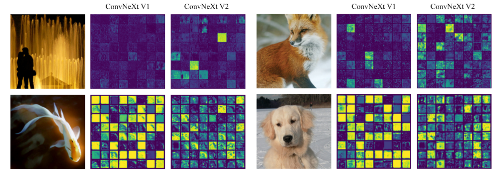

# [yolov11改进系列]使用ConvNeXtV2替换backbone用于增强特征学习和多样性的python源码+训练源码

> FL1623863129 于 2025-05-29 07:34:35 发布 阅读量756 收藏 13 点赞数 26 公开
> 文章链接：https://blog.csdn.net/FL1623863129/article/details/148295474

【ConvNeXtV2介绍】

在介绍 ConvNeXt V2 之前，让我们对 ConvNeXt 做一下简单的回顾：ConvNeXt 同样是 Meta AI 的工作，它的 motivation 是重新审视设计空间，测试纯卷积神经网络（ConvNet）的极限，探索纯卷积神经网络在计算机视觉任务中所能达到的性能。虽然在计算机视觉领域中，Transformers 已经在多个任务中超越了卷积神经网络，但是 ConvNeXt 论文认为卷积神经网络具有天然的归纳偏置（inductive bias）性质，因此仍然有很大的潜力可以挖掘。

作者通过逐步将标准 ResNet 现代化，测试了一系列的设计决策，发掘其中有用的关键组件，最终提出了一系列名为 ConvNeXt 的纯卷积神经网络，并在多个视觉任务上进行了评估，取得了与 Vision Transformer 相当的准确性和可扩展性，同时保持了标准卷积神经网络的简单和高效性。


简单来说，ConvNeXt 从宏观和微观两个层面对卷积神经网络和 Transformer 进行了比较和分析。在宏观层面上，作者发现了一些在卷积网络上可以稳定 work 的框架与技术，如 ResNeXt、反向瓶颈、大卷积核等，这些宏观调整有助于提高卷积网络的性能。在微观层面上，作者还研究了激活函数和归一化层等方面的不同设计选择，例如将 BatchNorm 替换为 LayerNorm 等。最终，作者提出了一系列纯卷积神经网络模型，具体的尝试如下图所示，一句话来说，即 Transformer 或者 Swin-Transformer 怎么做，我也在 ConvNeXt 上试着做对应的调整：


**ConvNeXt V2** 

ConvNeXt V2 是基于现代 ConvNets 并添加了自监督学习技术的结果。ConvNeXt V2 在 ConvNeXt 的基础上增加了两个创新点（一个 framework 和一个 technique）：全卷积掩码自编码器（fully convolutional masked autoencoder, FCMAE）和全局响应归一化（global response normalization, GRN）。

这种自监督学习技术和架构改进的协同设计（Co-design）共同创造了一个新的模型系列 ConvNeXt V2，它在包括 ImageNet 分类、COCO 检测和 ADE20K 分割在内的各种识别基准测试中显着提高了纯 ConvNets 的性能。

同时，作者还在 GitHub上 提供了各种大小的预训练 ConvNeXt V2 模型，范围从高效的 3.7M 参数 Atto 模型到 650M 的 Huge 模型。如下图所示，这里也展示了论文题目中提到的强大的模型缩放能力（Scaling），即在所有模型大小的监督训练的 baseline（ConvNeXt V1）上，ConvNeXt V2 的性能都得到了一致的改进。


前面提到，ConvNeXt V2 主要有两个创新点：一是提出了一种全卷积掩码自编码器（FCMAE）框架；二是提出了一种全局响应归一化（GRN）层。

下面让我们分别来简单地过一下它们的原理和效果，并看看新的训练框架（learning framework）与结构改进 （architectural improvement）同时考虑后结合（Co-design）的进一步提升。

**全卷积掩码自编码器（FCMAE）** 


全卷积掩码自编码器（FCMAE）框架是一种基于卷积神经网络的自监督学习方法，它的思想是在输入图像上随机掩盖一些区域，然后让模型尝试恢复被掩盖的部分。这样可以迫使模型学习到图像的全局和局部特征，从而提高其泛化能力。

FCMAE 框架与传统的掩码自编码器（MAE）框架相比，有两个优势：一是它使用了全卷积结构，而不是使用全连接层来生成掩码和重建图像，这样可以减少参数量和计算量，同时保持空间信息；二是它使用了多尺度掩码策略，而不是使用固定大小的掩码，这样可以增加模型对不同尺度特征的感知能力。

下表展示了在实验中一步步寻找 FCMAE 中最优解码器的过程：


Table 1. **MAE decoder ablation experiments** with ConvNeXt-Base on ImageNet-1K. We report fine-tuning (ft) accuracy (%). The pretraining schedule is 800 epochs. In the decoder design exploration, the wall-clock time is benchmarked on a 256-core TPU-v3 pod using JAX. The speedup is relative to the UNet decoder baseline. Our final design choices employed in the paper are marked in gray .

在这些实验中，研究人员对不同的解码器进行了比较，在最终的微调阶段的准确率作为评估标准。表格中展示了使用 ConvNeXt-Base 进行实验的结果，其中包括使用不同类型解码器的精度。最终，作者选择了最优的解码器用于结合 FCMAE 来训练最终的 ConvNeXt V2 模型。

**全局响应归一化（GRN）** 


全局响应归一化（GRN）层是一种新的卷积神经网络层，它的作用是在每个通道上对特征图进行归一化处理，从而增强通道间的特征竞争。GRN 层与传统的批量归一化（BN）层相比，有两个优势：一是它不需要额外的参数，因为它仅仅是对特征图进行归一化处理；二是它可以处理任意大小的 batch，而 BN 层则需要根据 batch 大小动态调整参数，计算量较大。

GRN 层的实现非常简单，只需要三行代码，并且没有可学习的参数。具体来说，GRN 层可以分为三个步骤：全局特征聚合、特征归一化和特征校准。在全局特征聚合步骤中，我们使用 L2 范数对每个通道上的特征图进行聚合，得到一个聚合后的向量。在特征归一化步骤中，我们使用标准除法归一化函数对聚合后的向量进行归一化。在特征校准步骤中，我们使用归一化后的向量对原始的特征图进行校准。整个 GRN 层的计算量非常小，因此可以很容易地添加到卷积神经网络中，从而增强特征竞争，提高模型性能。

作者发现 ConvNeXt V1 模型存在特征崩溃问题，即在通道之间存在冗余激活（死亡或饱和神经元）。为了解决这个问题，作者引入了一种新的归一化技术：全局响应归一化（GRN）层，作用于每个 patch 的特征，以促进特征多样性，用于解决特征崩溃问题。

具体来说，下图展示了作者对每个特征通道的激活图（activation map）进行可视化的结果，其中每张图片选取了 64 个通道，直观地证明了 ConvNeXt V1 存在特征崩溃问题，并进一步展示了使用 GRN 后的 ConvNeXt V2 对这一问题的缓解。



"We visualize the activation map for each feature channel in small squares. For clarity, we display 64 channels in each visualization. The ConvNeXt V1 model suffers from a feature collapse issue, which is characterized by the presence of redundant activations (dead or saturated neurons) across channels. To fix this problem, we introduce a new method to promote feature diversity during training: the global response normalization (GRN) layer. This technique is applied to high-dimensional features in every block, leading to the development of the ConvNeXt V2 architecture."

同时，为了进一步验证 GRN 的效果，论文在下表中展示了使用 ConvNeXt-Base 模型进行的一系列消融实验，来研究如何利用全局响应归一化（GRN）技术来增加特征的多样性，从而提高模型的性能。


Table 2. GRN ablations with ConvNeXt-Base. We report fine-tuning accuracy on ImageNet-1K. Our final proposal is marked in gray .

表格中展示了不同的实验情况，包括不同的特征归一化方法、特征加权方法以及在预训练和微调阶段中使用 GRN 的效果。实验结果表明，GRN 可以有效地提高模型的性能，特别是在预训练阶段。同时，GRN 与其他常见的特征归一化方法相比，也具有更好的效果。

**Co-design Matters** 

既然 FCMAE 与 GRN 都能带来一定程度的提升，那么它们一起使用会带来什么样的结果呢？这就是论文中关于“co-designing”相关实验要展示的内容。

具体来说，如下表所示：作者在实验中发现，在不修改模型结构的情况下，使用 FCMAE 框架对表征学习质量的影响有限。同样，新的 GRN 层对监督设置下的性能影响也相当小。然而，两者的结合使微调性能得到了明显的改善。这支持了前面提到的模型和学习框架应该一起考虑（both the model and learning framework should be considered together）的想法，特别是在涉及到自监督学习时。


Table 3. Co-design matters. When the architecture and the learning framework are co-designed and used together, maskedimagepre-training becomes effective for ConvNeXt. We report the finetuning performance from 800 epoch FCMAE pre-trained models. The relative improvement is bigger with a larger model.

**实验结果** 

在实验中，使用 FCMAE 框架和 GRN 层的 ConvNeXt V2 模型在不同的任务上表现出了显著的性能提升，包括 ImageNet 分类、COCO 检测和 ADE20K 分割。

首先是必须要有的 ImageNet-1k 上的结果：


Table 4. Comparisons with previous masked image modeling approaches. The pre-training data is the IN-1K training set. All self-supervised methods are benchmarked by the end-to-end finetuning performance with an image size of 224. We underline the highest accuracy for each model size and bold our best results.

如上表所示：ConvNeXt V2 + FCMAE 在所有的模型规模上都优于用 SimMIM 预训练的 Swin Transformer。同时，与用 MAE 预训练的 ViT 相比，ConvNeXt V2 在大模型体系中的表现相似，并且使用的参数少得多（198M vs 307M）。然而，更大的模型体系中，ConvNeXt V2 是略微落后于其他方法的。作者认为这可能是因为一个巨大的 ViT 模型可以从自监督的预训练中获益更多。

文中还介绍了 ImageNet-22K 的 intermediate fine-tuning（中间微调）结果：intermediate fine-tuning 的训练过程包括三个步骤：1. FCMAE 预训练；2. ImageNet-22K 微调；3. ImageNet1K 微调。结果如下表所示：


Table 5. ImageNet-1K fine-tuning results using IN-21K labels. The ConvNeXt V2 Huge model equipped with the FCMAE pretraining outperforms other architectures and sets a new state-of-the-art accuracy of 88.9% among methods using public data only.

同时，预训练好的 ConvNeXt V2 作为 backbone 连接 Mask R-CNN 做 head 在 COCO 上目标检测和实例分割；与结合 Uper-Net 在 ADE20k 上进行语义分割，ConvNeXt V2 同样表现出了优秀的效果。


Table 6. COCO object detection and instance segmentation results using Mask-RCNN. FLOPS are calculated with image size (1280, 800). All COCO fine-tuning experiments rely on ImageNet-1K pre-trained models.


Table 7. ADE20K semantic segmentation results using UPerNet. FLOPS are based on input sizes of (2048, 512) or (2560, 640). All ADE20K fine-tuning experiments rely on ImageNet-1K pre-trained model except FCMAE,22K ft, in which case the ImageNet-1K pre-training is followed by ImageNet-22K supervised fine-tuning.

ConvNeXtV2是一种新型的 卷积神经网络Q架构，它融合了自监督学习技术和架构改进，特别是加入了全卷积掩码自编码器框架和全局响应归一化（GRN）层。我将其替换YOLOv11的特征提取网络，用于提取更有用的特征。一方面利用全卷积掩码自动编码器在训练时优化特征学习，减少模型对大规模标注数据的依赖；另一方面，通过全局响应归一化层增强特征竞争，缓解特征坍塌问题，提高特征多样性。

【yolov11框架介绍】

2024 年 9 月 30 日，Ultralytics 在其活动 YOLOVision 中正式发布了 YOLOv11。YOLOv11 是 YOLO 的最新版本，由美国和西班牙的 Ultralytics 团队开发。YOLO 是一种用于基于图像的人工智能的计算机模

#### Ultralytics YOLO11 概述

YOLO11 是Ultralytics YOLO 系列实时物体检测器的最新版本，以尖端的精度、速度和效率重新定义了可能性。基于先前 YOLO 版本的令人印象深刻的进步，YOLO11 在架构和训练方法方面引入了重大改进，使其成为各种计算机视觉任务的多功能选择。


#### Key Features 主要特点

- 增强的特征提取：YOLO11采用改进的主干和颈部架构，增强了特征提取能力，以实现更精确的目标检测和复杂任务性能。

- 针对效率和速度进行优化：YOLO11 引入了精致的架构设计和优化的训练管道，提供更快的处理速度并保持准确性和性能之间的最佳平衡。

- 使用更少的参数获得更高的精度：随着模型设计的进步，YOLO11m 在 COCO 数据集上实现了更高的平均精度(mAP)，同时使用的参数比 YOLOv8m 少 22%，从而在不影响精度的情况下提高计算效率。

- 跨环境适应性：YOLO11可以无缝部署在各种环境中，包括边缘设备、云平台以及支持NVIDIA [GPU](https://cloud.tencent.com/product/gpu?from_column=20065&from=20065) 的系统，确保最大的灵活性。

- 支持的任务范围广泛：无论是对象检测、实例分割、图像分类、姿态估计还是定向对象检测 (OBB)，YOLO11 旨在应对各种计算机视觉挑战。

 

​​

##### 与之前的版本相比，Ultralytics YOLO11 有哪些关键改进？

Ultralytics YOLO11 与其前身相比引入了多项重大进步。主要改进包括：

- 增强的特征提取：YOLO11采用改进的主干和颈部架构，增强了特征提取能力，以实现更精确的目标检测。

- 优化的效率和速度：精细的架构设计和优化的训练管道可提供更快的处理速度，同时保持准确性和性能之间的平衡。

- 使用更少的参数获得更高的精度：YOLO11m 在 COCO 数据集上实现了更高的平均精度(mAP)，参数比 YOLOv8m 少 22%，从而在不影响精度的情况下提高计算效率。

- 跨环境适应性：YOLO11可以跨各种环境部署，包括边缘设备、云平台和支持NVIDIA GPU的系统。

- 支持的任务范围广泛：YOLO11 支持多种计算机视觉任务，例如对象检测、实例分割、图像分类、姿态估计和定向对象检测 (OBB)

【测试环境】

windows10 x64

ultralytics==8.3.0

torch==2.3.1

【改进流程】

##### 1. 新增ConvNeXtV2.py实现模块（代码太多，核心模块源码请参考改进步骤.docx）然后在同级目录下面创建一个__init___.py文件写代码

from .ConvNeXtV2. import *

##### 2. 文件修改步骤

**修改tasks.py文件** 

**创建模型配置文件** 

yolo11-ConvNeXtV2.yaml内容如下：

```cobol
# Ultralytics YOLO 🚀, AGPL-3.0 license
# YOLO11 object detection model with P3-P5 outputs. For Usage examples see https://docs.ultralytics.com/tasks/detect
 
# Parameters
nc: 80 # number of classes
scales: # model compound scaling constants, i.e. 'model=yolo11n.yaml' will call yolo11.yaml with scale 'n'
  # [depth, width, max_channels]
  n: [0.50, 0.25, 1024] # summary: 319 layers, 2624080 parameters, 2624064 gradients, 6.6 GFLOPs
  s: [0.50, 0.50, 1024] # summary: 319 layers, 9458752 parameters, 9458736 gradients, 21.7 GFLOPs
  m: [0.50, 1.00, 512] # summary: 409 layers, 20114688 parameters, 20114672 gradients, 68.5 GFLOPs
  l: [1.00, 1.00, 512] # summary: 631 layers, 25372160 parameters, 25372144 gradients, 87.6 GFLOPs
  x: [1.00, 1.50, 512] # summary: 631 layers, 56966176 parameters, 56966160 gradients, 196.0 GFLOPs
 
# 下面 [-1, 1, convnextv2_atto, [0.25]] 参数位置的0.25是通道放缩的系数, YOLOv11N是0.25 YOLOv11S是0.5 YOLOv11M是1. YOLOv11l是1 YOLOv11是1.5大家根据自己训练的YOLO版本设定即可.
# 本文支持版本有 'convnextv2_atto', 'convnextv2_femto', 'convnext_pico', 'convnextv2_nano', 'convnextv2_tiny', 'convnextv2_base', 'convnextv2_large', 'convnextv2_huge'
# YOLO11n backbone
backbone:
  # [from, repeats, module, args]
  - [-1, 1, convnextv2_atto, [0.5]] # 0-4 P1/2 这里是四层
  - [-1, 1, SPPF, [1024, 5]] # 5
  - [-1, 2, C2PSA, [1024]] # 6
 
# YOLO11n head
head:
  - [-1, 1, nn.Upsample, [None, 2, "nearest"]]
  - [[-1, 3], 1, Concat, [1]] # cat backbone P4
  - [-1, 2, C3k2, [512, False]] # 9
 
  - [-1, 1, nn.Upsample, [None, 2, "nearest"]]
  - [[-1, 2], 1, Concat, [1]] # cat backbone P3
  - [-1, 2, C3k2, [256, False]] # 12 (P3/8-small)
 
  - [-1, 1, Conv, [256, 3, 2]]
  - [[-1, 9], 1, Concat, [1]] # cat head P4
  - [-1, 2, C3k2, [512, False]] # 15 (P4/16-medium)
 
  - [-1, 1, Conv, [512, 3, 2]]
  - [[-1, 6], 1, Concat, [1]] # cat head P5
  - [-1, 2, C3k2, [1024, True]] # 18 (P5/32-large)
 
  - [[12, 15, 18], 1, Detect, [nc]] # Detect(P3, P4, P5)
```

##### 3. 验证集成

使用新建的yaml配置文件启动训练任务：

```cobol
from ultralytics import YOLO
 
if __name__ == '__main__':
    model = YOLO('yolo11-ConvNeXtV2.yaml')  # build from YAML and transfer weights
        # Train the model
    results = model.train(data='coco128.yaml',epochs=100, imgsz=640, batch=8, device=0, workers=1, save=True,resume=False)
```

成功集成后，训练日志中将显示ConvNeXtV2模块的初始化信息，表明已正确加载到模型中。

<div style="text-align:center;">​</div>

【训练说明】

第一步：首先安装好yolov11必要模块，可以参考yolov11框架安装流程，然后卸载官方版本pip uninstall ultralytics，最后安装改进的源码pip install .
第二步：将自己数据集按照dataset文件夹摆放，要求文件夹名字都不要改变
第三步：分别打开train.py,coco128.yaml和模型参数yaml文件修改必要的参数，最后执行python train.py即可训练

【提供文件】

```cobol
├── [官方源码]ultralytics-8.3.0.zip
├── train/
│   ├── coco128.yaml
│   ├── dataset/
│   │   ├── train/
│   │   │   ├── images/
│   │   │   │   ├── firc_pic_1.jpg
│   │   │   │   ├── firc_pic_10.jpg
│   │   │   │   ├── firc_pic_11.jpg
│   │   │   │   ├── firc_pic_12.jpg
│   │   │   │   ├── firc_pic_13.jpg
│   │   │   ├── labels/
│   │   │   │   ├── classes.txt
│   │   │   │   ├── firc_pic_1.txt
│   │   │   │   ├── firc_pic_10.txt
│   │   │   │   ├── firc_pic_11.txt
│   │   │   │   ├── firc_pic_12.txt
│   │   │   │   ├── firc_pic_13.txt
│   │   └── val/
│   │       ├── images/
│   │       │   ├── firc_pic_100.jpg
│   │       │   ├── firc_pic_81.jpg
│   │       │   ├── firc_pic_82.jpg
│   │       │   ├── firc_pic_83.jpg
│   │       │   ├── firc_pic_84.jpg
│   │       ├── labels/
│   │       │   ├── firc_pic_100.txt
│   │       │   ├── firc_pic_81.txt
│   │       │   ├── firc_pic_82.txt
│   │       │   ├── firc_pic_83.txt
│   │       │   ├── firc_pic_84.txt
│   ├── train.py
│   ├── yolo11-ConvNeXtV2.yaml
│   └── 训练说明.txt
├── [改进源码]ultralytics-8.3.0.zip
├── 改进原理.docx
└── 改进流程.docx
```

【常见问题汇总】
问：为什么我训练的模型epoch显示的map都是0或者map精度很低?
回答：由于源码改进过，因此不能直接从官方模型微调，而是从头训练，这样学习特征能力会很弱，需要训练很多epoch才能出现效果。此外由于改进的源码框架并不一定能够保证会超过官方精度，而且也有可能会存在远远不如官方效果，甚至精度会很低。这说明改进的框架并不能取得很好效果。所以说对于框架改进只是提供一种可行方案，至于改进后能不能取得很好map还需要结合实际训练情况确认，当然也不排除数据集存在问题，比如数据集比较单一，样本分布不均衡，泛化场景少，标注框不太贴合标注质量差，检测目标很小等等原因
【重要说明】
我们只提供改进框架一种方案，并不保证能够取得很好训练精度，甚至超过官方模型精度。因为改进框架，实际是一种比较复杂流程，包括框架原理可行性，训练数据集是否合适，训练需要反正验证以及同类框架训练结果参数比较，这个是十分复杂且漫长的过程。