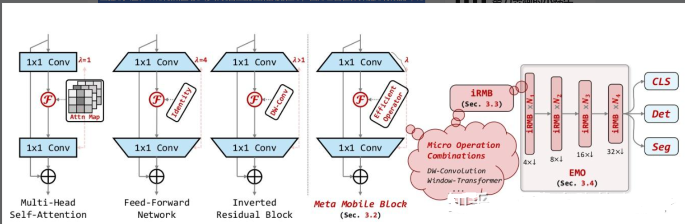
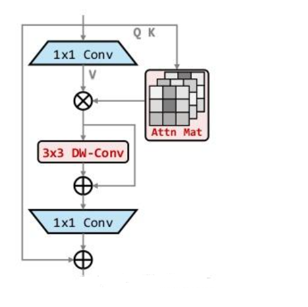
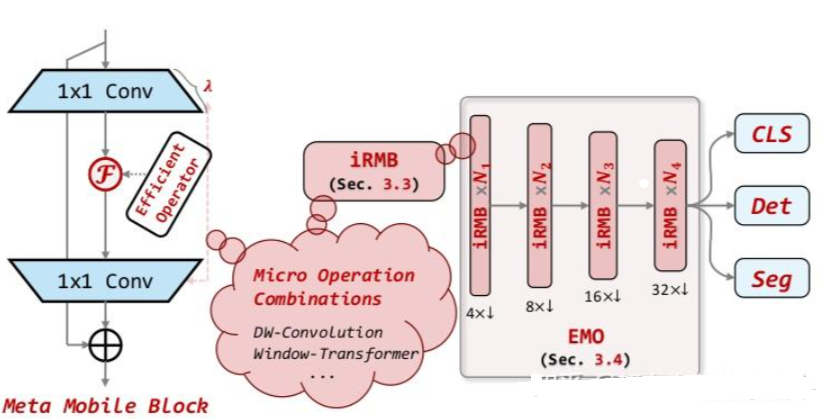

# [yolov11改进系列]基于yolov11引入倒置残差块块注意力机制iEMA的python源码+训练源码

> FL1623863129 于 2025-05-29 10:21:52 发布 阅读量951 收藏 19 点赞数 15 公开
> 文章链接：https://blog.csdn.net/FL1623863129/article/details/148304867

【iEMA介绍】

[iRMB](https://zhida.zhihu.com/search?content_id=251166579&content_type=Article&match_order=1&q=iRMB&zhida_source=entity) （Inverted Residual Mobile Block）的框架原理，是一种结合轻量级CNN和 [注意力机制](https://zhida.zhihu.com/search?content_id=251166579&content_type=Article&match_order=1&q=%E6%B3%A8%E6%84%8F%E5%8A%9B%E6%9C%BA%E5%88%B6&zhida_source=entity) 的方法，用于改进移动设备上的目标检测模型。IRMB通过 [倒置残差块](https://zhida.zhihu.com/search?content_id=251166579&content_type=Article&match_order=1&q=%E5%80%92%E7%BD%AE%E6%AE%8B%E5%B7%AE%E5%9D%97&zhida_source=entity) 和 [元移动块](https://zhida.zhihu.com/search?content_id=251166579&content_type=Article&match_order=1&q=%E5%85%83%E7%A7%BB%E5%8A%A8%E5%9D%97&zhida_source=entity) 实现高效信息处理，同时保持模型轻量化。本文中提出一个新的主干网络 [EMO](https://zhida.zhihu.com/search?content_id=251166579&content_type=Article&match_order=1&q=EMO&zhida_source=entity) ，主要思想是将轻量级的CNN架构与基于注意力的模型结构相结合

### 1. 简介

倒置残差块（IRB）作为轻量级CNN的基础设施，在基于注意力的研究中尚未有对应的部分。本文从统一的视角重新考虑了基于高效IRB和Transformer有效组件的轻量级基础设施，将基于CNN的IRB扩展到基于注意力的模型，并抽象出一个残差的元移动块（MMB）用于轻量级模型设计。遵循简单但有效的设计准则，本文推导出了现代化的倒置残差移动块（IRMB），并以此构建了类似 [ResNet](https://zhida.zhihu.com/search?content_id=251166579&content_type=Article&match_order=1&q=ResNet&zhida_source=entity) 的高效模型（EMO）用于下游任务。

### 2. iRMB主要思想

iRMB（Inverted Residual Mobile Block）的主要思想是将轻量级的CNN架构与基于注意力的模型结构相结合（优点类似于ACmix），以创建高效的移动网络。Irmb通过重新考虑导致残差（IRB）和Transformer的有效组件，实现了一种统一的视角，从而扩展了CNN的IRB到基于注意力的模型。Irmb的设计目标是在保持模型轻量级的同时，实现对计算资源的有效利用和高准确率。这一方法通过在下游任务上的广泛实验得到验证，展示出其在轻量级模型领域的优越性能。

iRMB的主要创新点在于以下三个点：

1. 结合CNN的轻量级特征和Transformer的动态模型能力，创新提出了iRMB结构，适用于移动设备上的密集预测任务

2. 使用倒置残差块设计，扩展了传统CNN的IRB到基于注意力的模型，增强了模型处理长距离信息的能力

3. 提出了元移动块（Meta-Mobile Block），通过不同的扩展比率和高效操作符，实现了模型的模块化设计，使得模型更加灵活和高效

### 3. IRMB结构

iRMB结构的主要创新点是它结合了卷积神经网络的轻量级特性和Transformer模型的动态处理能力。这种结构特别适用于移动设备上的密集预测任务，因为它旨在计算能力有限的环境中提供高效的性能。IRMB通过其倒置残差设计改进了信息流的处理，允许在保持模型轻量的同时捕捉和利用长距离依赖，这对于图像分类，对象检测和语义分割等任务至关重要。这种设计使得模型在资源受限的设备上也能够高效运行，同时保持或提高预测准确性。

 

上图展示了iRMB的设计理念和结构，左侧是从多头自注意力和前馈网络中抽象出的统一元移动块（Meta-Moblie Block），它将不同扩展比率和高效操作符结合起来，形成特定的模块。右侧是基于iRMB构建的类似ResNet的高效模型（EMO）,它仅由推导出的iRMB组成，并用于各种下游任务，如cls，det，seg。这种设计实现了模型的轻量化，同时保持了良好的性能和效率。

 

上图展示了Irmb的结构范式，Irmb是一种混合网络模块，它结合了 [深度可分离卷积](https://zhida.zhihu.com/search?content_id=251166579&content_type=Article&match_order=1&q=%E6%B7%B1%E5%BA%A6%E5%8F%AF%E5%88%86%E7%A6%BB%E5%8D%B7%E7%A7%AF&zhida_source=entity) 核自注意力机制。conv1用于通道数的压缩和扩张，以此优化计算效率。深度可分离卷积用于捕捉空间特征，而注意力机制则用于捕获特征间的全局依赖关系。

### 4. 倒置残差块

在IRMB设计中，使用倒置残差块（IRB）的概念被扩展到了其注意力的模块中。这使得模型能够更有效的处理长距离信息，这是因为自注意力机制能够捕获输入数据汇总不同部分之间的全局依赖关系。传统的cnn通常只能捕捉到局部特征，而通过引入注意力机制，IRMB能够在提取特征时考虑到整个输入空间，增强了模型对复杂数据模式的理解能力，特别是在处理视觉和序列数据时。这种结合了传统CNN的轻量化和Transformer的长距离建模能力的设计，为在资源受限的环境中实现了高效的深度学习模型提供了新的可能性

### 5. 元移动块（Meta-Mobile Block）

元移动块（Meta-Mobile Block），通过不同的扩展比率和高效操作符实现模块化设计。这种方法使得模型可以根据需要调整其容量，而无需重新设计整个网络。元移动块的核心理念是通过可插拔的方式，将不同的操作如卷积、自注意力等集成到一个统一的框架中，从而提高模型的效率和灵活性。这允许模型在复杂性和计算效率之间进行更好的权衡，特别适用于那些需要在有限资源下运行的应用

 

上图展示的是meta mobile block的设计，在这个构件中，conv1被用来


【yolov11框架介绍】

2024 年 9 月 30 日，Ultralytics 在其活动 YOLOVision 中正式发布了 YOLOv11。YOLOv11 是 YOLO 的最新版本，由美国和西班牙的 Ultralytics 团队开发。YOLO 是一种用于基于图像的人工智能的计算机模

#### Ultralytics YOLO11 概述

YOLO11 是Ultralytics YOLO 系列实时物体检测器的最新版本，以尖端的精度、速度和效率重新定义了可能性。基于先前 YOLO 版本的令人印象深刻的进步，YOLO11 在架构和训练方法方面引入了重大改进，使其成为各种计算机视觉任务的多功能选择。


#### Key Features 主要特点

- 增强的特征提取：YOLO11采用改进的主干和颈部架构，增强了特征提取能力，以实现更精确的目标检测和复杂任务性能。

- 针对效率和速度进行优化：YOLO11 引入了精致的架构设计和优化的训练管道，提供更快的处理速度并保持准确性和性能之间的最佳平衡。

- 使用更少的参数获得更高的精度：随着模型设计的进步，YOLO11m 在 COCO 数据集上实现了更高的平均精度(mAP)，同时使用的参数比 YOLOv8m 少 22%，从而在不影响精度的情况下提高计算效率。

- 跨环境适应性：YOLO11可以无缝部署在各种环境中，包括边缘设备、云平台以及支持NVIDIA [GPU](https://cloud.tencent.com/product/gpu?from_column=20065&from=20065) 的系统，确保最大的灵活性。

- 支持的任务范围广泛：无论是对象检测、实例分割、图像分类、姿态估计还是定向对象检测 (OBB)，YOLO11 旨在应对各种计算机视觉挑战。

 

​​

##### 与之前的版本相比，Ultralytics YOLO11 有哪些关键改进？

Ultralytics YOLO11 与其前身相比引入了多项重大进步。主要改进包括：

- 增强的特征提取：YOLO11采用改进的主干和颈部架构，增强了特征提取能力，以实现更精确的目标检测。

- 优化的效率和速度：精细的架构设计和优化的训练管道可提供更快的处理速度，同时保持准确性和性能之间的平衡。

- 使用更少的参数获得更高的精度：YOLO11m 在 COCO 数据集上实现了更高的平均精度(mAP)，参数比 YOLOv8m 少 22%，从而在不影响精度的情况下提高计算效率。

- 跨环境适应性：YOLO11可以跨各种环境部署，包括边缘设备、云平台和支持NVIDIA GPU的系统。

- 支持的任务范围广泛：YOLO11 支持多种计算机视觉任务，例如对象检测、实例分割、图像分类、姿态估计和定向对象检测 (OBB)

【测试环境】

windows10 x64

ultralytics==8.3.0

torch==2.3.1

【改进流程】

##### 1. 新增iEMA.py实现模块（代码太多，核心模块源码请参考改进步骤.docx）然后在同级目录下面创建一个__init___.py文件写代码

from .iEMA import *

##### 2. 文件修改步骤

**修改tasks.py文件** 

**创建模型配置文件** 

yolo11-iEMA.yaml内容如下：

```cobol
# Ultralytics YOLO 🚀, AGPL-3.0 license
# YOLO11 object detection model with P3-P5 outputs. For Usage examples see https://docs.ultralytics.com/tasks/detect
 
# Parameters
nc: 2 # number of classes
scales: # model compound scaling constants, i.e. 'model=yolo11n.yaml' will call yolo11.yaml with scale 'n'
  # [depth, width, max_channels]
  n: [0.50, 0.25, 1024] # summary: 319 layers, 2624080 parameters, 2624064 gradients, 6.6 GFLOPs
  s: [0.50, 0.50, 1024] # summary: 319 layers, 9458752 parameters, 9458736 gradients, 21.7 GFLOPs
  m: [0.50, 1.00, 512] # summary: 409 layers, 20114688 parameters, 20114672 gradients, 68.5 GFLOPs
  l: [1.00, 1.00, 512] # summary: 631 layers, 25372160 parameters, 25372144 gradients, 87.6 GFLOPs
  x: [1.00, 1.50, 512] # summary: 631 layers, 56966176 parameters, 56966160 gradients, 196.0 GFLOPs
 
# YOLO11n backbone
backbone:
  # [from, repeats, module, args]
  - [-1, 1, Conv, [64, 3, 2]] # 0-P1/2
  - [-1, 1, Conv, [128, 3, 2]] # 1-P2/4
  - [-1, 2, C3k2, [256, False, 0.25]]
  - [-1, 1, Conv, [256, 3, 2]] # 3-P3/8
  - [-1, 2, C3k2, [512, False, 0.25]]
  - [-1, 1, Conv, [512, 3, 2]] # 5-P4/16
  - [-1, 2, C3k2, [512, True]]
  - [-1, 1, Conv, [1024, 3, 2]] # 7-P5/32
  - [-1, 2, C3k2, [1024, True]]
  - [-1, 1, SPPF, [1024, 5]] # 9
  - [-1, 2, C2PSA, [1024]] # 10
 
# YOLO11n head
head:
  - [-1, 1, nn.Upsample, [None, 2, "nearest"]]
  - [[-1, 6], 1, Concat, [1]] # cat backbone P4
  - [-1, 2, C3k2, [512, False]] # 13
 
  - [-1, 1, nn.Upsample, [None, 2, "nearest"]]
  - [[-1, 4], 1, Concat, [1]] # cat backbone P3
  - [-1, 2, C3k2, [256, False]] # 16 (P3/8-small)
  - [-1, 1, iEMA, []] # 17 (P3/8-small)  小目标检测层输出位置增加注意力机制
 
  - [-1, 1, Conv, [256, 3, 2]]
  - [[-1, 13], 1, Concat, [1]] # cat head P4
  - [-1, 2, C3k2, [512, False]] # 20 (P4/16-medium)
  - [-1, 1, iEMA, []] # 21 (P4/16-medium) 中目标检测层输出位置增加注意力机制
 
  - [-1, 1, Conv, [512, 3, 2]]
  - [[-1, 10], 1, Concat, [1]] # cat head P5
  - [-1, 2, C3k2, [1024, True]] # 24 (P5/32-large)
  - [-1, 1, iEMA, []] # 25 (P5/32-large) 大目标检测层输出位置增加注意力机制
 
  # 注意力机制我这里其实是添加了三个但是实际一般生效就只添加一个就可以了，所以大家可以自行注释来尝试, 上面三个仅建议大家保留一个， 但是from位置要对齐.
  # 具体在那一层用注意力机制可以根据自己的数据集场景进行选择。
  # 如果你自己配置注意力位置注意from[17, 21, 25]位置要对应上对应的检测层！
  - [[17, 21, 25], 1, Detect, [nc]] # Detect(P3, P4, P5)
```

##### 3. 验证集成

使用新建的yaml配置文件启动训练任务：

```cobol
from ultralytics import YOLO
 
if __name__ == '__main__':
    model = YOLO('yolo11-iEMA.yaml')  # build from YAML and transfer weights
        # Train the model
    results = model.train(data='coco128.yaml',epochs=100, imgsz=640, batch=8, device=0, workers=1, save=True,resume=False)
```

成功集成后，训练日志中将显示iEMA模块的初始化信息，表明已正确加载到模型中。

<div style="text-align:center;">​</div>

【训练说明】

第一步：首先安装好yolov11必要模块，可以参考yolov11框架安装流程，然后卸载官方版本pip uninstall ultralytics，最后安装改进的源码pip install .
第二步：将自己数据集按照dataset文件夹摆放，要求文件夹名字都不要改变
第三步：分别打开train.py,coco128.yaml和模型参数yaml文件修改必要的参数，最后执行python train.py即可训练

【提供文件】

```cobol
├── [官方源码]ultralytics-8.3.0.zip
├── train/
│   ├── coco128.yaml
│   ├── dataset/
│   │   ├── train/
│   │   │   ├── images/
│   │   │   │   ├── firc_pic_1.jpg
│   │   │   │   ├── firc_pic_10.jpg
│   │   │   │   ├── firc_pic_11.jpg
│   │   │   │   ├── firc_pic_12.jpg
│   │   │   │   ├── firc_pic_13.jpg
│   │   │   ├── labels/
│   │   │   │   ├── classes.txt
│   │   │   │   ├── firc_pic_1.txt
│   │   │   │   ├── firc_pic_10.txt
│   │   │   │   ├── firc_pic_11.txt
│   │   │   │   ├── firc_pic_12.txt
│   │   │   │   ├── firc_pic_13.txt
│   │   └── val/
│   │       ├── images/
│   │       │   ├── firc_pic_100.jpg
│   │       │   ├── firc_pic_81.jpg
│   │       │   ├── firc_pic_82.jpg
│   │       │   ├── firc_pic_83.jpg
│   │       │   ├── firc_pic_84.jpg
│   │       ├── labels/
│   │       │   ├── firc_pic_100.txt
│   │       │   ├── firc_pic_81.txt
│   │       │   ├── firc_pic_82.txt
│   │       │   ├── firc_pic_83.txt
│   │       │   ├── firc_pic_84.txt
│   ├── train.py
│   ├── yolo11-iEMA.yaml
│   └── 训练说明.txt
├── [改进源码]ultralytics-8.3.0.zip
├── 改进原理.docx
└── 改进流程.docx
```

【常见问题汇总】
问：为什么我训练的模型epoch显示的map都是0或者map精度很低?
回答：由于源码改进过，因此不能直接从官方模型微调，而是从头训练，这样学习特征能力会很弱，需要训练很多epoch才能出现效果。此外由于改进的源码框架并不一定能够保证会超过官方精度，而且也有可能会存在远远不如官方效果，甚至精度会很低。这说明改进的框架并不能取得很好效果。所以说对于框架改进只是提供一种可行方案，至于改进后能不能取得很好map还需要结合实际训练情况确认，当然也不排除数据集存在问题，比如数据集比较单一，样本分布不均衡，泛化场景少，标注框不太贴合标注质量差，检测目标很小等等原因
【重要说明】
我们只提供改进框架一种方案，并不保证能够取得很好训练精度，甚至超过官方模型精度。因为改进框架，实际是一种比较复杂流程，包括框架原理可行性，训练数据集是否合适，训练需要反正验证以及同类框架训练结果参数比较，这个是十分复杂且漫长的过程。