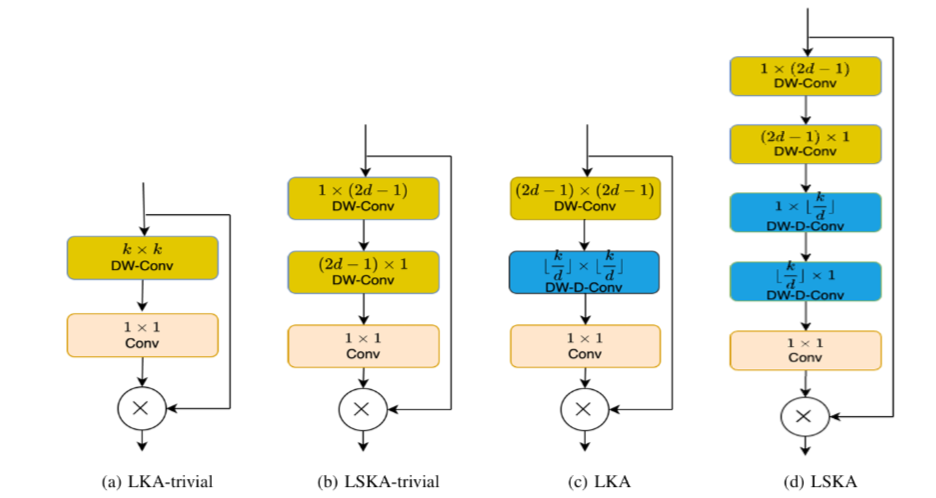
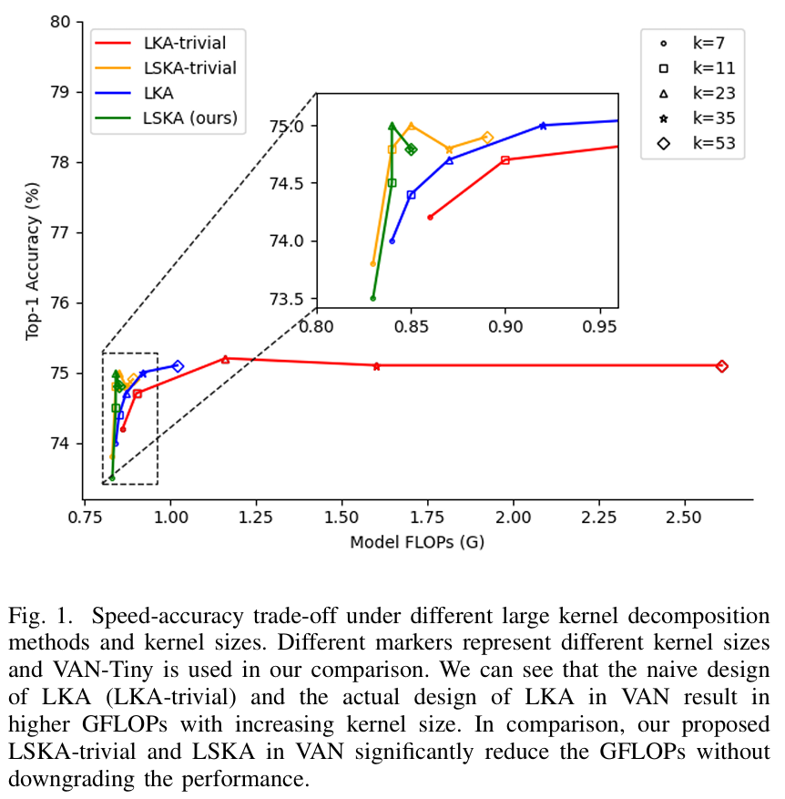

# [yolov11改进系列]基于yolov11引入大型分离卷积注意力模块LSKA减少计算复杂性和内存的python源码+训练源码

> FL1623863129 已于 2025-05-30 08:25:08 修改 阅读量634 收藏 25 点赞数 27 公开
> 文章链接：https://blog.csdn.net/FL1623863129/article/details/148322154

【LSKA介绍】

本文给大家带来一种超大核注意力机制的改进方法，尝试了多种改进方法。不仅速度快，而且还有不同程度的提升了精度！


 

论文：《LSKA（大可分离核注意力）：重新思考CNN大核注意力设计》
https://arxiv.org/pdf/2309.01439.pdf 大型可分离核注意力（LSKA）模块的视觉注意力网络（VAN）已被证明在各种基于视觉的任务上提供了卓越的性能，超过了视觉转换器（ViTs）。然而，这些LSKA模块中的逐深度卷积层随着卷积核尺寸的增加，计算和内存占用呈二次增长。为了缓解这些问题，并使VAN的注意力模块能够使用极大的卷积核，我们提出了一种大型可分离核注意力模块，称为LSKA。LSKA将深度卷积层的2D卷积核分解为级联的水平1D和垂直1D内核。与标准LKA设计不同，提出的分解使得可以直接使用注意力模块中的深度卷积层的大内核，而不需要任何额外的块。我们证明，与标准LKA模块相比，VAN中的提议LSKA模块可以获得相当的性能，并降低计算复杂性和内存占用。我们还发现，随着内核尺寸的增加，提议的LSKA设计使VAN更加偏向于对象的形状而不是纹理。此外，我们对LKA和LSKA在VAN、ViTs和最近的ConvNeXt上的鲁棒性进行了基准测试，这些基准测试在以前的工作中很大程度上没有被探索过。我们的实验结果表明，当内核尺寸增加时，VAN中的提议LSKA模块显著降低了计算复杂性和内存占用，同时超过了ViTs、ConvNeXt，并与VAN中的LKA模块在对象识别、对象检测、语义分割和鲁棒性测试上提供了类似的性能。代码可在https://github.com/StevenLauHKHK/Large-Separable-Kernel-Attention获得。

1、简介
在过去的十年里，卷积神经网络（CNN）的结构和优化技术得到了迅速发展。这种演变来自于激活函数的设计[1] - [3]，提出了CNN参数的正则化方法[4] - [6]，构建了新的优化方法[7] - [9]，代价函数[10] - [12]，以及新的网络结构[13] - [17]。CNN中的大多数突破都围绕着人类认知过程，特别是人类视觉系统。

由于平移等变性（translational equivariance）和局部性（locality）属性，CNN是各种基于视觉的任务的特征编码器的常见选择，包括图像分类[13] - [15]、语义分割[18] - [21]和目标检测[22][25]。通过使用注意力机制，可以进一步提高CNN在这些基于视觉的任务中的性能。例如，作者在[26] - [30]中表明，注意力机制通过产生与人类眼睛和大脑一致的显著区域来提高CNN的性能。虽然带有注意力机制的CNN正在取得成效，但最近在视觉领域对自注意力网络的适应性的增加，例如视觉转换器（ViT）及其变体[31][32]，在图像分类、目标检测和语义分割方面已经超过了CNN。与CNN相比，ViT的优越性能归因于Multi-Head-Self-Attention（MHSA）作为其关键组件的更好的缩放行为[33]。然而，ViT在视觉领域中的有效性是以高分辨率输入图像时计算和内存占用呈二次增长为代价的。尽管如此，像Swin-Transformer这样的ViT的有效性[32]重新打开了重新探索自VGG网络引入以来一直处于阴影下的CNN的设计选择的大门[33]。

与CNN相比，ViT在图像分类方面取得成功的其中一个主要原因是其能够模拟输入图像的长程依赖性。CNN中可以通过使用具有注意力机制的大感受野来模拟这种长程依赖性[34]。CNN中的大感受野可以通过堆叠许多卷积操作[28]或使用较大的内核大小[35]获得。虽然前者可能导致模型大小的增加，但后者由于其内存和计算需求而被认为成本过高。然而，在最近的一项研究中，作者表明，CNN中的大内核可以通过连接级联的深度卷积和扩张深度卷积来模拟，而不会导致计算和内存使用量的二次增加[34]。他们提出的视觉注意力网络（VAN）使用具有简单注意力机制的一组内核，称为大核注意力（LKA），如2c所示。LKA模块采用具有小感受野内核的标准深度卷积来捕捉局部依赖性并补偿网格问题[36]，然后是具有大感受野内核的扩张深度卷积来模拟长程依赖性。这种深度卷积和扩张深度卷积的组合相当于所提出的大规模CNN内核[33][35]。扩张深度卷积的输出馈送到1×1卷积以推断注意力图。然后将输出注意力图乘以输入特征以进行自适应特征细化。


 

带有LKA的VAN已被证明在图像分类、目标检测和语义分割方面优于最先进的ViTs和CNN。然而，如[35]所指出的，大尺度深度卷积核的朴素设计仍然会引起高计算量和内存使用量，降低模型效率随着核大小的增加。我们的初步结果如图1所示，与[35]的初步结果相符，我们发现VAN的LKA模块中深度卷积的设计（不使用深度膨胀卷积）对于大到35×35和53×53的核大小来说计算效率低下。

在本文中，我们首先研究了带有简单注意力模块的深度卷积在VAN中对大核大小的效果。我们将这种带有大核和注意力模块的深度卷积设计称为LKA-trivial。其次，我们提出了VAN中的分离式深度卷积版本。分离式深度卷积将给定的k×k卷积核均匀地分为1×k和k×1个可分离的卷积核，这些卷积核在输入特征上以级联方式起作用。在其他因素保持不变的情况下，VAN中LKA-trivial模块的提出的分离式深度卷积显著减少了随着核尺寸增加的参数数量的二次增长。我们将这种修改后的设计称为LSKA-trivial。此外，这种内核分解类型还与深度膨胀卷积兼容，允许我们在VAN中提出LKA模块的完全可分离版本。我们将这种提出的LKA模块的可分离版本称为LSKA。我们发现，即使在更大的核大小下，提出的LSKA版本的LKA也能在VAN中获得类似的性能，同时计算效率更高。此外，在更大的核大小下，提出的LSKA模块增强了输入图像的长程依赖性，而不会引起高昂的计算和内存使用量。

为了正式说明提出的LSKA在VAN中的有效性，我们对一系列下游任务进行了广泛的评估，并将LSKA与LKA在VAN中进行对比。我们还调查了所提出的LSKA和其他基线模型（如VAN中的LKA、ViTs [32]、[37]–[39]和ConvNeXt [33]）在各种失真数据集（如常见杂质、语义转移和未在先前工作中探索的分布自然对抗性示例）上的鲁棒性。我们工作的贡献可以总结如下： - 1）我们解决了深度卷积核随着核大小的增加在LKA-trivial和LKA in VAN中的计算效率问题。我们通过将k×k卷积核替换为级联的1×k和k×1卷积核，有效降低了LKA-trivial和LKA in VAN中随着核尺寸增加而产生的参数数量的二次增长，同时没有性能下降。 - 2）我们在各种基于视觉的任务（包括图像分类、目标检测和语义分割）上实验验证了LSKA在VAN中的有效性。我们证明，与原始LKA中的小核相比，LSKA可以从大核中受益，同时保持相同的推理时间成本。 - 3）我们对包含各种图像扰动的5个多样化ImageNet数据集进行基准测试，其中包括LKA-based VAN、LSKA-based VAN、ConvNeXt和最先进的ViTs。我们的结果表明，与先前的大的卷积核CNN和ViTs相比，LSKA-based VAN是一个鲁棒的学习器。 - 4）我们提供的定量证据表明，与ViTs和以前的大核cnn相比，基于lska的VAN中由大核学习的特征编码了更多的形状信息和更少的纹理。此外，在特征表示中编码的形状信息的数量与对不同图像失真的鲁棒性之间存在高度相关性。这一证据有助于我们解释为什么基于lska的VAN是一个健壮的学习器。

【yolov11框架介绍】

2024 年 9 月 30 日，Ultralytics 在其活动 YOLOVision 中正式发布了 YOLOv11。YOLOv11 是 YOLO 的最新版本，由美国和西班牙的 Ultralytics 团队开发。YOLO 是一种用于基于图像的人工智能的计算机模

#### Ultralytics YOLO11 概述

YOLO11 是Ultralytics YOLO 系列实时物体检测器的最新版本，以尖端的精度、速度和效率重新定义了可能性。基于先前 YOLO 版本的令人印象深刻的进步，YOLO11 在架构和训练方法方面引入了重大改进，使其成为各种计算机视觉任务的多功能选择。


#### Key Features 主要特点

- 增强的特征提取：YOLO11采用改进的主干和颈部架构，增强了特征提取能力，以实现更精确的目标检测和复杂任务性能。

- 针对效率和速度进行优化：YOLO11 引入了精致的架构设计和优化的训练管道，提供更快的处理速度并保持准确性和性能之间的最佳平衡。

- 使用更少的参数获得更高的精度：随着模型设计的进步，YOLO11m 在 COCO 数据集上实现了更高的平均精度(mAP)，同时使用的参数比 YOLOv8m 少 22%，从而在不影响精度的情况下提高计算效率。

- 跨环境适应性：YOLO11可以无缝部署在各种环境中，包括边缘设备、云平台以及支持NVIDIA [GPU](https://cloud.tencent.com/product/gpu?from_column=20065&from=20065) 的系统，确保最大的灵活性。

- 支持的任务范围广泛：无论是对象检测、实例分割、图像分类、姿态估计还是定向对象检测 (OBB)，YOLO11 旨在应对各种计算机视觉挑战。

 

​​

##### 与之前的版本相比，Ultralytics YOLO11 有哪些关键改进？

Ultralytics YOLO11 与其前身相比引入了多项重大进步。主要改进包括：

- 增强的特征提取：YOLO11采用改进的主干和颈部架构，增强了特征提取能力，以实现更精确的目标检测。

- 优化的效率和速度：精细的架构设计和优化的训练管道可提供更快的处理速度，同时保持准确性和性能之间的平衡。

- 使用更少的参数获得更高的精度：YOLO11m 在 COCO 数据集上实现了更高的平均精度(mAP)，参数比 YOLOv8m 少 22%，从而在不影响精度的情况下提高计算效率。

- 跨环境适应性：YOLO11可以跨各种环境部署，包括边缘设备、云平台和支持NVIDIA GPU的系统。

- 支持的任务范围广泛：YOLO11 支持多种计算机视觉任务，例如对象检测、实例分割、图像分类、姿态估计和定向对象检测 (OBB)

【测试环境】

windows10 x64

ultralytics==8.3.0

torch==2.3.1

【改进流程】

##### 1. 新增LSKA.py实现模块（代码太多，核心模块源码请参考改进步骤.docx）然后在同级目录下面创建一个__init___.py文件写代码

from .LSKA import *

##### 2. 文件修改步骤

**修改tasks.py文件** 

**创建模型配置文件** 

yolo11-LSKA.yaml内容如下：

```cobol
# Ultralytics YOLO 🚀, AGPL-3.0 license
# YOLO11 object detection model with P3-P5 outputs. For Usage examples see https://docs.ultralytics.com/tasks/detect
 
# Parameters
nc: 80 # number of classes
scales: # model compound scaling constants, i.e. 'model=yolo11n.yaml' will call yolo11.yaml with scale 'n'
  # [depth, width, max_channels]
  n: [0.50, 0.25, 1024] # summary: 319 layers, 2624080 parameters, 2624064 gradients, 6.6 GFLOPs
  s: [0.50, 0.50, 1024] # summary: 319 layers, 9458752 parameters, 9458736 gradients, 21.7 GFLOPs
  m: [0.50, 1.00, 512] # summary: 409 layers, 20114688 parameters, 20114672 gradients, 68.5 GFLOPs
  l: [1.00, 1.00, 512] # summary: 631 layers, 25372160 parameters, 25372144 gradients, 87.6 GFLOPs
  x: [1.00, 1.50, 512] # summary: 631 layers, 56966176 parameters, 56966160 gradients, 196.0 GFLOPs
 
# YOLO11n backbone
backbone:
  # [from, repeats, module, args]
  - [-1, 1, Conv, [64, 3, 2]] # 0-P1/2
  - [-1, 1, Conv, [128, 3, 2]] # 1-P2/4
  - [-1, 2, C3k2, [256, False, 0.25]]
  - [-1, 1, Conv, [256, 3, 2]] # 3-P3/8
  - [-1, 2, C3k2, [512, False, 0.25]]
  - [-1, 1, Conv, [512, 3, 2]] # 5-P4/16
  - [-1, 2, C3k2, [512, True]]
  - [-1, 1, Conv, [1024, 3, 2]] # 7-P5/32
  - [-1, 2, C3k2, [1024, True]]
  - [-1, 1, SPPF, [1024, 5]] # 9
  - [-1, 2, C2PSA, [1024]] # 10
 
# YOLO11n head
head:
  - [-1, 1, nn.Upsample, [None, 2, "nearest"]]
  - [[-1, 6], 1, Concat, [1]] # cat backbone P4
  - [-1, 2, C3k2, [512, False]] # 13
 
  - [-1, 1, nn.Upsample, [None, 2, "nearest"]]
  - [[-1, 4], 1, Concat, [1]] # cat backbone P3
  - [-1, 2, C3k2, [256, False]] # 16 (P3/8-small)
  - [-1, 1, LSKA, []] # 17 (P3/8-small)  小目标检测层输出位置增加注意力机制
 
  - [-1, 1, Conv, [256, 3, 2]]
  - [[-1, 13], 1, Concat, [1]] # cat head P4
  - [-1, 2, C3k2, [512, False]] # 20 (P4/16-medium)
  - [-1, 1, LSKA, []] # 21 (P4/16-medium) 中目标检测层输出位置增加注意力机制
 
  - [-1, 1, Conv, [512, 3, 2]]
  - [[-1, 10], 1, Concat, [1]] # cat head P5
  - [-1, 2, C3k2, [1024, True]] # 24 (P5/32-large)
  - [-1, 1, LSKA, []] # 25 (P5/32-large) 大目标检测层输出位置增加注意力机制
 
  # 具体在那一层用注意力机制可以根据自己的数据集场景进行选择。
  # 如果你自己配置注意力位置注意from[17, 21, 25]位置要对应上对应的检测层！
  - [[17, 21, 25], 1, Detect, [nc]] # Detect(P3, P4, P5)
```

##### 3. 验证集成

使用新建的yaml配置文件启动训练任务：

```cobol
from ultralytics import YOLO
 
if __name__ == '__main__':
    model = YOLO('yolo11-LSKA.yaml')  # build from YAML and transfer weights
        # Train the model
    results = model.train(data='coco128.yaml',epochs=100, imgsz=640, batch=8, device=0, workers=1, save=True,resume=False)
```

成功集成后，训练日志中将显示LSKA模块的初始化信息，表明已正确加载到模型中。

<div style="text-align:center;">​</div>

【训练说明】

第一步：首先安装好yolov11必要模块，可以参考yolov11框架安装流程，然后卸载官方版本pip uninstall ultralytics，最后安装改进的源码pip install .
第二步：将自己数据集按照dataset文件夹摆放，要求文件夹名字都不要改变
第三步：分别打开train.py,coco128.yaml和模型参数yaml文件修改必要的参数，最后执行python train.py即可训练

【提供文件】

```cobol
├── [官方源码]ultralytics-8.3.0.zip
├── train/
│   ├── coco128.yaml
│   ├── dataset/
│   │   ├── train/
│   │   │   ├── images/
│   │   │   │   ├── firc_pic_1.jpg
│   │   │   │   ├── firc_pic_10.jpg
│   │   │   │   ├── firc_pic_11.jpg
│   │   │   │   ├── firc_pic_12.jpg
│   │   │   │   ├── firc_pic_13.jpg
│   │   │   ├── labels/
│   │   │   │   ├── classes.txt
│   │   │   │   ├── firc_pic_1.txt
│   │   │   │   ├── firc_pic_10.txt
│   │   │   │   ├── firc_pic_11.txt
│   │   │   │   ├── firc_pic_12.txt
│   │   │   │   ├── firc_pic_13.txt
│   │   └── val/
│   │       ├── images/
│   │       │   ├── firc_pic_100.jpg
│   │       │   ├── firc_pic_81.jpg
│   │       │   ├── firc_pic_82.jpg
│   │       │   ├── firc_pic_83.jpg
│   │       │   ├── firc_pic_84.jpg
│   │       ├── labels/
│   │       │   ├── firc_pic_100.txt
│   │       │   ├── firc_pic_81.txt
│   │       │   ├── firc_pic_82.txt
│   │       │   ├── firc_pic_83.txt
│   │       │   ├── firc_pic_84.txt
│   ├── train.py
│   ├── yolo11-LSKA.yaml
│   └── 训练说明.txt
├── [改进源码]ultralytics-8.3.0.zip
├── 改进原理.docx
└── 改进流程.docx
```

【常见问题汇总】
问：为什么我训练的模型epoch显示的map都是0或者map精度很低?
回答：由于源码改进过，因此不能直接从官方模型微调，而是从头训练，这样学习特征能力会很弱，需要训练很多epoch才能出现效果。此外由于改进的源码框架并不一定能够保证会超过官方精度，而且也有可能会存在远远不如官方效果，甚至精度会很低。这说明改进的框架并不能取得很好效果。所以说对于框架改进只是提供一种可行方案，至于改进后能不能取得很好map还需要结合实际训练情况确认，当然也不排除数据集存在问题，比如数据集比较单一，样本分布不均衡，泛化场景少，标注框不太贴合标注质量差，检测目标很小等等原因
【重要说明】
我们只提供改进框架一种方案，并不保证能够取得很好训练精度，甚至超过官方模型精度。因为改进框架，实际是一种比较复杂流程，包括框架原理可行性，训练数据集是否合适，训练需要反正验证以及同类框架训练结果参数比较，这个是十分复杂且漫长的过程。