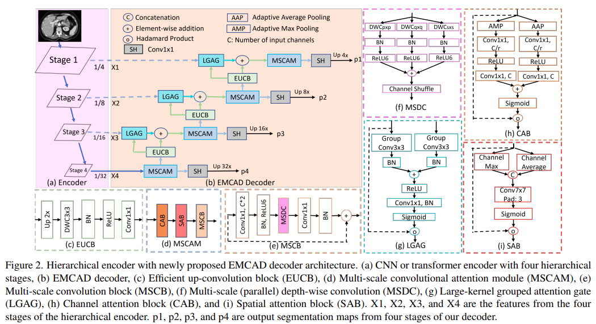
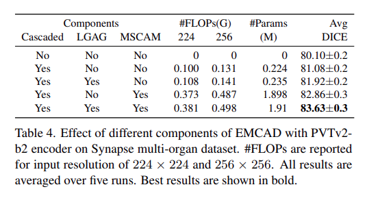
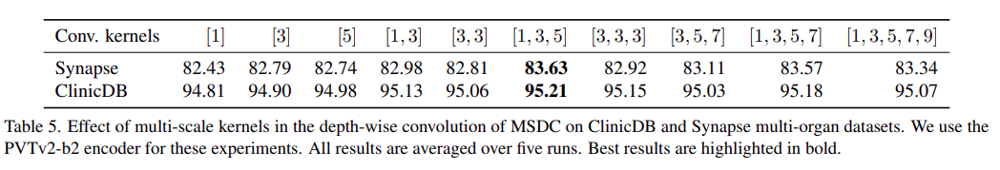

# [yolov11改进系列]基于yolov11引入高效上采样卷积块EUCB的python源码+训练源码

> FL1623863129 于 2025-05-31 08:50:07 发布 阅读量1k 收藏 30 点赞数 7 公开
> 文章链接：https://blog.csdn.net/FL1623863129/article/details/148348793

【EUCB介绍】

论文介绍
题目
EMCAD:EfficientMulti-scale Convolutional Attention Decoding for MedicalImageSegmentation

论文地址
https://arxiv.org/pdf/2405.06880

创新点
多尺度卷积解码器：提出了一种高效的多尺度卷积注意力解码器（EMCAD），专门设计用于医学图像分割任务，通过多尺度深度卷积块增强特征表示，有助于在有限的计算资源下提高分割性能。
多尺度卷积注意力模块：引入MSCAM模块，通过多尺度的深度卷积抑制无关区域并增强特征图，从而捕捉多尺度显著特征，降低了计算成本。
大核分组注意力门：在解码器中加入了一种大核分组注意力门，通过更大局部上下文捕捉显著特征，提升了模型对重要区域的关注度。
更低的计算成本与参数量：与现有的最先进方法相比，EMCAD在保持或提升分割精度的同时，显著减少了模型参数和浮点运算次数（FLOPs），在多个医学图像分割基准上达到了最优性能。
广泛适配性：EMCAD可用于不同的编码器结构，在多个医学图像分割任务中表现出优越的性能和适应性，适合在计算资源受限的实际应用场景中应用。
方法
整体结构
该模型由一个分层编码器和高效多尺度卷积注意力解码器（EMCAD）组成，通过编码器提取不同尺度的特征图，然后利用EMCAD中的多尺度卷积注意力模块、分组注意力门和上采样模块逐步融合和增强这些特征，实现精确的医学图像分割。最终，通过分割头输出高分辨率的分割结果，模型在保持高精度的同时显著降低了计算成本。

 

分层编码器：模型使用了层次化的编码器来提取不同尺度的特征图，这些特征图被分为多个阶段。编码器可以是PVTv2-B0或PVTv2-B2等预训练模型，用于捕捉输入图像的多尺度信息。分层编码器输出四个特征图（即X1, X2, X3, X4），用于后续解码处理。
EMCAD解码器：这是论文的核心创新部分，包含多个模块：
多尺度卷积注意力模块（MSCAM）：通过深度卷积在不同尺度上对特征图进行处理，增强特征表示并抑制无关区域。
大核分组注意力门（LGAG）：通过分组卷积结合大核，进一步融合编码器和解码器之间的特征，以捕捉更大的上下文信息。
高效上采样卷积块（EUCB）：该模块用于逐步上采样特征图，将特征的空间分辨率提升到目标输出的分辨率。
分割头（SH）：每个阶段的特征图都通过一个1×1卷积输出一个分割图，最终整合多个分割图生成最终的分割结果。
多阶段损失和输出整合：解码器每个阶段生成的分割图会参与损失计算，采用多种组合方式计算损失，以强化各阶段输出的精度。最终分割图使用Sigmoid或Softmax函数生成二分类或多分类的分割结果。
即插即用模块作用
EUCB 作为一个即插即用模块，主要适用于：

医学图像分割：如CT、MRI等医学影像的像素级分割任务。
语义分割：广泛应用于需要精细分割的任务中，包括遥感图像分析、自动驾驶中的路面分割等。
资源受限场景：在计算资源有限的设备（如边缘设备、移动端）上实现高效图像分割。
消融实验结果

 

展示了不同组件对模型性能的影响，评估了解码器的级联结构、大核分组注意力门（LGAG）和多尺度卷积注意力模块（MSCAM）的贡献。实验结果显示，逐步添加这些模块能显著提升模型的DICE分数，其中MSCAM的效果尤为显著，当同时使用LGAG和MSCAM时，模型达到了最佳性能。这表明这两个模块在捕捉多尺度特征和增强局部上下文信息方面发挥了关键作用。

 

探讨了多尺度卷积内不同卷积核的选择对性能的影响。实验结果表明，使用1x1、3x3和5x5卷积核组合能够带来最佳性能，这一组合在捕捉多尺度特征方面具有优势。而进一步添加更大的卷积核（如7x7或9x9）反而降低了性能，说明适当的卷积核大小组合有助于模型在保持计算效率的同时提升分割效果。

【yolov11框架介绍】

2024 年 9 月 30 日，Ultralytics 在其活动 YOLOVision 中正式发布了 YOLOv11。YOLOv11 是 YOLO 的最新版本，由美国和西班牙的 Ultralytics 团队开发。YOLO 是一种用于基于图像的人工智能的计算机模

#### Ultralytics YOLO11 概述

YOLO11 是Ultralytics YOLO 系列实时物体检测器的最新版本，以尖端的精度、速度和效率重新定义了可能性。基于先前 YOLO 版本的令人印象深刻的进步，YOLO11 在架构和训练方法方面引入了重大改进，使其成为各种计算机视觉任务的多功能选择。


#### Key Features 主要特点

- 增强的特征提取：YOLO11采用改进的主干和颈部架构，增强了特征提取能力，以实现更精确的目标检测和复杂任务性能。

- 针对效率和速度进行优化：YOLO11 引入了精致的架构设计和优化的训练管道，提供更快的处理速度并保持准确性和性能之间的最佳平衡。

- 使用更少的参数获得更高的精度：随着模型设计的进步，YOLO11m 在 COCO 数据集上实现了更高的平均精度(mAP)，同时使用的参数比 YOLOv8m 少 22%，从而在不影响精度的情况下提高计算效率。

- 跨环境适应性：YOLO11可以无缝部署在各种环境中，包括边缘设备、云平台以及支持NVIDIA [GPU](https://cloud.tencent.com/product/gpu?from_column=20065&from=20065) 的系统，确保最大的灵活性。

- 支持的任务范围广泛：无论是对象检测、实例分割、图像分类、姿态估计还是定向对象检测 (OBB)，YOLO11 旨在应对各种计算机视觉挑战。

 

​​

##### 与之前的版本相比，Ultralytics YOLO11 有哪些关键改进？

Ultralytics YOLO11 与其前身相比引入了多项重大进步。主要改进包括：

- 增强的特征提取：YOLO11采用改进的主干和颈部架构，增强了特征提取能力，以实现更精确的目标检测。

- 优化的效率和速度：精细的架构设计和优化的训练管道可提供更快的处理速度，同时保持准确性和性能之间的平衡。

- 使用更少的参数获得更高的精度：YOLO11m 在 COCO 数据集上实现了更高的平均精度(mAP)，参数比 YOLOv8m 少 22%，从而在不影响精度的情况下提高计算效率。

- 跨环境适应性：YOLO11可以跨各种环境部署，包括边缘设备、云平台和支持NVIDIA GPU的系统。

- 支持的任务范围广泛：YOLO11 支持多种计算机视觉任务，例如对象检测、实例分割、图像分类、姿态估计和定向对象检测 (OBB)

【测试环境】

windows10 x64

ultralytics==8.3.0

torch==2.3.1

【改进流程】

##### 1. 新增EUCB.py实现模块（代码太多，核心模块源码请参考改进步骤.docx）然后在同级目录下面创建一个__init___.py文件写代码

from .EUCB import *

##### 2. 文件修改步骤

**修改tasks.py文件** 

**创建模型配置文件** 

yolo11-EUCB.yaml内容如下：

```cobol
# Ultralytics YOLO 🚀, AGPL-3.0 license
# YOLO11 object detection model with P3-P5 outputs. For Usage examples see https://docs.ultralytics.com/tasks/detect
 
# Parameters
nc: 2 # number of classes
scales: # model compound scaling constants, i.e. 'model=yolo11n.yaml' will call yolo11.yaml with scale 'n'
  # [depth, width, max_channels]
  n: [0.50, 0.25, 1024] # summary: 319 layers, 2624080 parameters, 2624064 gradients, 6.6 GFLOPs
  s: [0.50, 0.50, 1024] # summary: 319 layers, 9458752 parameters, 9458736 gradients, 21.7 GFLOPs
  m: [0.50, 1.00, 512] # summary: 409 layers, 20114688 parameters, 20114672 gradients, 68.5 GFLOPs
  l: [1.00, 1.00, 512] # summary: 631 layers, 25372160 parameters, 25372144 gradients, 87.6 GFLOPs
  x: [1.00, 1.50, 512] # summary: 631 layers, 56966176 parameters, 56966160 gradients, 196.0 GFLOPs
 
# YOLO11n backbone
backbone:
  # [from, repeats, module, args]
  - [-1, 1, Conv, [64, 3, 2]] # 0-P1/2
  - [-1, 1, Conv, [128, 3, 2]] # 1-P2/4
  - [-1, 2, C3k2, [256, False, 0.25]]
  - [-1, 1, Conv, [256, 3, 2]] # 3-P3/8
  - [-1, 2, C3k2, [512, False, 0.25]]
  - [-1, 1, Conv, [512, 3, 2]] # 5-P4/16
  - [-1, 2, C3k2, [512, True]]
  - [-1, 1, Conv, [1024, 3, 2]] # 7-P5/32
  - [-1, 2, C3k2, [1024, True]]
  - [-1, 1, SPPF, [1024, 5]] # 9
  - [-1, 2, C2PSA, [1024]] # 10
 
# YOLO11n head
head:
  - [-1, 1, EUCB, []]
  - [[-1, 6], 1, Concat, [1]] # cat backbone P4
  - [-1, 2, C3k2, [512, False]] # 13
 
  - [-1, 1, EUCB, []]
  - [[-1, 4], 1, Concat, [1]] # cat backbone P3
  - [-1, 2, C3k2, [256, False]] # 16 (P3/8-small)
 
  - [-1, 1, Conv, [256, 3, 2]]
  - [[-1, 13], 1, Concat, [1]] # cat head P4
  - [-1, 2, C3k2, [512, False]] # 19 (P4/16-medium)
 
  - [-1, 1, Conv, [512, 3, 2]]
  - [[-1, 10], 1, Concat, [1]] # cat head P5
  - [-1, 2, C3k2, [1024, True]] # 22 (P5/32-large)
 
  - [[16, 19, 22], 1, Detect, [nc]] # Detect(P3, P4, P5)
```

##### 3. 验证集成

使用新建的yaml配置文件启动训练任务：

```cobol
from ultralytics import YOLO
 
if __name__ == '__main__':
    model = YOLO('yolo11-EUCB.yaml')  # build from YAML and transfer weights
        # Train the model
    results = model.train(data='coco128.yaml',epochs=100, imgsz=640, batch=8, device=0, workers=1, save=True,resume=False)
```

成功集成后，训练日志中将显示EUCB模块的初始化信息，表明已正确加载到模型中。

<div style="text-align:center;">​</div>

【训练说明】

第一步：首先安装好yolov11必要模块，可以参考yolov11框架安装流程，然后卸载官方版本pip uninstall ultralytics，最后安装改进的源码pip install .
第二步：将自己数据集按照dataset文件夹摆放，要求文件夹名字都不要改变
第三步：分别打开train.py,coco128.yaml和模型参数yaml文件修改必要的参数，最后执行python train.py即可训练

【提供文件】

```cobol
├── [官方源码]ultralytics-8.3.0.zip
├── train/
│   ├── coco128.yaml
│   ├── dataset/
│   │   ├── train/
│   │   │   ├── images/
│   │   │   │   ├── firc_pic_1.jpg
│   │   │   │   ├── firc_pic_10.jpg
│   │   │   │   ├── firc_pic_11.jpg
│   │   │   │   ├── firc_pic_12.jpg
│   │   │   │   ├── firc_pic_13.jpg
│   │   │   ├── labels/
│   │   │   │   ├── classes.txt
│   │   │   │   ├── firc_pic_1.txt
│   │   │   │   ├── firc_pic_10.txt
│   │   │   │   ├── firc_pic_11.txt
│   │   │   │   ├── firc_pic_12.txt
│   │   │   │   ├── firc_pic_13.txt
│   │   └── val/
│   │       ├── images/
│   │       │   ├── firc_pic_100.jpg
│   │       │   ├── firc_pic_81.jpg
│   │       │   ├── firc_pic_82.jpg
│   │       │   ├── firc_pic_83.jpg
│   │       │   ├── firc_pic_84.jpg
│   │       ├── labels/
│   │       │   ├── firc_pic_100.txt
│   │       │   ├── firc_pic_81.txt
│   │       │   ├── firc_pic_82.txt
│   │       │   ├── firc_pic_83.txt
│   │       │   ├── firc_pic_84.txt
│   ├── train.py
│   ├── yolo11-EUCB.yaml
│   └── 训练说明.txt
├── [改进源码]ultralytics-8.3.0.zip
├── 改进原理.docx
└── 改进流程.docx
```

【常见问题汇总】
问：为什么我训练的模型epoch显示的map都是0或者map精度很低?
回答：由于源码改进过，因此不能直接从官方模型微调，而是从头训练，这样学习特征能力会很弱，需要训练很多epoch才能出现效果。此外由于改进的源码框架并不一定能够保证会超过官方精度，而且也有可能会存在远远不如官方效果，甚至精度会很低。这说明改进的框架并不能取得很好效果。所以说对于框架改进只是提供一种可行方案，至于改进后能不能取得很好map还需要结合实际训练情况确认，当然也不排除数据集存在问题，比如数据集比较单一，样本分布不均衡，泛化场景少，标注框不太贴合标注质量差，检测目标很小等等原因
【重要说明】
我们只提供改进框架一种方案，并不保证能够取得很好训练精度，甚至超过官方模型精度。因为改进框架，实际是一种比较复杂流程，包括框架原理可行性，训练数据集是否合适，训练需要反正验证以及同类框架训练结果参数比较，这个是十分复杂且漫长的过程。