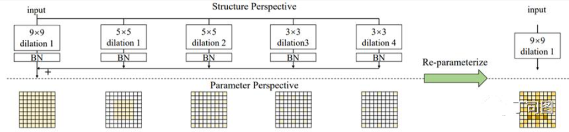

# [yolov11改进系列]基于yolov11使用大卷积核UniRepLKNet替换backbone的python源码+训练源码

> FL1623863129 于 2025-06-03 12:16:49 发布 阅读量849 收藏 10 点赞数 15 公开
> 文章链接：https://blog.csdn.net/FL1623863129/article/details/148398882

【UniRepLKNet介绍】

大内核卷积神经网络（ConvNet）最近受到了广泛的研究关注，但有两个未解决的关键问题需要进一步研究。1）现有大内核ConvNet的架构很大程度上遵循传统ConvNet或Transformer的设计原则，而大内核ConvNet的架构设计仍然没有得到解决。2）由于 Transformer 已经主导了多种模态，ConvNet 是否在视觉以外的领域也具有强大的通用感知能力还有待研究。在本文中，我们从两个方面做出贡献。1）我们提出了设计大内核ConvNet的四个架构指南，其核心是利用大内核区别于小内核的本质特征——看得宽而不深入。遵循这些准则，我们提出的大内核 ConvNet 在图像识别方面表现出了领先的性能。例如，我们的模型实现了 88.0% 的 ImageNet 准确率、55.6% 的 [ADE20K](https://zhida.zhihu.com/search?content_id=240686553&content_type=Article&match_order=1&q=ADE20K&zhida_source=entity) mIoU 和 56.4% 的 [COCO box AP](https://zhida.zhihu.com/search?content_id=240686553&content_type=Article&match_order=1&q=COCO+box+AP&zhida_source=entity) ，表现出比最近提出的一些强大竞争对手更好的性能和更高的速度。2）我们发现，大内核是在 ConvNet 原本不擅长的领域发挥卓越性能的关键。通过某些与模态相关的预处理方法，即使没有对架构进行模态特定的定制，所提出的模型也能在时间序列预测和音频识别任务上实现最先进的性能。


大卷积核CNN设计：

- 局部结构设计：使用SE、bottleneck等高效结构来增加深度。

- 重参数化：用膨胀卷积来捕捉稀疏特征。本文提出了一个子模块叫 [Dilated Reparam Block](https://zhida.zhihu.com/search?content_id=240686553&content_type=Article&match_order=1&q=Dilated+Reparam+Block&zhida_source=entity) ，这个模块中除了大核卷积以外，还用了并行的膨胀卷积，而且利用 **结构重参数化** 的思想， **整个block可以等价转换为一个大核卷积** 。这是因为 **小kernel+膨胀卷积等价于大kernel+非膨胀卷积** 。如下图所示。

- 关于kernel size：根据下游任务及所采用的具体框架来选定kernel size；对本文涉及的任务而言，13x13是足够的。

- 关于scaling law：对一个已经用了很多大kernel的小模型而言，当增加模型的深度时（例如从Tiny级别模型的18层增加到Base级别的36层），增加的那些block应该用depthwise 3x3，不用再增加大kernel了，感受野已经足够大了，但用3x3这么高效的操作来提高特征抽象层次总是有好处的。

 

大卷积核的优势到底是什么呢？我们认为是不依赖深度堆叠的大 **感受野** 。深度又代表什么？一方面是 **更高层次的特征抽象** ，另一方面是更强的 **一般的表示能力** 。我们的新架构设计原则来自于对这三个概念的一些思考。首先我们详细比较一下这三个概念。

- 最大感受野描述了当模型试图抽取空间pattern时，特征图上的一个点理论上能与多远的点建立空间联系。例如，如果我堆叠三个3x3，得到的最大感受野就是7x7，那么一个点最多能和与它间隔5个点的另一个点建立联系。然而在实际的CNN中，两个点之间可能虽然理论上存在联系，但这一联系是通过若干层才实现的，非常微弱，对最终的输出影响极小。这就引入了有效感受野的概念。有理论分析表明，一个模型的有效感受野正比于kernel size乘以层数的平方根 [2]。也就是说，随着层数越来越深，进一步加深模型带来的提升有效感受野的效用是边际递减的。RepLKNet等工作表明，像 [ResNet-152](https://zhida.zhihu.com/search?content_id=240466174&content_type=Article&match_order=1&q=ResNet-152&zhida_source=entity) 这种模型虽然有几十个3x3卷积层，但其有效感受野其实不大，而且相对于ResNet-101并没有本质提升。

- 特征抽象的层次也与空间pattern有关。当讨论感受野时，我们关注模型能感知“多大的范围”，但除此之外，我们还要关注模型能感知“多高的抽象层次”。卷积神经网络的直观解释是模型通过用卷积核逐层提取空间pattern，令得到的特征的抽象层次越来越高，例如从线条到纹理，从纹理到物体的局部，再到物体。除了这种直观的抽象层次以外，CNN提取到的抽象层次也可能是人类所无法理解的。

- 深度所带来的一般的表示能力来自于更多的trainable参数和非线性激活函数。一般来说，更深的、参数更多的模型可以拟合更复杂的函数，从而学到更复杂的表征。

传统的卷积网络架构具有什么样的共性呢？我们注意到，当我们向网络中添加一个3x3或5x5卷积层时，我们实际上期望它 **同时产生三个作用：增大感受野、提高抽象层次、通过增加深度而一般地提高表征能力。** 

这给传统卷积网络设计带来了怎样的局限呢？

- 小卷积核必须要大量堆叠才能实现大感受野，所以我们得用很多3x3或者5x5层，而且最终效果也不好。

- 卷积层多了，特征抽象层次当然是够了，但到底多高的抽象层次算够？谁也不知道，因为这东西跟感受野是紧密耦合的，没法单独调整。

- 卷积层占用的参数和运算量太多了，在模型大小的限制下，很难再进一步提高其一般的表征能力了。

在大卷积核的加持下，我们可以用很少的大卷积核就实现足够的有效感受野。如果我们还遵循传统CNN的堆叠卷积核的设计范式，会有哪些不对劲的地方？

- 感受野可能过大了。这个问题不只是浪费算力而已。对于一些下游任务的framework（如语义分割的 [UperNet](https://zhida.zhihu.com/search?content_id=240466174&content_type=Article&match_order=1&q=UperNet&zhida_source=entity) ）而言，backbone中的低层feature过早地获得过大的感受野可能会产生负面效果（本来低层feature应该是局部特征，UperNet将其与高层feature组合才能涨点；而现在低层感受野也很大，全变成全局特征了）。

- 在感受野完全足够的前提下，把较低抽象层次的特征变成较高抽象层次的特征这种简单工作，明明一个depthwise 3x3就能胜任，我非要用一个31x31来干，属实没有必要。

- 模型可能只用很少的层就实现了大感受野，但如果我们止步于这样的深度（如RepLKNet只用了24个超大卷积层和24个FFN结构），模型的表征能力可能不够。

那我们应该遵循怎样的原则去设计大卷积核CNN架构？我们的回答是 **解耦上述三种要素，需要什么效果就用对应的结构来实现。** 我们能够实现这样的解耦，正是大卷积核的本质优势所保证的。

- 用少量大卷积核保证大感受野。

- 用depthwise 3x3等小卷积提高特征抽象层次。

- 用一些高效结构（如SE Block、Bottleneck structure等）来提高模型的深度从而增强其一般的表示能力。

在这一思想的指导下，我们进行了一系列系统的研究，提出了大卷积核CNN设计的 **四条Architectural Guidelines** ，简单概括如下：

- 关于局部结构设计：用一些像SE或bottleneck之类的高效结构来增加深度。

- 关于重参数化：用膨胀卷积来捕捉稀疏特征。本文提出了一个子模块叫Dilated Reparam Block，这个模块中除了大核卷积以外，还用了并行的膨胀卷积，而且利用 **结构重参数化** 的思想， **整个block可以等价转换为一个大核卷积** 。这是因为 **小kernel+膨胀卷积等价于大kernel+非膨胀卷积** 。如下图所示。

- 关于kernel size：根据下游任务及所采用的具体框架来选定kernel size。正如前文所提到的，对语义分割框架UperNet而言，低层feature过早地获得过大的感受野可能会产生负面效果。但这并不意味着大kernel会降低模型的表征能力或最终feature的质量！RepLKNet的“kernel size加大至少不会变差”的结论并没有被推翻（RepLKNet做语义分割用的是 [DeepLabv3](https://zhida.zhihu.com/search?content_id=240466174&content_type=Article&match_order=1&q=DeepLabv3&zhida_source=entity) ，不依赖于低层的特征的局部性），只是被修正了。对本文涉及的任务而言，13x13是足够的。

- 关于scaling law：对一个已经用了很多大kernel的小模型而言，当增加模型的深度时（例如从Tiny级别模型的18层增加到Base级别的36层），增加的那些block应该用depthwise 3x3，不用再增加大kernel了，感受野已经足够大了，但用3x3这么高效的操作来提高特征抽象层次总是有好处的。

【yolov11框架介绍】

2024 年 9 月 30 日，Ultralytics 在其活动 YOLOVision 中正式发布了 YOLOv11。YOLOv11 是 YOLO 的最新版本，由美国和西班牙的 Ultralytics 团队开发。YOLO 是一种用于基于图像的人工智能的计算机模

#### Ultralytics YOLO11 概述

YOLO11 是Ultralytics YOLO 系列实时物体检测器的最新版本，以尖端的精度、速度和效率重新定义了可能性。基于先前 YOLO 版本的令人印象深刻的进步，YOLO11 在架构和训练方法方面引入了重大改进，使其成为各种计算机视觉任务的多功能选择。


#### Key Features 主要特点

- 增强的特征提取：YOLO11采用改进的主干和颈部架构，增强了特征提取能力，以实现更精确的目标检测和复杂任务性能。

- 针对效率和速度进行优化：YOLO11 引入了精致的架构设计和优化的训练管道，提供更快的处理速度并保持准确性和性能之间的最佳平衡。

- 使用更少的参数获得更高的精度：随着模型设计的进步，YOLO11m 在 COCO 数据集上实现了更高的平均精度(mAP)，同时使用的参数比 YOLOv8m 少 22%，从而在不影响精度的情况下提高计算效率。

- 跨环境适应性：YOLO11可以无缝部署在各种环境中，包括边缘设备、云平台以及支持NVIDIA [GPU](https://cloud.tencent.com/product/gpu?from_column=20065&from=20065) 的系统，确保最大的灵活性。

- 支持的任务范围广泛：无论是对象检测、实例分割、图像分类、姿态估计还是定向对象检测 (OBB)，YOLO11 旨在应对各种计算机视觉挑战。

 

​​​

##### 与之前的版本相比，Ultralytics YOLO11 有哪些关键改进？

Ultralytics YOLO11 与其前身相比引入了多项重大进步。主要改进包括：

- 增强的特征提取：YOLO11采用改进的主干和颈部架构，增强了特征提取能力，以实现更精确的目标检测。

- 优化的效率和速度：精细的架构设计和优化的训练管道可提供更快的处理速度，同时保持准确性和性能之间的平衡。

- 使用更少的参数获得更高的精度：YOLO11m 在 COCO 数据集上实现了更高的平均精度(mAP)，参数比 YOLOv8m 少 22%，从而在不影响精度的情况下提高计算效率。

- 跨环境适应性：YOLO11可以跨各种环境部署，包括边缘设备、云平台和支持NVIDIA GPU的系统。

- 支持的任务范围广泛：YOLO11 支持多种计算机视觉任务，例如对象检测、实例分割、图像分类、姿态估计和定向对象检测 (OBB)

【测试环境】

windows10 x64

ultralytics==8.3.0

torch==2.3.1

RTX2070显卡8GB，使用改进源码推荐显存>=6GB，显卡型号不限

【改进流程】

##### 1. 新增UniRepLKNet.py实现模块（代码太多，核心模块源码请参考改进步骤.docx）然后在同级目录下面创建一个__init___.py文件写代码

from .UniRepLKNet import *

##### 2. 文件修改步骤

**修改tasks.py文件** 

**创建模型配置文件** 

yolo11-UniRepLKNet.yaml内容如下：

```cobol
# Ultralytics YOLO 🚀, AGPL-3.0 license
# YOLO11 object detection model with P3-P5 outputs. For Usage examples see https://docs.ultralytics.com/tasks/detect
 
# Parameters
nc: 80 # number of classes
scales: # model compound scaling constants, i.e. 'model=yolo11n.yaml' will call yolo11.yaml with scale 'n'
  # [depth, width, max_channels]
  n: [0.50, 0.25, 1024] # summary: 319 layers, 2624080 parameters, 2624064 gradients, 6.6 GFLOPs
  s: [0.50, 0.50, 1024] # summary: 319 layers, 9458752 parameters, 9458736 gradients, 21.7 GFLOPs
  m: [0.50, 1.00, 512] # summary: 409 layers, 20114688 parameters, 20114672 gradients, 68.5 GFLOPs
  l: [1.00, 1.00, 512] # summary: 631 layers, 25372160 parameters, 25372144 gradients, 87.6 GFLOPs
  x: [1.00, 1.50, 512] # summary: 631 layers, 56966176 parameters, 56966160 gradients, 196.0 GFLOPs
 
# 0-P1/2
# 1-P2/4
# 2-P3/8
# 3-P4/16
# 4-P5/32
 
# YOLO11n backbone
backbone:
  # [from, repeats, module, args]
  - [-1, 1, unireplknet_a, []]  # 4
  - [-1, 1, SPPF, [1024, 5]]  # 5
  - [-1, 2, C2PSA, [1024]] # 6
 
# YOLO11n head
head:
  - [-1, 1, nn.Upsample, [None, 2, "nearest"]]
  - [[-1, 3], 1, Concat, [1]] # cat backbone P4
  - [-1, 2, C3k2, [512, False]] # 9
 
  - [-1, 1, nn.Upsample, [None, 2, "nearest"]]
  - [[-1, 2], 1, Concat, [1]] # cat backbone P3
  - [-1, 2, C3k2, [256, False]] # 12 (P3/8-small)
 
  - [-1, 1, Conv, [256, 3, 2]]
  - [[-1, 9], 1, Concat, [1]] # cat head P4
  - [-1, 2, C3k2, [512, False]] # 15 (P4/16-medium)
 
  - [-1, 1, Conv, [512, 3, 2]]
  - [[-1, 6], 1, Concat, [1]] # cat head P5
  - [-1, 2, C3k2, [1024, True]] # 18 (P5/32-large)
 
  - [[12, 15, 18], 1, Detect, [nc]] # Detect(P3, P4, P5)
```

##### 3. 验证集成

git搜futureflsl/yolo-improve获取源码，然后使用新建的yaml配置文件启动训练任务：

```cobol
from ultralytics import YOLO
 
if __name__ == '__main__':
    model = YOLO('yolo11-UniRepLKNet.yaml')  # build from YAML and transfer weights
        # Train the model
    results = model.train(data='coco128.yaml',epochs=100, imgsz=640, batch=8, device=0, workers=1, save=True,resume=False)
```

成功集成后，训练日志中将显示UniRepLKNet模块的初始化信息，表明已正确加载到模型中。

<div style="text-align:center;">​​</div>

【训练说明】

第一步：首先安装好yolov11必要模块，可以参考yolov11框架安装流程，然后卸载官方版本pip uninstall ultralytics，最后安装改进的源码pip install .
第二步：将自己数据集按照dataset文件夹摆放，要求文件夹名字都不要改变
第三步：分别打开train.py,coco128.yaml和模型参数yaml文件修改必要的参数，最后执行python train.py即可训练

【提供文件】

```cobol
├── [官方源码]ultralytics-8.3.0.zip
├── train/
│   ├── coco128.yaml
│   ├── dataset/
│   │   ├── train/
│   │   │   ├── images/
│   │   │   │   ├── firc_pic_1.jpg
│   │   │   │   ├── firc_pic_10.jpg
│   │   │   │   ├── firc_pic_11.jpg
│   │   │   │   ├── firc_pic_12.jpg
│   │   │   │   ├── firc_pic_13.jpg
│   │   │   ├── labels/
│   │   │   │   ├── classes.txt
│   │   │   │   ├── firc_pic_1.txt
│   │   │   │   ├── firc_pic_10.txt
│   │   │   │   ├── firc_pic_11.txt
│   │   │   │   ├── firc_pic_12.txt
│   │   │   │   ├── firc_pic_13.txt
│   │   └── val/
│   │       ├── images/
│   │       │   ├── firc_pic_100.jpg
│   │       │   ├── firc_pic_81.jpg
│   │       │   ├── firc_pic_82.jpg
│   │       │   ├── firc_pic_83.jpg
│   │       │   ├── firc_pic_84.jpg
│   │       ├── labels/
│   │       │   ├── firc_pic_100.txt
│   │       │   ├── firc_pic_81.txt
│   │       │   ├── firc_pic_82.txt
│   │       │   ├── firc_pic_83.txt
│   │       │   ├── firc_pic_84.txt
│   ├── train.py
│   ├── yolo11-UniRepLKNet.yaml
│   └── 训练说明.txt
├── [改进源码]ultralytics-8.3.0.zip
├── 改进原理.docx
└── 改进流程.docx
```

【常见问题汇总】
问：为什么我训练的模型epoch显示的map都是0或者map精度很低?
回答：由于源码改进过，因此不能直接从官方模型微调，而是从头训练，这样学习特征能力会很弱，需要训练很多epoch才能出现效果。此外由于改进的源码框架并不一定能够保证会超过官方精度，而且也有可能会存在远远不如官方效果，甚至精度会很低。这说明改进的框架并不能取得很好效果。所以说对于框架改进只是提供一种可行方案，至于改进后能不能取得很好map还需要结合实际训练情况确认，当然也不排除数据集存在问题，比如数据集比较单一，样本分布不均衡，泛化场景少，标注框不太贴合标注质量差，检测目标很小等等原因
【重要说明】
我们只提供改进框架一种方案，并不保证能够取得很好训练精度，甚至超过官方模型精度。因为改进框架，实际是一种比较复杂流程，包括框架原理可行性，训练数据集是否合适，训练需要反正验证以及同类框架训练结果参数比较，这个是十分复杂且漫长的过程。