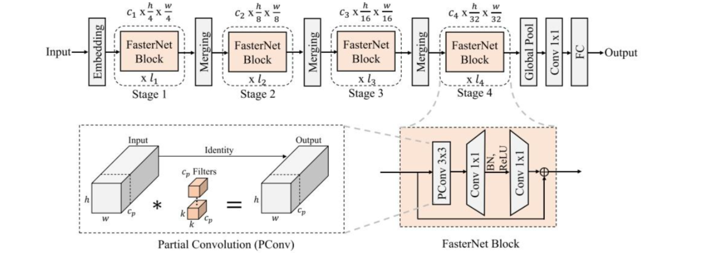

# [yolov11改进系列]基于yolov11使用FasterNet替换backbone用于轻量化网络的python源码+训练源码

> FL1623863129 于 2025-06-03 20:40:03 发布 阅读量859 收藏 23 点赞数 8 公开
> 文章链接：https://blog.csdn.net/FL1623863129/article/details/148409430

【FasterNet介绍】
为了设计快速神经网络，许多工作都集中在减少浮点运算的数量（FLOPs）上。 然而，我们观察到FLOPs的减少并不一定会导致延迟的类似程度的减少。 这主要源于低效率的每秒浮点运算(FLOPS)。 为了实现更快的网络，我们回顾了流行的操作，并证明如此低的FLOPS主要是由于操作频繁的内存访问，特别是深度卷积。 因此，我们提出了一种新的部分卷积(PConv)，通过同时减少冗余计算和内存访问，可以更有效地提取空间特征。 在Ponv的基础上，我们进一步提出了FasterNet，这是一个新的神经网络家族，它在各种设备上获得了比其他网络更高的运行速度，而不影响各种视觉任务的准确性。 例如，在ImageNet1K上，我们的微型FasterNet-T0在GPU、CPU和ARM处理器上分别比MobileVit-XXS快3.1×、3.1×和2.5×，同时精度提高2.9%。 我们的大型FasterNet-L实现了令人印象深刻的83.5%的Top-1准确率，与新兴的Swin-B不相上下，同时在GPU上提高了49%的推断吞吐量，并在CPU上节省了42%的计算时间。


###  **1. FasterNet** 

本文思考了一个问题：怎样才能更快？之前的工作大多使用FLOPs来表示神经网络的快慢，但是某些操作（如 [DWConv](https://zhida.zhihu.com/search?content_id=228944314&content_type=Article&match_order=1&q=DWConv&zhida_source=entity) ）实际运行并不快，这主要是因为频繁的内存访问。本文提出了新的见解：设计一个低FLOPs高FLOPS的操作，这样可以加快网络运行速度。由此，本文作者提出了一个“T型”的卷积——PConv，主要思想是DWConv虽然FLOPs小，但是由于频繁的内存访问导致FLOPS也小。由于网络存在冗余通道，那我是不是可以设计一个网络只用一部分去做空间计算，作者就尝试了这一想法，发现效果非常好，速度快，精度高。具体的操作如图5所示：


 

基于PConv和传统的分层Transformer，本文提出了一个新的网络架构——FasterNet，结构图如图所示：

 

​FasterNet的网络结构借鉴CNN的设计理念，通过提出的PConv减少推理时的计算和内存成本，同时减少通道数并增加部分比例，降低延迟，并通过后续的 PWConv 来弥补特征信息可能缺失的问题，提高了准确性。

【yolov11框架介绍】

2024 年 9 月 30 日，Ultralytics 在其活动 YOLOVision 中正式发布了 YOLOv11。YOLOv11 是 YOLO 的最新版本，由美国和西班牙的 Ultralytics 团队开发。YOLO 是一种用于基于图像的人工智能的计算机模

#### Ultralytics YOLO11 概述

YOLO11 是Ultralytics YOLO 系列实时物体检测器的最新版本，以尖端的精度、速度和效率重新定义了可能性。基于先前 YOLO 版本的令人印象深刻的进步，YOLO11 在架构和训练方法方面引入了重大改进，使其成为各种计算机视觉任务的多功能选择。


#### Key Features 主要特点

- 增强的特征提取：YOLO11采用改进的主干和颈部架构，增强了特征提取能力，以实现更精确的目标检测和复杂任务性能。

- 针对效率和速度进行优化：YOLO11 引入了精致的架构设计和优化的训练管道，提供更快的处理速度并保持准确性和性能之间的最佳平衡。

- 使用更少的参数获得更高的精度：随着模型设计的进步，YOLO11m 在 COCO 数据集上实现了更高的平均精度(mAP)，同时使用的参数比 YOLOv8m 少 22%，从而在不影响精度的情况下提高计算效率。

- 跨环境适应性：YOLO11可以无缝部署在各种环境中，包括边缘设备、云平台以及支持NVIDIA [GPU](https://cloud.tencent.com/product/gpu?from_column=20065&from=20065) 的系统，确保最大的灵活性。

- 支持的任务范围广泛：无论是对象检测、实例分割、图像分类、姿态估计还是定向对象检测 (OBB)，YOLO11 旨在应对各种计算机视觉挑战。

 

​​​

##### 与之前的版本相比，Ultralytics YOLO11 有哪些关键改进？

Ultralytics YOLO11 与其前身相比引入了多项重大进步。主要改进包括：

- 增强的特征提取：YOLO11采用改进的主干和颈部架构，增强了特征提取能力，以实现更精确的目标检测。

- 优化的效率和速度：精细的架构设计和优化的训练管道可提供更快的处理速度，同时保持准确性和性能之间的平衡。

- 使用更少的参数获得更高的精度：YOLO11m 在 COCO 数据集上实现了更高的平均精度(mAP)，参数比 YOLOv8m 少 22%，从而在不影响精度的情况下提高计算效率。

- 跨环境适应性：YOLO11可以跨各种环境部署，包括边缘设备、云平台和支持NVIDIA GPU的系统。

- 支持的任务范围广泛：YOLO11 支持多种计算机视觉任务，例如对象检测、实例分割、图像分类、姿态估计和定向对象检测 (OBB)

【测试环境】

windows10 x64

ultralytics==8.3.0

torch==2.3.1

【改进流程】

##### 1. 新增FasterNet.py实现模块（代码太多，核心模块源码请参考改进步骤.docx）然后在同级目录下面创建一个__init___.py文件写代码

from .FasterNet import *

##### 2. 文件修改步骤

**修改tasks.py文件** 

**创建模型配置文件** 

yolo11-FasterNet.yaml内容如下：

```cobol
# Ultralytics YOLO 🚀, AGPL-3.0 license
# YOLO11 object detection model with P3-P5 outputs. For Usage examples see https://docs.ultralytics.com/tasks/detect
 
# Parameters
nc: 80 # number of classes
scales: # model compound scaling constants, i.e. 'model=yolo11n.yaml' will call yolo11.yaml with scale 'n'
  # [depth, width, max_channels]
  n: [0.50, 0.25, 1024] # summary: 319 layers, 2624080 parameters, 2624064 gradients, 6.6 GFLOPs
  s: [0.50, 0.50, 1024] # summary: 319 layers, 9458752 parameters, 9458736 gradients, 21.7 GFLOPs
  m: [0.50, 1.00, 512] # summary: 409 layers, 20114688 parameters, 20114672 gradients, 68.5 GFLOPs
  l: [1.00, 1.00, 512] # summary: 631 layers, 25372160 parameters, 25372144 gradients, 87.6 GFLOPs
  x: [1.00, 1.50, 512] # summary: 631 layers, 56966176 parameters, 56966160 gradients, 196.0 GFLOPs
 
# 下面 [-1, 1, FasterNet, [0.25]] 参数位置的0.25是通道放缩的系数, YOLOv11N是0.25 YOLOv11S是0.5 YOLOv11M是1. YOLOv11l是1 YOLOv11是1.5大家根据自己训练的YOLO版本设定即可.
# YOLO11n backbone
backbone:
  # [from, repeats, module, args]
  - [-1, 1, FasterNet, [0.25]] # 0-4 P1/2 这里是四层
  - [-1, 1, SPPF, [1024, 5]] # 5
  - [-1, 2, C2PSA, [1024]] # 6
 
# YOLO11n head
head:
  - [-1, 1, nn.Upsample, [None, 2, "nearest"]]
  - [[-1, 3], 1, Concat, [1]] # cat backbone P4
  - [-1, 2, C3k2, [512, False]] # 9
 
  - [-1, 1, nn.Upsample, [None, 2, "nearest"]]
  - [[-1, 2], 1, Concat, [1]] # cat backbone P3
  - [-1, 2, C3k2, [256, False]] # 12 (P3/8-small)
 
  - [-1, 1, Conv, [256, 3, 2]]
  - [[-1, 9], 1, Concat, [1]] # cat head P4
  - [-1, 2, C3k2, [512, False]] # 15 (P4/16-medium)
 
  - [-1, 1, Conv, [512, 3, 2]]
  - [[-1, 6], 1, Concat, [1]] # cat head P5
  - [-1, 2, C3k2, [1024, True]] # 18 (P5/32-large)
 
  - [[12, 15, 18], 1, Detect, [nc]] # Detect(P3, P4, P5)
```

##### 3. 验证集成

git搜futureflsl/yolo-improve获取源码，然后使用新建的yaml配置文件启动训练任务：

```cobol
from ultralytics import YOLO
 
if __name__ == '__main__':
    model = YOLO('yolo11-FasterNet.yaml')  # build from YAML and transfer weights
        # Train the model
    results = model.train(data='coco128.yaml',epochs=100, imgsz=640, batch=8, device=0, workers=1, save=True,resume=False)
```

成功集成后，训练日志中将显示FasterNet模块的初始化信息，表明已正确加载到模型中。

<div style="text-align:center;">​​</div>

【训练说明】

第一步：首先安装好yolov11必要模块，可以参考yolov11框架安装流程，然后卸载官方版本pip uninstall ultralytics，最后安装改进的源码pip install .
第二步：将自己数据集按照dataset文件夹摆放，要求文件夹名字都不要改变
第三步：分别打开train.py,coco128.yaml和模型参数yaml文件修改必要的参数，最后执行python train.py即可训练

【提供文件】

```cobol
├── [官方源码]ultralytics-8.3.0.zip
├── train/
│   ├── coco128.yaml
│   ├── dataset/
│   │   ├── train/
│   │   │   ├── images/
│   │   │   │   ├── firc_pic_1.jpg
│   │   │   │   ├── firc_pic_10.jpg
│   │   │   │   ├── firc_pic_11.jpg
│   │   │   │   ├── firc_pic_12.jpg
│   │   │   │   ├── firc_pic_13.jpg
│   │   │   ├── labels/
│   │   │   │   ├── classes.txt
│   │   │   │   ├── firc_pic_1.txt
│   │   │   │   ├── firc_pic_10.txt
│   │   │   │   ├── firc_pic_11.txt
│   │   │   │   ├── firc_pic_12.txt
│   │   │   │   ├── firc_pic_13.txt
│   │   └── val/
│   │       ├── images/
│   │       │   ├── firc_pic_100.jpg
│   │       │   ├── firc_pic_81.jpg
│   │       │   ├── firc_pic_82.jpg
│   │       │   ├── firc_pic_83.jpg
│   │       │   ├── firc_pic_84.jpg
│   │       ├── labels/
│   │       │   ├── firc_pic_100.txt
│   │       │   ├── firc_pic_81.txt
│   │       │   ├── firc_pic_82.txt
│   │       │   ├── firc_pic_83.txt
│   │       │   ├── firc_pic_84.txt
│   ├── train.py
│   ├── yolo11-FasterNet.yaml
│   └── 训练说明.txt
├── [改进源码]ultralytics-8.3.0.zip
├── 改进原理.docx
└── 改进流程.docx
```

【常见问题汇总】
问：为什么我训练的模型epoch显示的map都是0或者map精度很低?
回答：由于源码改进过，因此不能直接从官方模型微调，而是从头训练，这样学习特征能力会很弱，需要训练很多epoch才能出现效果。此外由于改进的源码框架并不一定能够保证会超过官方精度，而且也有可能会存在远远不如官方效果，甚至精度会很低。这说明改进的框架并不能取得很好效果。所以说对于框架改进只是提供一种可行方案，至于改进后能不能取得很好map还需要结合实际训练情况确认，当然也不排除数据集存在问题，比如数据集比较单一，样本分布不均衡，泛化场景少，标注框不太贴合标注质量差，检测目标很小等等原因
【重要说明】
我们只提供改进框架一种方案，并不保证能够取得很好训练精度，甚至超过官方模型精度。因为改进框架，实际是一种比较复杂流程，包括框架原理可行性，训练数据集是否合适，训练需要反正验证以及同类框架训练结果参数比较，这个是十分复杂且漫长的过程。