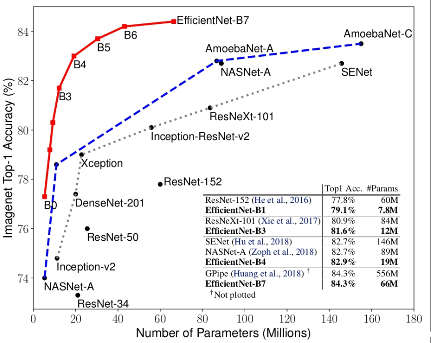
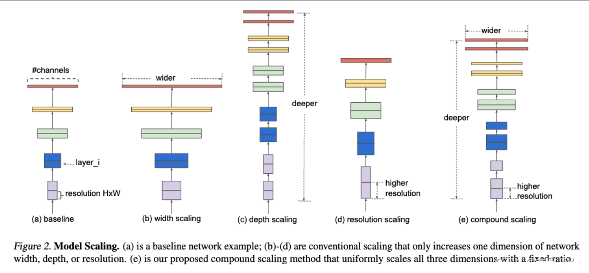
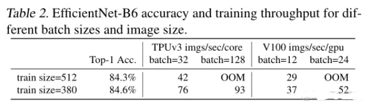
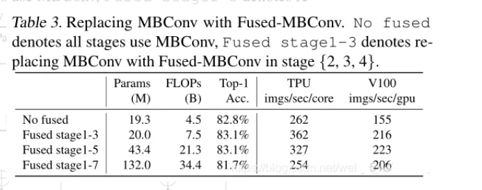
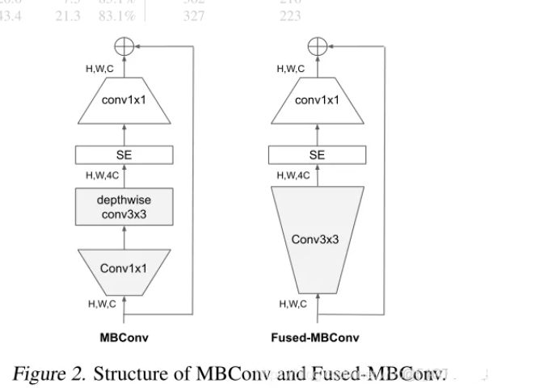
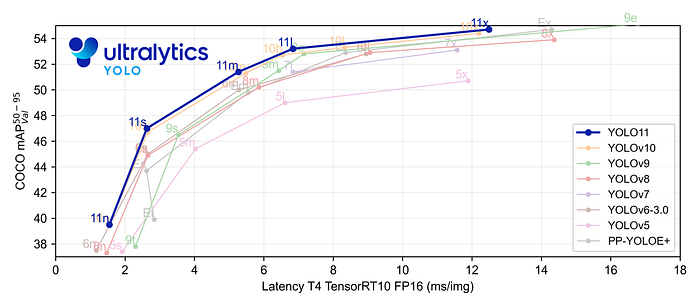
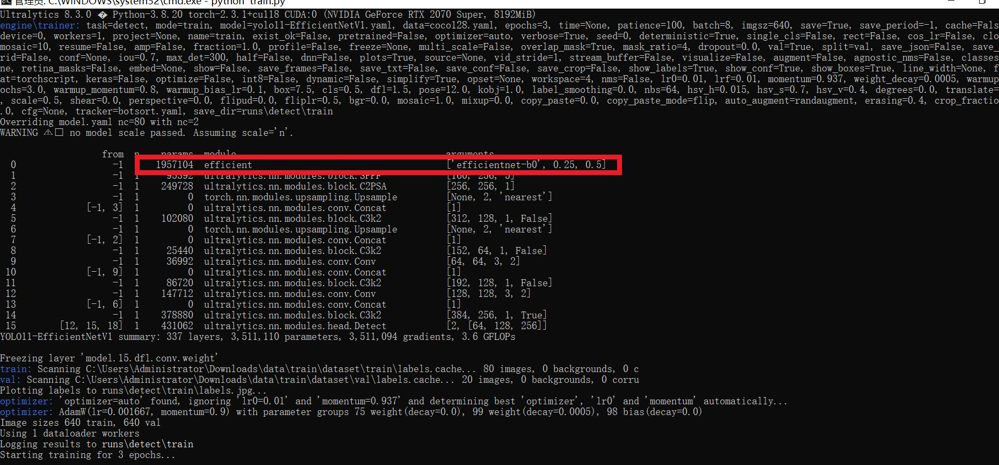

# [yolov11改进系列]基于yolov11使用EfficientNetV1或者EfficientNetV2替换backbone的python源码+训练源码

> FL1623863129 已于 2025-06-05 06:34:44 修改 阅读量891 收藏 22 点赞数 29 公开
> 文章链接：https://blog.csdn.net/FL1623863129/article/details/148425499

【EfficientNetV1介绍】

一. EfficientNet V1 神经网络介绍
EfficientNet 是 Google 提出的一种高效的神经网络架构，它的核心思想是通过比例缩放网络的宽度（通道数）、高度和深度（层数）来平衡计算资源和准确性。EfficientNet 使用了一种称为“复合缩放法”（compound scaling method），这种方法基于模型规模和训练数据量动态调整网络的宽度、高度和深度，以获得最佳性能。这种缩放方法使得模型能够根据可用的计算资源和数据量自适应地调整自身，从而在不同的硬件和数据集上都能达到较好的效果。

在论文中提到， 本文提出的 EfficientNet-B7 在 Imagenet top-1 上达到了当年最高准确率 84.3% ，与之前准确率最高的 GPipe 相比，参数数量仅为其 1/8.4 ，推理速度提升了 6.1 倍。

 

EfficientNet 的主要特点如下：

复合缩放法：

EfficientNet 根据训练数据量和计算资源动态调整网络的宽度、高度和深度。它使用一个固定的缩放系数来同时缩放网络的宽度、深度和分辨率，以找到最优的资源分配策略。
MobileNetV2 风格的倒置残差块：

EfficientNet 使用了类似于 MobileNetV2 的倒置残差块作为基本构建模块，其中包含了分组卷积和线性瓶颈结构，以及 Squeeze-and-Excitation 注意力机制。
AutoML：

EfficientNet 利用了 AutoML 技术来确定最佳的网络结构，通过自动化搜索得到最优的缩放系数。
混合精度训练：

EfficientNet 使用混合精度训练技术，即使用半精度（FP16）和单精度（FP32）混合的数据类型进行训练，以加速训练过程并在 GPU 上节省内存。
梯度带宽缩减：

为了避免梯度爆炸或消失的问题，EfficientNet 应用了梯度带宽缩减技术，这是一种改良版的梯度剪裁。
EfficientNet 有多个变体，从 EfficientNet-B0 到 EfficientNet-B7，它们的规模逐渐增大，性能也相应提升。这些变体通过复合缩放法生成，B0 是基础模型，其他变体则通过增加宽度、深度和输入图像分辨率来扩展 B0 的规模。

EfficientNet 的成功在于它能够在保持高准确率的同时，显著减小模型大小和计算需求，这对于资源有限的环境（如移动设备）非常有用。由于其良好的性能和效率，EfficientNet 已成为计算机视觉任务中的流行选择之一。

下图给出了模型的结构图。图 a 是传统的卷积神经网络，图 b 在 a 的基础上增大了网络的宽度（即特征矩阵的channel个数），图 c 在 a 的基础上增加了网络的深度（层的个数），图 d 在 a 的基础上增大了输入分辨率（即输入高和宽，这会使得之后所有特征矩阵的高和宽都会相应增加），图 e 即本文考虑的同时增加网络的宽度、深度、以及网络的输入分辨率。

 

【EfficientNetV2介绍】

EfficientNetV2 是 2021 年 4 月发表于 CVPR 的，其原始论文为 EfficientNetV2: Smaller Models and Faster Training。下图给出了EfficientNetV2 的性能，可其分为 S，M，L，XL 几个版本，在 ImageNet 21k 上进行预训练后，迁移参数到 ImageNet 1k 分类可见达到的正确率非常之高。相比而言 ViT 预训练后的性能也低了快两个点，训练速度也会更慢。

EfficientNetV1的不足：

使用非常大的图像尺寸进行训练是缓慢的。并且容易导致Out Of Memery

 

depthwise convolutions在早期层是缓慢的。DW卷积比常规卷积具有更少的参数和失败，但它们往往不能充分利用现代加速器。Fused-MBConv与MBConv的部分结合效果比较好。（如下图所示，1-3层用Fused-MBConv而其他层用MBConv效果最好）

 

两者的结构图：

 

同等地扩大每个阶段是次优的。EfficientNetV2将使用非统一的缩放策略，逐步添加更多的层到后面的阶段。并稍微修改了缩放规则，将图像的最大尺寸限制为较小的值。
EfficientNetV2的贡献：

提出EfficientNetV2，一个更小更快的新系列。通过我们的训练感知NAS和缩放发现，EfficientNetV2在训练速度和参数效率方面都优于以前的模型。
提出一种改进的渐进式学习方法，它可以自适应地调整正则化与图像大小。试验表明，它加快了训练，同时提高了准确性。
在ImageNet、CIFAR、Cars和Flowers数据集上演示了比现有技术快11倍的训练速度和6.8倍的参数效率。
EfficientNetV2的主要工作：

主要关注训练速度与参数量
对于小尺寸的图片采用小强度的正则化；对于大尺寸的图片采用高强度的正则化，提高了准确率，从而实现自适应正则化操作
使用NAS搜索技术优化训练速度与参数效率

【yolov11框架介绍】

2024 年 9 月 30 日，Ultralytics 在其活动 YOLOVision 中正式发布了 YOLOv11。YOLOv11 是 YOLO 的最新版本，由美国和西班牙的 Ultralytics 团队开发。YOLO 是一种用于基于图像的人工智能的计算机模

#### Ultralytics YOLO11 概述

YOLO11 是Ultralytics YOLO 系列实时物体检测器的最新版本，以尖端的精度、速度和效率重新定义了可能性。基于先前 YOLO 版本的令人印象深刻的进步，YOLO11 在架构和训练方法方面引入了重大改进，使其成为各种计算机视觉任务的多功能选择。



#### Key Features 主要特点

- 增强的特征提取：YOLO11采用改进的主干和颈部架构，增强了特征提取能力，以实现更精确的目标检测和复杂任务性能。

- 针对效率和速度进行优化：YOLO11 引入了精致的架构设计和优化的训练管道，提供更快的处理速度并保持准确性和性能之间的最佳平衡。

- 使用更少的参数获得更高的精度：随着模型设计的进步，YOLO11m 在 COCO 数据集上实现了更高的平均精度(mAP)，同时使用的参数比 YOLOv8m 少 22%，从而在不影响精度的情况下提高计算效率。

- 跨环境适应性：YOLO11可以无缝部署在各种环境中，包括边缘设备、云平台以及支持NVIDIA [GPU](https://cloud.tencent.com/product/gpu?from_column=20065&from=20065) 的系统，确保最大的灵活性。

- 支持的任务范围广泛：无论是对象检测、实例分割、图像分类、姿态估计还是定向对象检测 (OBB)，YOLO11 旨在应对各种计算机视觉挑战。

 

​​​

##### 与之前的版本相比，Ultralytics YOLO11 有哪些关键改进？

Ultralytics YOLO11 与其前身相比引入了多项重大进步。主要改进包括：

- 增强的特征提取：YOLO11采用改进的主干和颈部架构，增强了特征提取能力，以实现更精确的目标检测。

- 优化的效率和速度：精细的架构设计和优化的训练管道可提供更快的处理速度，同时保持准确性和性能之间的平衡。

- 使用更少的参数获得更高的精度：YOLO11m 在 COCO 数据集上实现了更高的平均精度(mAP)，参数比 YOLOv8m 少 22%，从而在不影响精度的情况下提高计算效率。

- 跨环境适应性：YOLO11可以跨各种环境部署，包括边缘设备、云平台和支持NVIDIA GPU的系统。

- 支持的任务范围广泛：YOLO11 支持多种计算机视觉任务，例如对象检测、实例分割、图像分类、姿态估计和定向对象检测 (OBB)

【测试环境】

windows10 x64

ultralytics==8.3.0

torch==2.3.1

RTX2070显卡 8GB显存，推荐显存>=6GB，否则可能训练不起来

【改进流程】

##### 1. 新增EfficientNetV1.py和EfficientNetV2.py实现模块（代码太多，核心模块源码请参考改进步骤.docx）然后在同级目录下面创建一个__init___.py文件写代码

from .EfficientNetV1 import *

from .EfficientNetV2 import *

##### 2. 文件修改步骤

**修改tasks.py文件** 

**创建模型配置文件** 

yolo11-EfficientNetV1.yaml内容如下：

```cobol
# Ultralytics YOLO 🚀, AGPL-3.0 license
# YOLO11 object detection model with P3-P5 outputs. For Usage examples see https://docs.ultralytics.com/tasks/detect
 
# Parameters
nc: 80 # number of classes
scales: # model compound scaling constants, i.e. 'model=yolo11n.yaml' will call yolo11.yaml with scale 'n'
  # [depth, width, max_channels]
  n: [0.50, 0.25, 1024] # summary: 319 layers, 2624080 parameters, 2624064 gradients, 6.6 GFLOPs
  s: [0.50, 0.50, 1024] # summary: 319 layers, 9458752 parameters, 9458736 gradients, 21.7 GFLOPs
  m: [0.50, 1.00, 512] # summary: 409 layers, 20114688 parameters, 20114672 gradients, 68.5 GFLOPs
  l: [1.00, 1.00, 512] # summary: 631 layers, 25372160 parameters, 25372144 gradients, 87.6 GFLOPs
  x: [1.00, 1.50, 512] # summary: 631 layers, 56966176 parameters, 56966160 gradients, 196.0 GFLOPs
 
# 下面 [-1, 1, efficientnet-b0}, [efficientnet-b0, 0.25，0.5]] 参数位置的0.25是通道放缩的系数, YOLOv11N是0.25 YOLOv11S是0.5 YOLOv11M是1. YOLOv11l是1 YOLOv11是1.5大家根据自己训练的YOLO版本设定即可.
                                #  0.5对应的是模型的深度系数
                                #  efficientnet-b0为模型的版本
# 支持的版本:
#     'efficientnet-b0', 'efficientnet-b1', 'efficientnet-b2', 'efficientnet-b3',
#     'efficientnet-b4', 'efficientnet-b5', 'efficientnet-b6', 'efficientnet-b7',
#     'efficientnet-b8', 'efficientnet-l2'
# YOLO11n backbone
backbone:
  # [from, repeats, module, args]
  - [-1, 1, efficient, [efficientnet-b0, 0.25,0.5]] # 0-4 P1/2
  - [-1, 1, SPPF, [1024, 5]] # 5
  - [-1, 2, C2PSA, [1024]] # 6
 
# YOLO11n head
head:
  - [-1, 1, nn.Upsample, [None, 2, "nearest"]]
  - [[-1, 3], 1, Concat, [1]] # cat backbone P4
  - [-1, 2, C3k2, [512, False]] # 9
 
  - [-1, 1, nn.Upsample, [None, 2, "nearest"]]
  - [[-1, 2], 1, Concat, [1]] # cat backbone P3
  - [-1, 2, C3k2, [256, False]] # 12 (P3/8-small)
 
  - [-1, 1, Conv, [256, 3, 2]]
  - [[-1, 9], 1, Concat, [1]] # cat head P4
  - [-1, 2, C3k2, [512, False]] # 15 (P4/16-medium)
 
  - [-1, 1, Conv, [512, 3, 2]]
  - [[-1, 6], 1, Concat, [1]] # cat head P5
  - [-1, 2, C3k2, [1024, True]] # 18 (P5/32-large)
 
  - [[12, 15, 18], 1, Detect, [nc]] # Detect(P3, P4, P5)
```

yolo11-EfficientNetV2.yaml内容如下：

```cobol
# Ultralytics YOLO 🚀, AGPL-3.0 license
# YOLO11 object detection model with P3-P5 outputs. For Usage examples see https://docs.ultralytics.com/tasks/detect
 
# Parameters
nc: 80 # number of classes
scales: # model compound scaling constants, i.e. 'model=yolo11n.yaml' will call yolo11.yaml with scale 'n'
  # [depth, width, max_channels]
  n: [0.50, 0.25, 1024] # summary: 319 layers, 2624080 parameters, 2624064 gradients, 6.6 GFLOPs
  s: [0.50, 0.50, 1024] # summary: 319 layers, 9458752 parameters, 9458736 gradients, 21.7 GFLOPs
  m: [0.50, 1.00, 512] # summary: 409 layers, 20114688 parameters, 20114672 gradients, 68.5 GFLOPs
  l: [1.00, 1.00, 512] # summary: 631 layers, 25372160 parameters, 25372144 gradients, 87.6 GFLOPs
  x: [1.00, 1.50, 512] # summary: 631 layers, 56966176 parameters, 56966160 gradients, 196.0 GFLOPs
 
# 下面 [-1, 1, efficientnet_v2}, [efficientnet_v2_s, 0.25，0.5]] 参数位置的0.25是通道放缩的系数, YOLOv11N是0.25 YOLOv11S是0.5 YOLOv11M是1. YOLOv11l是1 YOLOv11是1.5大家根据自己训练的YOLO版本设定即可.
                                #  0.5对应的是模型的深度系数
                                #  efficientnet_v2_s为模型的版本
# 支持的版本: efficientnet_v2_s, efficientnet_v2_m, efficientnet_v2_l, efficientnet_v2_xl
# YOLO11n backbone
backbone:
  # [from, repeats, module, args]
  - [-1, 1, efficientnet_v2, [efficientnet_v2_s, 0.25,0.5]] # 0-4 P1/2
  - [-1, 1, SPPF, [1024, 5]] # 5
  - [-1, 2, C2PSA, [1024]] # 6
 
# YOLO11n head
head:
  - [-1, 1, nn.Upsample, [None, 2, "nearest"]]
  - [[-1, 3], 1, Concat, [1]] # cat backbone P4
  - [-1, 2, C3k2, [512, False]] # 9
 
  - [-1, 1, nn.Upsample, [None, 2, "nearest"]]
  - [[-1, 2], 1, Concat, [1]] # cat backbone P3
  - [-1, 2, C3k2, [256, False]] # 12 (P3/8-small)
 
  - [-1, 1, Conv, [256, 3, 2]]
  - [[-1, 9], 1, Concat, [1]] # cat head P4
  - [-1, 2, C3k2, [512, False]] # 15 (P4/16-medium)
 
  - [-1, 1, Conv, [512, 3, 2]]
  - [[-1, 6], 1, Concat, [1]] # cat head P5
  - [-1, 2, C3k2, [1024, True]] # 18 (P5/32-large)
 
  - [[12, 15, 18], 1, Detect, [nc]] # Detect(P3, P4, P5)
```


##### 3. 验证集成

git搜futureflsl/yolo-improve获取源码，然后使用新建的yaml配置文件启动训练任务：

```cobol
from ultralytics import YOLO
 
if __name__ == '__main__':
    model = YOLO('yolo11-EfficientNetV1.yaml')  # build from YAML and transfer weights
        # Train the model
    results = model.train(data='coco128.yaml',epochs=100, imgsz=640, batch=8, device=0, workers=1, save=True,resume=False)
```

成功集成后，训练日志中将显示EfficientNet.yaml模块的初始化信息，表明已正确加载到模型中。

 

​​

【训练说明】

第一步：首先安装好yolov11必要模块，可以参考yolov11框架安装流程，然后卸载官方版本pip uninstall ultralytics，最后安装改进的源码pip install .
第二步：将自己数据集按照dataset文件夹摆放，要求文件夹名字都不要改变
第三步：分别打开train.py,coco128.yaml和模型参数yaml文件修改必要的参数，最后执行python train.py即可训练

【提供文件】

```cobol
├── [官方源码]ultralytics-8.3.0.zip
├── train/
│   ├── coco128.yaml
│   ├── dataset/
│   │   ├── train/
│   │   │   ├── images/
│   │   │   │   ├── firc_pic_1.jpg
│   │   │   │   ├── firc_pic_10.jpg
│   │   │   │   ├── firc_pic_11.jpg
│   │   │   │   ├── firc_pic_12.jpg
│   │   │   │   ├── firc_pic_13.jpg
│   │   │   ├── labels/
│   │   │   │   ├── classes.txt
│   │   │   │   ├── firc_pic_1.txt
│   │   │   │   ├── firc_pic_10.txt
│   │   │   │   ├── firc_pic_11.txt
│   │   │   │   ├── firc_pic_12.txt
│   │   │   │   ├── firc_pic_13.txt
│   │   └── val/
│   │       ├── images/
│   │       │   ├── firc_pic_100.jpg
│   │       │   ├── firc_pic_81.jpg
│   │       │   ├── firc_pic_82.jpg
│   │       │   ├── firc_pic_83.jpg
│   │       │   ├── firc_pic_84.jpg
│   │       ├── labels/
│   │       │   ├── firc_pic_100.txt
│   │       │   ├── firc_pic_81.txt
│   │       │   ├── firc_pic_82.txt
│   │       │   ├── firc_pic_83.txt
│   │       │   ├── firc_pic_84.txt
│   ├── train.py
│   ├── yolo11-EfficientNetV1.yaml
│   ├── yolo11-EfficientNetV2.yaml
│   └── 训练说明.txt
├── [改进源码]ultralytics-8.3.0.zip
├── EfficientNetV1原理.docx
├── EfficientNetV2原理.docx
└── 改进流程.docx
```

【常见问题汇总】
问：为什么我训练的模型epoch显示的map都是0或者map精度很低?
回答：由于源码改进过，因此不能直接从官方模型微调，而是从头训练，这样学习特征能力会很弱，需要训练很多epoch才能出现效果。此外由于改进的源码框架并不一定能够保证会超过官方精度，而且也有可能会存在远远不如官方效果，甚至精度会很低。这说明改进的框架并不能取得很好效果。所以说对于框架改进只是提供一种可行方案，至于改进后能不能取得很好map还需要结合实际训练情况确认，当然也不排除数据集存在问题，比如数据集比较单一，样本分布不均衡，泛化场景少，标注框不太贴合标注质量差，检测目标很小等等原因
【重要说明】
我们只提供改进框架一种方案，并不保证能够取得很好训练精度，甚至超过官方模型精度。因为改进框架，实际是一种比较复杂流程，包括框架原理可行性，训练数据集是否合适，训练需要反正验证以及同类框架训练结果参数比较，这个是十分复杂且漫长的过程。