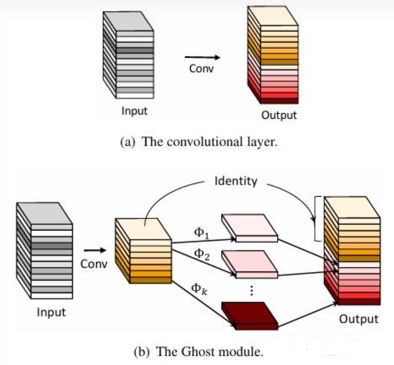

# [yolov11改进系列]基于yolov11使用GhostNetV1或者GhostNetV2替换backbone的python源码+训练源码

> FL1623863129 于 2025-06-05 06:33:44 发布 阅读量839 收藏 11 点赞数 14 公开
> 文章链接：https://blog.csdn.net/FL1623863129/article/details/148438519

【GhostNetV1介绍】

1. GhostNetV1核心原理
1.1 Ghost模块设计
GhostNet的核心创新在于Ghost模块，其通过两步生成特征图：

初级卷积：少量标准卷积生成内在特征图（如输入通道的1/2）。
廉价操作：对内在特征图应用线性变换（如深度卷积、逐点卷积）生成冗余的“Ghost特征图”，最终拼接为完整输出。
数学表达：
给定输入特征图 ( X )，传统卷积输出 ( Y = Conv(X) )，而Ghost模块输出为：
[ Y’ = Concat(Y_{primary}, \Phi(Y_{primary})) ]
其中 ( \Phi ) 为廉价操作，( Y_{primary} ) 是初级卷积结果。

1.2 轻量化优势
参数量减少：Ghost模块通过复用内在特征，减少冗余计算。例如，生成相同通道数的特征图时，参数量仅为传统卷积的 ( 1/s )（( s ) 为廉价操作比例）。
硬件友好：深度可分离卷积等操作适配移动端NPU加速。

#### Ghost瓶颈（Ghost Bottlenecks）

-  **组成结构** ：主要由两个 **堆叠** 的Ghost模块组成。第一个Ghost模块作为扩展层，增加通道数量，其输出通道数与输入通道数的比值称为扩展比；第二个Ghost模块减少通道数量以匹配捷径路径。捷径连接在这两个Ghost模块的输入和输出之间，并且在每个层之后应用批量归一化（BN）和ReLU非线性激活函数，但根据 [MobileNetV2](https://zhida.zhihu.com/search?content_id=251518063&content_type=Article&match_order=1&q=MobileNetV2&zhida_source=entity) 
  MobileNetV2的建议，第二个Ghost模块之后不使用ReLU。

-  **不同步长的结构差异** ：对于 stride=1 的情况，结构如上述描述；对于 stride=2 的情况，捷径路径通过一个下采样层实现，并且在两个Ghost模块之间插入一个步长为 **2** 的深度卷积层。在实际应用中，Ghost模块中的主要卷积采用逐点卷积以提高效率。

 

​

【GhostNetV2介绍】

智能手机等边缘设备计算资源有限，在设计模型时，不仅需要考虑模型的性能，更要考虑其实际的推理速度。最近计算机视觉领域爆火的Transformer模型在多个任务取得了很高精度，但在端侧设备上运行速度较慢，难以满足实时性的要求。经典的自注意力(self-attention)模块的计算复杂度较高，计算量随着输入分辨率的增加以二次方的速度增长。尽管目前主流的局部注意力模块（将图像切分为多个区域，在每个区域内分别部署注意力模块）降低了理论复杂度，但图像切分需要大量变换张量形状的操作（比如reshape、transpose等），在端侧设备上会产生很高的时延。比如，将局部注意力模块和轻量级模型GhostNet结合，理论复杂度只增加了20%，但是实际的推理时延却翻了2倍。因此，为轻量化小模型专门设计硬件友好的注意力机制非常有必要。

2. DFC attention
2.1 移动端CNN的注意力模块
一个适用于移动端CNN的注意力模块应当满足3个条件：

对长距离空间信息的建模能力强。相比CNN，Transformer性能强大的一个重要原因是它能够建模全局空间信息，因此新的注意力模块也应当能捕捉空间长距离信息。
部署高效。注意力模块应该硬件友好，计算高效，以免拖慢推理速度，特别是不应包含硬件不友好的操作。
概念简单。为了保证注意力模块的泛化能力，这个模块的设计应当越简单越好。

将 `DFC attention` 插入到轻量化网络 `GhostNetV1` 中可以提升表征能力，从而构建出新型视觉骨干网络 `GhostNetV2` 。

2.2 GhostV2 bottleneck

GhostNet采用了一个包含两个Ghost模块的反向残差瓶颈，其中第一个模块产生的扩展特征具有更多的通道，而第二个模块减少通道的数量得到输出特征。这个反向瓶颈自然地分离了模型[28]的“表达性”和“容量”。前者通过扩展特征度量，后者通过块的输入输出域反映。原始的Ghost模块通过廉价的操作生成了部分特征，这损害了表达能力和容量。通过研究在扩展特征或输出特征上配置DFC注意力的性能差异(第5.4节表8)，我们发现增强“表现力”更有效。因此，我们只将扩展的特征与DFC注意相乘。

图4(b)显示了GhostV2瓶颈示意图**。DFC注意分支与第一个Ghost模块并行，以增强扩展功能**。然后将增强的特征发送到第二个Ghost模块产生输出特征。它捕获了不同空间位置像素之间的长程依赖性，增强了模型的表达能力。

【yolov11框架介绍】

2024 年 9 月 30 日，Ultralytics 在其活动 YOLOVision 中正式发布了 YOLOv11。YOLOv11 是 YOLO 的最新版本，由美国和西班牙的 Ultralytics 团队开发。YOLO 是一种用于基于图像的人工智能的计算机模

#### Ultralytics YOLO11 概述

YOLO11 是Ultralytics YOLO 系列实时物体检测器的最新版本，以尖端的精度、速度和效率重新定义了可能性。基于先前 YOLO 版本的令人印象深刻的进步，YOLO11 在架构和训练方法方面引入了重大改进，使其成为各种计算机视觉任务的多功能选择。


#### Key Features 主要特点

- 增强的特征提取：YOLO11采用改进的主干和颈部架构，增强了特征提取能力，以实现更精确的目标检测和复杂任务性能。

- 针对效率和速度进行优化：YOLO11 引入了精致的架构设计和优化的训练管道，提供更快的处理速度并保持准确性和性能之间的最佳平衡。

- 使用更少的参数获得更高的精度：随着模型设计的进步，YOLO11m 在 COCO 数据集上实现了更高的平均精度(mAP)，同时使用的参数比 YOLOv8m 少 22%，从而在不影响精度的情况下提高计算效率。

- 跨环境适应性：YOLO11可以无缝部署在各种环境中，包括边缘设备、云平台以及支持NVIDIA [GPU](https://cloud.tencent.com/product/gpu?from_column=20065&from=20065) 的系统，确保最大的灵活性。

- 支持的任务范围广泛：无论是对象检测、实例分割、图像分类、姿态估计还是定向对象检测 (OBB)，YOLO11 旨在应对各种计算机视觉挑战。

 

​​​

##### 与之前的版本相比，Ultralytics YOLO11 有哪些关键改进？

Ultralytics YOLO11 与其前身相比引入了多项重大进步。主要改进包括：

- 增强的特征提取：YOLO11采用改进的主干和颈部架构，增强了特征提取能力，以实现更精确的目标检测。

- 优化的效率和速度：精细的架构设计和优化的训练管道可提供更快的处理速度，同时保持准确性和性能之间的平衡。

- 使用更少的参数获得更高的精度：YOLO11m 在 COCO 数据集上实现了更高的平均精度(mAP)，参数比 YOLOv8m 少 22%，从而在不影响精度的情况下提高计算效率。

- 跨环境适应性：YOLO11可以跨各种环境部署，包括边缘设备、云平台和支持NVIDIA GPU的系统。

- 支持的任务范围广泛：YOLO11 支持多种计算机视觉任务，例如对象检测、实例分割、图像分类、姿态估计和定向对象检测 (OBB)

【测试环境】

windows10 x64

ultralytics==8.3.0

torch==2.3.1

RTX2070显卡 8GB显存，推荐显存>=6GB，否则可能训练不起来

【改进流程】

##### 1. 新增GhostNetV1.py和GhostNetV2.py实现模块（代码太多，核心模块源码请参考改进步骤.docx）然后在同级目录下面创建一个__init___.py文件写代码

from .GhostNetV1 import *

from .GhostNetV2 import *

##### 2. 文件修改步骤

**修改tasks.py文件** 

**创建模型配置文件** 

yolo11-GhostNetV1.yaml内容如下：

```cobol
# Ultralytics YOLO 🚀, AGPL-3.0 license
# YOLO11 object detection model with P3-P5 outputs. For Usage examples see https://docs.ultralytics.com/tasks/detect
 
# Parameters
nc: 80 # number of classes
scales: # model compound scaling constants, i.e. 'model=yolo11n.yaml' will call yolo11.yaml with scale 'n'
  # [depth, width, max_channels]
  n: [0.50, 0.25, 1024] # summary: 319 layers, 2624080 parameters, 2624064 gradients, 6.6 GFLOPs
  s: [0.50, 0.50, 1024] # summary: 319 layers, 9458752 parameters, 9458736 gradients, 21.7 GFLOPs
  m: [0.50, 1.00, 512] # summary: 409 layers, 20114688 parameters, 20114672 gradients, 68.5 GFLOPs
  l: [1.00, 1.00, 512] # summary: 631 layers, 25372160 parameters, 25372144 gradients, 87.6 GFLOPs
  x: [1.00, 1.50, 512] # summary: 631 layers, 56966176 parameters, 56966160 gradients, 196.0 GFLOPs
 
# 共四个版本  "mobile_vit_small, mobile_vit_x_small, mobile_vit_xx_small"
# YOLO11n backbone
backbone:
  # [from, repeats, module, args]
  - [-1, 1, Ghostnetv1, []] # 0-4 P1/2
  - [-1, 1, SPPF, [1024, 5]] # 5
  - [-1, 2, C2PSA, [1024]] # 6
 
# YOLO11n head
head:
  - [-1, 1, nn.Upsample, [None, 2, "nearest"]]
  - [[-1, 3], 1, Concat, [1]] # cat backbone P4
  - [-1, 2, C3k2, [512, False]] # 9
 
  - [-1, 1, nn.Upsample, [None, 2, "nearest"]]
  - [[-1, 2], 1, Concat, [1]] # cat backbone P3
  - [-1, 2, C3k2, [256, False]] # 12 (P3/8-small)
 
  - [-1, 1, Conv, [256, 3, 2]]
  - [[-1, 9], 1, Concat, [1]] # cat head P4
  - [-1, 2, C3k2, [512, False]] # 15 (P4/16-medium)
 
  - [-1, 1, Conv, [512, 3, 2]]
  - [[-1, 6], 1, Concat, [1]] # cat head P5
  - [-1, 2, C3k2, [1024, True]] # 18 (P5/32-large)
 
  - [[12, 15, 18], 1, Detect, [nc]] # Detect(P3, P4, P5)
```

yolo11-GhostNetV2.yaml内容如下：

```cobol
# Ultralytics YOLO 🚀, AGPL-3.0 license
# YOLO11 object detection model with P3-P5 outputs. For Usage examples see https://docs.ultralytics.com/tasks/detect
 
# Parameters
nc: 80 # number of classes
scales: # model compound scaling constants, i.e. 'model=yolo11n.yaml' will call yolo11.yaml with scale 'n'
  # [depth, width, max_channels]
  n: [0.50, 0.25, 1024] # summary: 319 layers, 2624080 parameters, 2624064 gradients, 6.6 GFLOPs
  s: [0.50, 0.50, 1024] # summary: 319 layers, 9458752 parameters, 9458736 gradients, 21.7 GFLOPs
  m: [0.50, 1.00, 512] # summary: 409 layers, 20114688 parameters, 20114672 gradients, 68.5 GFLOPs
  l: [1.00, 1.00, 512] # summary: 631 layers, 25372160 parameters, 25372144 gradients, 87.6 GFLOPs
  x: [1.00, 1.50, 512] # summary: 631 layers, 56966176 parameters, 56966160 gradients, 196.0 GFLOPs
 
 
# YOLO11n backbone
backbone:
  # [from, repeats, module, args]
  - [-1, 1, Ghostnetv2, []] # 0-4 P1/2
  - [-1, 1, SPPF, [1024, 5]] # 5
  - [-1, 2, C2PSA, [1024]] # 6
 
# YOLO11n head
head:
  - [-1, 1, nn.Upsample, [None, 2, "nearest"]]
  - [[-1, 3], 1, Concat, [1]] # cat backbone P4
  - [-1, 2, C3k2, [512, False]] # 9
 
  - [-1, 1, nn.Upsample, [None, 2, "nearest"]]
  - [[-1, 2], 1, Concat, [1]] # cat backbone P3
  - [-1, 2, C3k2, [256, False]] # 12 (P3/8-small)
 
  - [-1, 1, Conv, [256, 3, 2]]
  - [[-1, 9], 1, Concat, [1]] # cat head P4
  - [-1, 2, C3k2, [512, False]] # 15 (P4/16-medium)
 
  - [-1, 1, Conv, [512, 3, 2]]
  - [[-1, 6], 1, Concat, [1]] # cat head P5
  - [-1, 2, C3k2, [1024, True]] # 18 (P5/32-large)
 
  - [[12, 15, 18], 1, Detect, [nc]] # Detect(P3, P4, P5)
```


##### 3. 验证集成

git搜futureflsl/yolo-improve获取源码，然后使用新建的yaml配置文件启动训练任务：

```cobol
from ultralytics import YOLO
 
if __name__ == '__main__':
    model = YOLO('yolo11-GhostNetV1.yaml')  # build from YAML and transfer weights
        # Train the model
    results = model.train(data='coco128.yaml',epochs=100, imgsz=640, batch=8, device=0, workers=1, save=True,resume=False)
```

成功集成后，训练日志中将显示GhostNet模块的初始化信息，表明已正确加载到模型中。

<div style="text-align:center;">​​</div>

【训练说明】

第一步：首先安装好yolov11必要模块，可以参考yolov11框架安装流程，然后卸载官方版本pip uninstall ultralytics，最后安装改进的源码pip install .
第二步：将自己数据集按照dataset文件夹摆放，要求文件夹名字都不要改变
第三步：分别打开train.py,coco128.yaml和模型参数yaml文件修改必要的参数，最后执行python train.py即可训练

【提供文件】

```cobol
├── [官方源码]ultralytics-8.3.0.zip
├── train/
│   ├── coco128.yaml
│   ├── dataset/
│   │   ├── train/
│   │   │   ├── images/
│   │   │   │   ├── firc_pic_1.jpg
│   │   │   │   ├── firc_pic_10.jpg
│   │   │   │   ├── firc_pic_11.jpg
│   │   │   │   ├── firc_pic_12.jpg
│   │   │   │   ├── firc_pic_13.jpg
│   │   │   ├── labels/
│   │   │   │   ├── classes.txt
│   │   │   │   ├── firc_pic_1.txt
│   │   │   │   ├── firc_pic_10.txt
│   │   │   │   ├── firc_pic_11.txt
│   │   │   │   ├── firc_pic_12.txt
│   │   │   │   ├── firc_pic_13.txt
│   │   └── val/
│   │       ├── images/
│   │       │   ├── firc_pic_100.jpg
│   │       │   ├── firc_pic_81.jpg
│   │       │   ├── firc_pic_82.jpg
│   │       │   ├── firc_pic_83.jpg
│   │       │   ├── firc_pic_84.jpg
│   │       ├── labels/
│   │       │   ├── firc_pic_100.txt
│   │       │   ├── firc_pic_81.txt
│   │       │   ├── firc_pic_82.txt
│   │       │   ├── firc_pic_83.txt
│   │       │   ├── firc_pic_84.txt
│   ├── train.py
│   ├── yolo11-GhostNetV1.yaml
│   ├── yolo11-GhostNetV2.yaml
│   └── 训练说明.txt
├── [改进源码]ultralytics-8.3.0.zip
├── GhostNetV1原理.docx
├── GhostNetV2原理.docx
└── 改进流程.docx
```

【常见问题汇总】
问：为什么我训练的模型epoch显示的map都是0或者map精度很低?
回答：由于源码改进过，因此不能直接从官方模型微调，而是从头训练，这样学习特征能力会很弱，需要训练很多epoch才能出现效果。此外由于改进的源码框架并不一定能够保证会超过官方精度，而且也有可能会存在远远不如官方效果，甚至精度会很低。这说明改进的框架并不能取得很好效果。所以说对于框架改进只是提供一种可行方案，至于改进后能不能取得很好map还需要结合实际训练情况确认，当然也不排除数据集存在问题，比如数据集比较单一，样本分布不均衡，泛化场景少，标注框不太贴合标注质量差，检测目标很小等等原因
【重要说明】
我们只提供改进框架一种方案，并不保证能够取得很好训练精度，甚至超过官方模型精度。因为改进框架，实际是一种比较复杂流程，包括框架原理可行性，训练数据集是否合适，训练需要反正验证以及同类框架训练结果参数比较，这个是十分复杂且漫长的过程。