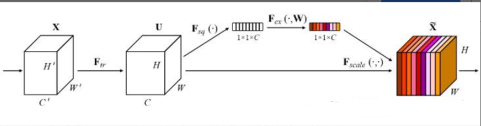
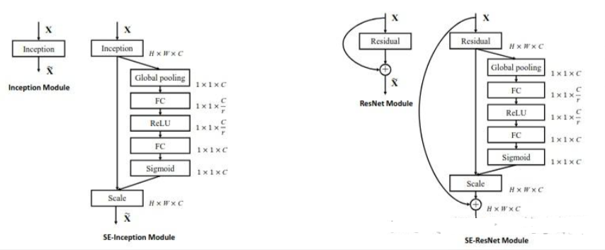
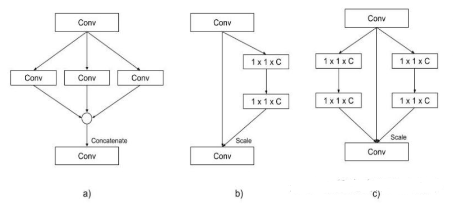
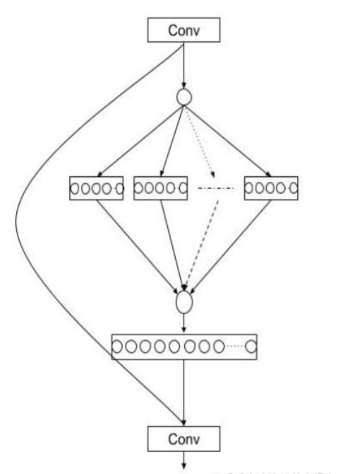

# [yolov11改进系列]基于yolov11引入注意力机制SENetV1或者SENetV2的python源码+训练源码

> FL1623863129 于 2025-06-05 08:37:57 发布 阅读量1k 收藏 17 点赞数 8 公开
> 文章链接：https://blog.csdn.net/FL1623863129/article/details/148439170

本文给大家带来的改进机制是SENet（Squeeze-and-Excitation Networks）其是一种通过调整卷积网络中的通道关系来提升性能的网络结构。SENet并不是一个独立的网络模型Q，而是一个可以和现有的任何一个模型相结合的模块（可以看作是一种通道型的注意力机制）。在SENet中，所谓的挤压和激励（Squeeze-and-Excitation）操作是作为一个单元添加到传统的卷积网络结构中，如残差单元中（后面我会把修改好的残差单元给大家大家直接复制粘贴即可使用）。这样可以增强模型对通道间关系的捕获，提升整体的特征表达能力，而不需要从头开始设计一个全新的网络架构。

【SENetV1介绍】

### 1. 简介

[SeNet](https://zhida.zhihu.com/search?content_id=251245107&content_type=Article&match_order=1&q=SeNet&zhida_source=entity) (Sequeeze-and-Excitation Networks)是一种通过调整 [卷积网络](https://zhida.zhihu.com/search?content_id=251245107&content_type=Article&match_order=1&q=%E5%8D%B7%E7%A7%AF%E7%BD%91%E7%BB%9C&zhida_source=entity) 中的通道关系来提升性能的网络结构。SeNet并不是一个独立的网络模型，而是一个可以和现有的任何一个模型相结合的模块。在SeNet中，所谓的挤压和激励（Sequeeze-and-Excitation）操作是作为一个单元添加到传统的卷积网络结构中，如 [残差单元](https://zhida.zhihu.com/search?content_id=251245107&content_type=Article&match_order=1&q=%E6%AE%8B%E5%B7%AE%E5%8D%95%E5%85%83&zhida_source=entity) 中，这样可以增强模型对通道间关系的捕获，提升整体的特征表达能力。

CNN的核心是构建模块的 [卷积算子](https://zhida.zhihu.com/search?content_id=251245107&content_type=Article&match_order=1&q=%E5%8D%B7%E7%A7%AF%E7%AE%97%E5%AD%90&zhida_source=entity) ，卷积算子能使网络通过融合每层局部感受野中的空间和通道信息来构建有意义的特征。大量先前的研究调查了这种关系的空间组成部分，试图通过提高其特征层次结构中空间编码的质量来增强CNN的表征能力。本文转而关注通道之间的关系，并提出了一种新颖的架构单元，称之为“挤压-激励”（SE）块，通过显示建模通道之间的相互依赖性来自适应的重新校准通道特征响应。本文展示了这些块可以堆叠在一起形成SENet架构，这些架构在不同数据集上具有及其有效的泛化能力。

### 2. SEnet网络结构

SENet的主要思想在于通过挤压-激励（SE）块强化网络对通道间依赖性的建模。这一创新的核心在于自适应的重新校准每个通道的特征响应，显著提升了网络对特征的表示能力。SE块的叠加构成了SENet架构，有效提高了模型在不同数据集上的泛化性。SENet的创新点包括其独特的结构设计，在增加极少计算成本的情况下，为现有CNN模型带来了显著的性能提升。

 

上图展示了一个挤压-激励（Squeeze-and-Excitation,SE）块的结构。输入特征图X经过一个变换Ftr后产生特征图U。然后，特征图U通过全局平均池化Fsq被压缩成一个全局通道描述子。这个描述子经过两个全连接层Fex，降维+升维，并通过激活函数RELU和Sigmoid激活。最后，原始特征图U与学习到的通道权重Fscale相乘，得到重新校准的特征图hatX。这种结构有助于网络学习通道间的依赖性，自适应地强化或抑制某些特征通道。

 

上图展示了两种神经网络模块的结构图：Inception模块和残差（ResNet）模块。每个模块都有其标准形式和一个修改形式，对比图融入了Squeeze-and-Excitation（SE）块来提升性能。

左面部分是原始Inception模块，右侧是SE模块，SE模块通过全局平均池化和两个全连接层（第一个使用RELU激活函数，第二个使用Sigmoid函数）来生成通道级权重，然后对输入特征图进行缩放。

右面的部分展示了原始残差模块和 [SE-ResNet模块](https://zhida.zhihu.com/search?content_id=251245107&content_type=Article&match_order=1&q=SE-ResNet%E6%A8%A1%E5%9D%97&zhida_source=entity) 。SE-ResNet模块在传统的残差连接之后添加了SE块，同样使用全局平均池化和全连接层来获得通道级权重，并对残差模块的输出进行缩放。


【SENetV2介绍】

### 1. 摘要

[SENetV2](https://zhida.zhihu.com/search?content_id=251212766&content_type=Article&match_order=1&q=SENetV2&zhida_source=entity) ：通过Squeeze aggregated excitation（SaE）模块增强全局表示学习。是一种通过调整卷积网络中的通道关系来提升性能的网络结构。SENet并不是一个独立的网络模型，而是一个可以和现有任何一个模型相结合的模块。在SENet中，所谓的挤压和激励（Squeeze-and-Excitation）操作是作为一个单元添加到传统的卷积网络结构中。

所提出的挤压激励网络模块收集了输入的通道级表示， [多层感知器](https://zhida.zhihu.com/search?content_id=251212766&content_type=Article&match_order=1&q=%E5%A4%9A%E5%B1%82%E6%84%9F%E7%9F%A5%E5%99%A8&zhida_source=entity) （MLP）从数据中学习全局表示，并在大多数图像分类模型中用于学习图像的提取特征。本文中，介绍了一种新颖的聚合多层感知器，即在挤压激励残差模块中的多分支密集层。改方法利用挤压激励网络模块与密集层的组合。这华宗融合增强了网络捕捉通道级模式和全局知识的能力，从而实现了更好的特征表示。

### 2. SENetV2架构

 

上图展示了三种不同的神经网络模块对比：

（a） [ResNext模块](https://zhida.zhihu.com/search?content_id=251212766&content_type=Article&match_order=1&q=ResNext%E6%A8%A1%E5%9D%97&zhida_source=entity) ：采用多分支CNN结构，不同分支的特征图通过卷积操作处理合并（Concatenate），再进行额外的卷积操作

（b）SENet模块：标准卷积操作后，利用 [全局平均池化](https://zhida.zhihu.com/search?content_id=251212766&content_type=Article&match_order=1&q=%E5%85%A8%E5%B1%80%E5%B9%B3%E5%9D%87%E6%B1%A0%E5%8C%96&zhida_source=entity) 来挤压特征，然后通过两个尺寸为conv1的全连接FC和 [sigmoid激活函数](https://zhida.zhihu.com/search?content_id=251212766&content_type=Article&match_order=1&q=sigmoid%E6%BF%80%E6%B4%BB%E5%87%BD%E6%95%B0&zhida_source=entity) 来获取通道权重，最后对卷积特征进行缩放

（c）SENetV2模块：结合了ResNext和SENet的特点，采用多分支全连接（FC）来挤压和激励操作，最后进行特征缩放

SENetV2的设计旨在通过多分支结构进一步提升特征表达的精细度和全局信息的整合能力

### 3. SaE原理

 

SaE（Squeeze-and-Excitation）模块的内部工作机制。挤压输出后，被输入到多分支的全连接（FC）层，然后进行激励过程。分割的输入在最后被传递以恢复其原始形状。这种设计能够让网络更有效的学习到输入数据的不同特征，并且在进行特征准换时考虑到不同通道之间的相互依赖性。

【yolov11框架介绍】

2024 年 9 月 30 日，Ultralytics 在其活动 YOLOVision 中正式发布了 YOLOv11。YOLOv11 是 YOLO 的最新版本，由美国和西班牙的 Ultralytics 团队开发。YOLO 是一种用于基于图像的人工智能的计算机模

#### Ultralytics YOLO11 概述

YOLO11 是Ultralytics YOLO 系列实时物体检测器的最新版本，以尖端的精度、速度和效率重新定义了可能性。基于先前 YOLO 版本的令人印象深刻的进步，YOLO11 在架构和训练方法方面引入了重大改进，使其成为各种计算机视觉任务的多功能选择。


#### Key Features 主要特点

- 增强的特征提取：YOLO11采用改进的主干和颈部架构，增强了特征提取能力，以实现更精确的目标检测和复杂任务性能。

- 针对效率和速度进行优化：YOLO11 引入了精致的架构设计和优化的训练管道，提供更快的处理速度并保持准确性和性能之间的最佳平衡。

- 使用更少的参数获得更高的精度：随着模型设计的进步，YOLO11m 在 COCO 数据集上实现了更高的平均精度(mAP)，同时使用的参数比 YOLOv8m 少 22%，从而在不影响精度的情况下提高计算效率。

- 跨环境适应性：YOLO11可以无缝部署在各种环境中，包括边缘设备、云平台以及支持NVIDIA [GPU](https://cloud.tencent.com/product/gpu?from_column=20065&from=20065) 的系统，确保最大的灵活性。

- 支持的任务范围广泛：无论是对象检测、实例分割、图像分类、姿态估计还是定向对象检测 (OBB)，YOLO11 旨在应对各种计算机视觉挑战。

 

​​​

##### 与之前的版本相比，Ultralytics YOLO11 有哪些关键改进？

Ultralytics YOLO11 与其前身相比引入了多项重大进步。主要改进包括：

- 增强的特征提取：YOLO11采用改进的主干和颈部架构，增强了特征提取能力，以实现更精确的目标检测。

- 优化的效率和速度：精细的架构设计和优化的训练管道可提供更快的处理速度，同时保持准确性和性能之间的平衡。

- 使用更少的参数获得更高的精度：YOLO11m 在 COCO 数据集上实现了更高的平均精度(mAP)，参数比 YOLOv8m 少 22%，从而在不影响精度的情况下提高计算效率。

- 跨环境适应性：YOLO11可以跨各种环境部署，包括边缘设备、云平台和支持NVIDIA GPU的系统。

- 支持的任务范围广泛：YOLO11 支持多种计算机视觉任务，例如对象检测、实例分割、图像分类、姿态估计和定向对象检测 (OBB)

【测试环境】

windows10 x64

ultralytics==8.3.0

torch==2.3.1

RTX2070显卡 8GB显存，推荐显存>=6GB，否则可能训练不起来

【改进流程】

##### 1. 新增SENetV1.py和SENetV2.py实现模块（代码太多，核心模块源码请参考改进步骤.docx）然后在同级目录下面创建一个__init___.py文件写代码

from .SENetV1 import *

from .SENetV2 import *

##### 2. 文件修改步骤

**修改tasks.py文件** 

**创建模型配置文件** 

yolo11-SENetV1.yaml内容如下：

```cobol
# Ultralytics YOLO 🚀, AGPL-3.0 license
# YOLO11 object detection model with P3-P5 outputs. For Usage examples see https://docs.ultralytics.com/tasks/detect
 
# Parameters
nc: 80 # number of classes
scales: # model compound scaling constants, i.e. 'model=yolo11n.yaml' will call yolo11.yaml with scale 'n'
  # [depth, width, max_channels]
  n: [0.50, 0.25, 1024] # summary: 319 layers, 2624080 parameters, 2624064 gradients, 6.6 GFLOPs
  s: [0.50, 0.50, 1024] # summary: 319 layers, 9458752 parameters, 9458736 gradients, 21.7 GFLOPs
  m: [0.50, 1.00, 512] # summary: 409 layers, 20114688 parameters, 20114672 gradients, 68.5 GFLOPs
  l: [1.00, 1.00, 512] # summary: 631 layers, 25372160 parameters, 25372144 gradients, 87.6 GFLOPs
  x: [1.00, 1.50, 512] # summary: 631 layers, 56966176 parameters, 56966160 gradients, 196.0 GFLOPs
 
# YOLO11n backbone
backbone:
  # [from, repeats, module, args]
  - [-1, 1, Conv, [64, 3, 2]] # 0-P1/2
  - [-1, 1, Conv, [128, 3, 2]] # 1-P2/4
  - [-1, 2, C3k2, [256, False, 0.25]]
  - [-1, 1, Conv, [256, 3, 2]] # 3-P3/8
  - [-1, 2, C3k2, [512, False, 0.25]]
  - [-1, 1, Conv, [512, 3, 2]] # 5-P4/16
  - [-1, 2, C3k2, [512, True]]
  - [-1, 1, Conv, [1024, 3, 2]] # 7-P5/32
  - [-1, 2, C3k2, [1024, True]]
  - [-1, 1, SPPF, [1024, 5]] # 9
  - [-1, 2, C2PSA, [1024]] # 10
 
# YOLO11n head
head:
  - [-1, 1, nn.Upsample, [None, 2, "nearest"]]
  - [[-1, 6], 1, Concat, [1]] # cat backbone P4
  - [-1, 2, C3k2, [512, False]] # 13
 
  - [-1, 1, nn.Upsample, [None, 2, "nearest"]]
  - [[-1, 4], 1, Concat, [1]] # cat backbone P3
  - [-1, 2, C3k2, [256, False]] # 16 (P3/8-small)
  - [-1, 1, SELayerV1, []] # 17 (P3/8-small)  小目标检测层输出位置增加注意力机制
 
  - [-1, 1, Conv, [256, 3, 2]]
  - [[-1, 13], 1, Concat, [1]] # cat head P4
  - [-1, 2, C3k2, [512, False]] # 20 (P4/16-medium)
  - [-1, 1, SELayerV1, []] # 21 (P4/16-medium) 中目标检测层输出位置增加注意力机制
 
  - [-1, 1, Conv, [512, 3, 2]]
  - [[-1, 10], 1, Concat, [1]] # cat head P5
  - [-1, 2, C3k2, [1024, True]] # 24 (P5/32-large)
  - [-1, 1, SELayerV1, []] # 25 (P5/32-large) 大目标检测层输出位置增加注意力机制
 
  # 具体在那一层用注意力机制可以根据自己的数据集场景进行选择。
  # 如果你自己配置注意力位置注意from[17, 21, 25]位置要对应上对应的检测层！
  - [[17, 21, 25], 1, Detect, [nc]] # Detect(P3, P4, P5)
```

yolo11-SENetV2.yaml内容如下：

```cobol
# Ultralytics YOLO 🚀, AGPL-3.0 license
# YOLO11 object detection model with P3-P5 outputs. For Usage examples see https://docs.ultralytics.com/tasks/detect
 
# Parameters
nc: 80 # number of classes
scales: # model compound scaling constants, i.e. 'model=yolo11n.yaml' will call yolo11.yaml with scale 'n'
  # [depth, width, max_channels]
  n: [0.50, 0.25, 1024] # summary: 319 layers, 2624080 parameters, 2624064 gradients, 6.6 GFLOPs
  s: [0.50, 0.50, 1024] # summary: 319 layers, 9458752 parameters, 9458736 gradients, 21.7 GFLOPs
  m: [0.50, 1.00, 512] # summary: 409 layers, 20114688 parameters, 20114672 gradients, 68.5 GFLOPs
  l: [1.00, 1.00, 512] # summary: 631 layers, 25372160 parameters, 25372144 gradients, 87.6 GFLOPs
  x: [1.00, 1.50, 512] # summary: 631 layers, 56966176 parameters, 56966160 gradients, 196.0 GFLOPs
 
# YOLO11n backbone
backbone:
  # [from, repeats, module, args]
  - [-1, 1, Conv, [64, 3, 2]] # 0-P1/2
  - [-1, 1, Conv, [128, 3, 2]] # 1-P2/4
  - [-1, 2, C3k2, [256, False, 0.25]]
  - [-1, 1, Conv, [256, 3, 2]] # 3-P3/8
  - [-1, 2, C3k2, [512, False, 0.25]]
  - [-1, 1, Conv, [512, 3, 2]] # 5-P4/16
  - [-1, 2, C3k2, [512, True]]
  - [-1, 1, Conv, [1024, 3, 2]] # 7-P5/32
  - [-1, 2, C3k2, [1024, True]]
  - [-1, 1, SPPF, [1024, 5]] # 9
  - [-1, 2, C2PSA, [1024]] # 10
 
# YOLO11n head
head:
  - [-1, 1, nn.Upsample, [None, 2, "nearest"]]
  - [[-1, 6], 1, Concat, [1]] # cat backbone P4
  - [-1, 2, C3k2, [512, False]] # 13
 
  - [-1, 1, nn.Upsample, [None, 2, "nearest"]]
  - [[-1, 4], 1, Concat, [1]] # cat backbone P3
  - [-1, 2, C3k2, [256, False]] # 16 (P3/8-small)
  - [-1, 1, SELayerV2, []] # 17 (P3/8-small)  小目标检测层输出位置增加注意力机制
 
  - [-1, 1, Conv, [256, 3, 2]]
  - [[-1, 13], 1, Concat, [1]] # cat head P4
  - [-1, 2, C3k2, [512, False]] # 20 (P4/16-medium)
  - [-1, 1, SELayerV2, []] # 21 (P4/16-medium) 中目标检测层输出位置增加注意力机制
 
  - [-1, 1, Conv, [512, 3, 2]]
  - [[-1, 10], 1, Concat, [1]] # cat head P5
  - [-1, 2, C3k2, [1024, True]] # 24 (P5/32-large)
  - [-1, 1, SELayerV2, []] # 25 (P5/32-large) 大目标检测层输出位置增加注意力机制
 
  # 注意力机制我这里其实是添加了三个但是实际一般生效就只添加一个就可以了，所以大家可以自行注释来尝试, 上面三个仅建议大家保留一个， 但是from位置要对齐.
  # 具体在那一层用注意力机制可以根据自己的数据集场景进行选择。
  # 如果你自己配置注意力位置注意from[17, 21, 25]位置要对应上对应的检测层！
  - [[17, 21, 25], 1, Detect, [nc]] # Detect(P3, P4, P5)
```


##### 3. 验证集成

git搜futureflsl/yolo-improve获取源码，然后使用新建的yaml配置文件启动训练任务：

```cobol
from ultralytics import YOLO
 
if __name__ == '__main__':
    model = YOLO('yolo11-SENetV1.yaml')  # build from YAML and transfer weights
        # Train the model
    results = model.train(data='coco128.yaml',epochs=100, imgsz=640, batch=8, device=0, workers=1, save=True,resume=False)
```

成功集成后，训练日志中将显示SELayer模块的初始化信息，表明已正确加载到模型中。

<div style="text-align:center;">​​</div>

【训练说明】

第一步：首先安装好yolov11必要模块，可以参考yolov11框架安装流程，然后卸载官方版本pip uninstall ultralytics，最后安装改进的源码pip install .
第二步：将自己数据集按照dataset文件夹摆放，要求文件夹名字都不要改变
第三步：分别打开train.py,coco128.yaml和模型参数yaml文件修改必要的参数，最后执行python train.py即可训练

【提供文件】

```cobol
├── [官方源码]ultralytics-8.3.0.zip
├── train/
│   ├── coco128.yaml
│   ├── dataset/
│   │   ├── train/
│   │   │   ├── images/
│   │   │   │   ├── firc_pic_1.jpg
│   │   │   │   ├── firc_pic_10.jpg
│   │   │   │   ├── firc_pic_11.jpg
│   │   │   │   ├── firc_pic_12.jpg
│   │   │   │   ├── firc_pic_13.jpg
│   │   │   ├── labels/
│   │   │   │   ├── classes.txt
│   │   │   │   ├── firc_pic_1.txt
│   │   │   │   ├── firc_pic_10.txt
│   │   │   │   ├── firc_pic_11.txt
│   │   │   │   ├── firc_pic_12.txt
│   │   │   │   ├── firc_pic_13.txt
│   │   └── val/
│   │       ├── images/
│   │       │   ├── firc_pic_100.jpg
│   │       │   ├── firc_pic_81.jpg
│   │       │   ├── firc_pic_82.jpg
│   │       │   ├── firc_pic_83.jpg
│   │       │   ├── firc_pic_84.jpg
│   │       ├── labels/
│   │       │   ├── firc_pic_100.txt
│   │       │   ├── firc_pic_81.txt
│   │       │   ├── firc_pic_82.txt
│   │       │   ├── firc_pic_83.txt
│   │       │   ├── firc_pic_84.txt
│   ├── train.py
│   ├── yolo11-GhostNetV1.yaml
│   ├── yolo11-GhostNetV2.yaml
│   └── 训练说明.txt
├── [改进源码]ultralytics-8.3.0.zip
├── SENetV1原理.docx
├── SENetV2原理.docx
└── 改进流程.docx
```

【常见问题汇总】
问：为什么我训练的模型epoch显示的map都是0或者map精度很低?
回答：由于源码改进过，因此不能直接从官方模型微调，而是从头训练，这样学习特征能力会很弱，需要训练很多epoch才能出现效果。此外由于改进的源码框架并不一定能够保证会超过官方精度，而且也有可能会存在远远不如官方效果，甚至精度会很低。这说明改进的框架并不能取得很好效果。所以说对于框架改进只是提供一种可行方案，至于改进后能不能取得很好map还需要结合实际训练情况确认，当然也不排除数据集存在问题，比如数据集比较单一，样本分布不均衡，泛化场景少，标注框不太贴合标注质量差，检测目标很小等等原因
【重要说明】
我们只提供改进框架一种方案，并不保证能够取得很好训练精度，甚至超过官方模型精度。因为改进框架，实际是一种比较复杂流程，包括框架原理可行性，训练数据集是否合适，训练需要反正验证以及同类框架训练结果参数比较，这个是十分复杂且漫长的过程。