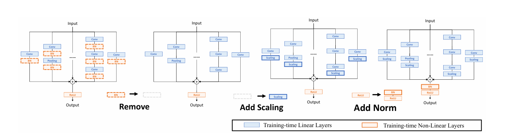
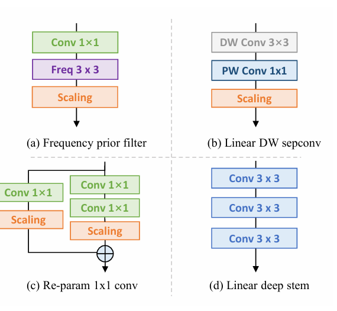
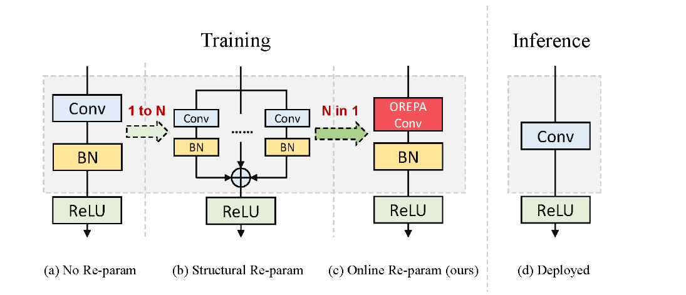

# [yolov11改进系列]基于yolov11引入在线重参数化卷积OREPA用于推理加速的python源码+训练源码

> FL1623863129 于 2025-06-05 21:40:00 发布 阅读量900 收藏 24 点赞数 28 公开
> 文章链接：https://blog.csdn.net/FL1623863129/article/details/148459419

【OREPA介绍】

### 摘要

结构重参数化在各种计算机视觉任务中引起了越来越多的关注。它旨在提高深度模型的性能，同时不引入任何推理时间成本。虽然在推理过程中效率很高，但这些模型在复杂的训练阶段中依赖于复杂的训练块来达到高准确性，导致额外的大量训练成本。本文介绍了在线卷积重参数化（OREPA），这是一个两阶段的流程，旨在通过将复杂的训练阶段块压缩为单个卷积来减少巨大的训练开销。为了实现这个目标，我们引入了一个线性缩放层，以更好地优化在线块。在降低训练成本的同时，我们还探索了一些更有效的重参数化组件。与最先进的重参数化模型相比，OREPA能够减少约70%的训练时间内存开销，并将训练速度加快约2倍。同时，配备OREPA，这些模型在ImageNet上的表现超过以前的方法，提高了最多+0.6%。我们还在目标检测和语义分割上进行了实验，并展示了对下游任务的一致改进。

## 基本原理

### 什么是结构重新参数化？

结构重新参数化是一种在神经网络训练和推理阶段优化模型性能的方法。其基本思想是通过在训练阶段使用复杂的、多分支的网络结构来提高模型的表达能力和性能，而在推理阶段将这些复杂结构重新参数化为更简单的等效结构，以减少计算开销和存储需求。

具体来说，结构重新参数化通常涉及以下几个步骤：

1.  **训练阶段** ：

   - 使用复杂的网络结构进行训练。例如，一个卷积层可能被替换为多个并行的卷积层和跳跃连接（shortcut connections），以增强模型的表达能力和学习能力。

   - 这种复杂的结构能够捕捉更多的特征，帮助模型在训练过程中更好地拟合数据。

2.  **重新参数化** ：

   - 在训练完成后，将复杂的多分支结构转换为一个等效的简单结构。例如，将多个并行的卷积层的权重和偏置合并到一个单独的卷积层中。

   - 这种转换是通过数学方法和等效变换实现的，确保在推理阶段模型的输出不变。

3.  **推理阶段** ：

   - 使用重新参数化后的简单结构进行推理。由于结构更简单，推理的计算效率更高，延迟更低，所需的存储资源也更少。

   - 这种优化对于部署在资源受限的设备（如移动设备）上的模型尤其有用。

结构重新参数化的一种常见应用是RepVGG模型。RepVGG在训练阶段使用多分支结构，而在推理阶段将其重新参数化为简单的VGG样式的卷积神经网络，从而兼具高性能和高效率。这种方法的优势在于，它能够在不牺牲模型性能的前提下，大幅度减少推理阶段的计算和存储需求，从而实现更快的推理速度和更低的资源占用。

### OREPA关键点

1.  **在线优化阶段** ： 在这个阶段，OREPA通过移除原型块中的非线性组件，并引入线性缩放层来优化卷积层的性能。通过去除非线性组件，模型变得更易于优化。线性缩放层的引入可以提高模型的灵活性和优化效果。

2.  **压缩训练时模块阶段** ： 在这个阶段，OREPA将复杂的训练时模块压缩成一个单一的卷积操作，从而降低训练成本。通过简化结构将多个卷积层和批量归一化层合并为一个简单的卷积层，减少内存和计算成本。这种压缩结构的设计有助于提高训练效率。

3.  **线性缩放层** ： 线性缩放层是OREPA的关键组成部分，通过适当缩放权重来提高模型的灵活性和优化效果。这种线性缩放层取代了原有的非线性规范化层，保持了优化的多样性和表示能力。线性缩放层的引入有助于优化模型的训练过程，并提高模型的性能。

4.  **训练时模块压缩** ： 通过将复杂的训练时模块压缩成一个单一的卷积操作，OREPA降低了训练时的复杂性和资源消耗。这种压缩结构的设计使得在推理阶段，无论训练时的结构多么复杂，所有模型都被简化为单一的卷积层，提高了推理速度和降低了资源消耗。训练时模块压缩的过程有助于简化模型结构，提高训练和推理效率。

OREPA能够将复杂的训练时间块简化为单个卷积层，并保持较高的精度。OREPA的总体流程如图2所示，包括块线性化阶段和块压缩阶段。

 

- ####  **块线性化** 

  在训练过程中，中间的归一化层会阻碍单独层的合并，但直接删除它们会导致性能问题。为了解决这个困境，引入了一种通道级线性缩放操作，作为归一化的线性替代。缩放层包含一个可学习的向量，用于在通道维度上缩放特征图。线性缩放层与归一化层的作用相似，它们都鼓励多分支向不同方向优化，这是重参数化提高性能的关键。关于其具体影响的详细分析将在第3.4节中讨论。除了对性能的影响，线性缩放层还可以在训练过程中合并，使在线重参数化成为可能。

  基于线性缩放层，对重参数化块进行修改，如图3所示。具体来说，块线性化阶段包括以下三个步骤：

  1.  **去除所有非线性层** ：移除重参数化块中的所有非线性层，如归一化层。

  2.  **添加尺度层** ：在每个分支的末尾添加一个尺度层，即线性缩放层，以保持优化多样性。

  3.  **添加后归一化层** ：在合并所有分支之后，添加一个后归一化层，以稳定训练过程。

  一旦完成线性化阶段，re-param块中只存在线性层，这意味着可以在训练阶段合并块中的所有组件。

  由于所提出的的OREPA大大节省了训练成本，它使能够探索更复杂的训练块。为此，通过对最先进的DBB模型进行线性化，并插入以下组件(图5)，设计了一种新的重参数化模型OREPA-ResNet。

  - 频率先验滤波器

  ```cobol
  在之前的工作中，块中使用了池化层。Qin 等人认为池化层是一种特殊的频率滤波器。为此，添加了一个 Conv1×1 频率滤波器分支。
  ```

  - 线性深度可分卷积

    对深度可分卷积进行了稍微修改，去掉了中间的非线性激活层，使其在训练时可以合并。

  - 1×1 卷积的重参数化

    以前的工作主要集中在 3×3 卷积层的重参数化，而忽略了 1×1 层。建议对 1×1 层进行重参数化，因为它们在瓶颈结构中扮演着重要角色。具体来说，添加了一个额外的 Conv1×1 - Conv1×1 分支。

  - 线性深 Stem

    大型卷积核通常放置在最开始的层，如 7×7 stem 层，目的是获得更大的接收野。Guo 等人将 7×7 卷积层替换为堆叠的 3×3 层。

  ​ 

  ####  **块压缩** 

  得益于块的线性化，得到了一个线性块。块压缩步骤将中间特征映射上的操作转换为更高效的内核操作。这将重参数化的额外训练成本从 (O(H \times W)) 降低到 (O(K_H \times K_W))，其中 (H) 和 (W) 是特征图的空间尺寸，(K_H) 和 (K_W) 是卷积核的尺寸。

  一般来说，无论线性重参数块多么复杂，以下两个属性始终有效：

  - 块中的所有线性层，例如深度卷积、平均池化和线性缩放层，都可以用退化的卷积层表示，并具有相应的一组参数。

  - 块可以由一系列并行分支表示，每个分支由一系列卷积层组成。

   

【yolov11框架介绍】

2024 年 9 月 30 日，Ultralytics 在其活动 YOLOVision 中正式发布了 YOLOv11。YOLOv11 是 YOLO 的最新版本，由美国和西班牙的 Ultralytics 团队开发。YOLO 是一种用于基于图像的人工智能的计算机模

#### Ultralytics YOLO11 概述

YOLO11 是Ultralytics YOLO 系列实时物体检测器的最新版本，以尖端的精度、速度和效率重新定义了可能性。基于先前 YOLO 版本的令人印象深刻的进步，YOLO11 在架构和训练方法方面引入了重大改进，使其成为各种计算机视觉任务的多功能选择。


#### Key Features 主要特点

- 增强的特征提取：YOLO11采用改进的主干和颈部架构，增强了特征提取能力，以实现更精确的目标检测和复杂任务性能。

- 针对效率和速度进行优化：YOLO11 引入了精致的架构设计和优化的训练管道，提供更快的处理速度并保持准确性和性能之间的最佳平衡。

- 使用更少的参数获得更高的精度：随着模型设计的进步，YOLO11m 在 COCO 数据集上实现了更高的平均精度(mAP)，同时使用的参数比 YOLOv8m 少 22%，从而在不影响精度的情况下提高计算效率。

- 跨环境适应性：YOLO11可以无缝部署在各种环境中，包括边缘设备、云平台以及支持NVIDIA [GPU](https://cloud.tencent.com/product/gpu?from_column=20065&from=20065) 的系统，确保最大的灵活性。

- 支持的任务范围广泛：无论是对象检测、实例分割、图像分类、姿态估计还是定向对象检测 (OBB)，YOLO11 旨在应对各种计算机视觉挑战。

 

​​​

##### 与之前的版本相比，Ultralytics YOLO11 有哪些关键改进？

Ultralytics YOLO11 与其前身相比引入了多项重大进步。主要改进包括：

- 增强的特征提取：YOLO11采用改进的主干和颈部架构，增强了特征提取能力，以实现更精确的目标检测。

- 优化的效率和速度：精细的架构设计和优化的训练管道可提供更快的处理速度，同时保持准确性和性能之间的平衡。

- 使用更少的参数获得更高的精度：YOLO11m 在 COCO 数据集上实现了更高的平均精度(mAP)，参数比 YOLOv8m 少 22%，从而在不影响精度的情况下提高计算效率。

- 跨环境适应性：YOLO11可以跨各种环境部署，包括边缘设备、云平台和支持NVIDIA GPU的系统。

- 支持的任务范围广泛：YOLO11 支持多种计算机视觉任务，例如对象检测、实例分割、图像分类、姿态估计和定向对象检测 (OBB)

【测试环境】

windows10 x64

ultralytics==8.3.0

torch==2.3.1

【改进流程】

##### 1. 新增OREPA.py实现模块（代码太多，核心模块源码请参考改进步骤.docx）然后在同级目录下面创建一个__init___.py文件写代码

from .OREPA import *

##### 2. 文件修改步骤

**修改tasks.py文件** 

**创建模型配置文件** 

yolo11-OREPA.yaml内容如下：

```cobol
# Ultralytics YOLO 🚀, AGPL-3.0 license
# YOLO11 object detection model with P3-P5 outputs. For Usage examples see https://docs.ultralytics.com/tasks/detect
 
# Parameters
nc: 80 # number of classes
scales: # model compound scaling constants, i.e. 'model=yolo11n.yaml' will call yolo11.yaml with scale 'n'
  # [depth, width, max_channels]
  n: [0.50, 0.25, 1024] # summary: 319 layers, 2624080 parameters, 2624064 gradients, 6.6 GFLOPs
  s: [0.50, 0.50, 1024] # summary: 319 layers, 9458752 parameters, 9458736 gradients, 21.7 GFLOPs
  m: [0.50, 1.00, 512] # summary: 409 layers, 20114688 parameters, 20114672 gradients, 68.5 GFLOPs
  l: [1.00, 1.00, 512] # summary: 631 layers, 25372160 parameters, 25372144 gradients, 87.6 GFLOPs
  x: [1.00, 1.50, 512] # summary: 631 layers, 56966176 parameters, 56966160 gradients, 196.0 GFLOPs
 
# YOLO11n backbone
backbone:
  # [from, repeats, module, args]
  - [-1, 1, Conv, [64, 3, 2]] # 0-P1/2
  - [-1, 1, OREPA, [128, 3, 2]] # 1-P2/4
  - [-1, 2, C3k2, [256, False, 0.25]]
  - [-1, 1, OREPA, [256, 3, 2]] # 3-P3/8
  - [-1, 2, C3k2, [512, False, 0.25]]
  - [-1, 1, OREPA, [512, 3, 2]] # 5-P4/16
  - [-1, 2, C3k2, [512, True]]
  - [-1, 1, OREPA, [1024, 3, 2]] # 7-P5/32
  - [-1, 2, C3k2, [1024, True]]
  - [-1, 1, SPPF, [1024, 5]] # 9
  - [-1, 2, C2PSA, [1024]] # 10
 
# YOLO11n head
head:
  - [-1, 1, nn.Upsample, [None, 2, "nearest"]]
  - [[-1, 6], 1, Concat, [1]] # cat backbone P4
  - [-1, 2, C3k2, [512, False]] # 13
 
  - [-1, 1, nn.Upsample, [None, 2, "nearest"]]
  - [[-1, 4], 1, Concat, [1]] # cat backbone P3
  - [-1, 2, C3k2, [256, False]] # 16 (P3/8-small)
 
  - [-1, 1, OREPA, [256, 3, 2]]
  - [[-1, 13], 1, Concat, [1]] # cat head P4
  - [-1, 2, C3k2, [512, False]] # 19 (P4/16-medium)
 
  - [-1, 1, OREPA, [512, 3, 2]]
  - [[-1, 10], 1, Concat, [1]] # cat head P5
  - [-1, 2, C3k2, [1024, True]] # 22 (P5/32-large)
 
  - [[16, 19, 22], 1, Detect, [nc]] # Detect(P3, P4, P5)
```

##### 3. 验证集成

git搜futureflsl/yolo-improve获取源码，然后使用新建的yaml配置文件启动训练任务：

```cobol
from ultralytics import YOLO
 
if __name__ == '__main__':
    model = YOLO('yolo11-OREPA.yaml')  # build from YAML and transfer weights
        # Train the model
    results = model.train(data='coco128.yaml',epochs=100, imgsz=640, batch=8, device=0, workers=1, save=True,resume=False)
```

成功集成后，训练日志中将显示OREPA模块的初始化信息，表明已正确加载到模型中。

<div style="text-align:center;">​​</div>

【训练说明】

第一步：首先安装好yolov11必要模块，可以参考yolov11框架安装流程，然后卸载官方版本pip uninstall ultralytics，最后安装改进的源码pip install .
第二步：将自己数据集按照dataset文件夹摆放，要求文件夹名字都不要改变
第三步：分别打开train.py,coco128.yaml和模型参数yaml文件修改必要的参数，最后执行python train.py即可训练

【提供文件】

```cobol
├── [官方源码]ultralytics-8.3.0.zip
├── train/
│   ├── coco128.yaml
│   ├── dataset/
│   │   ├── train/
│   │   │   ├── images/
│   │   │   │   ├── firc_pic_1.jpg
│   │   │   │   ├── firc_pic_10.jpg
│   │   │   │   ├── firc_pic_11.jpg
│   │   │   │   ├── firc_pic_12.jpg
│   │   │   │   ├── firc_pic_13.jpg
│   │   │   ├── labels/
│   │   │   │   ├── classes.txt
│   │   │   │   ├── firc_pic_1.txt
│   │   │   │   ├── firc_pic_10.txt
│   │   │   │   ├── firc_pic_11.txt
│   │   │   │   ├── firc_pic_12.txt
│   │   │   │   ├── firc_pic_13.txt
│   │   └── val/
│   │       ├── images/
│   │       │   ├── firc_pic_100.jpg
│   │       │   ├── firc_pic_81.jpg
│   │       │   ├── firc_pic_82.jpg
│   │       │   ├── firc_pic_83.jpg
│   │       │   ├── firc_pic_84.jpg
│   │       ├── labels/
│   │       │   ├── firc_pic_100.txt
│   │       │   ├── firc_pic_81.txt
│   │       │   ├── firc_pic_82.txt
│   │       │   ├── firc_pic_83.txt
│   │       │   ├── firc_pic_84.txt
│   ├── train.py
│   ├── yolo11-OREPA.yaml
│   └── 训练说明.txt
├── [改进源码]ultralytics-8.3.0.zip
├── 改进原理.docx
└── 改进流程.docx
```

【常见问题汇总】
问：为什么我训练的模型epoch显示的map都是0或者map精度很低?
回答：由于源码改进过，因此不能直接从官方模型微调，而是从头训练，这样学习特征能力会很弱，需要训练很多epoch才能出现效果。此外由于改进的源码框架并不一定能够保证会超过官方精度，而且也有可能会存在远远不如官方效果，甚至精度会很低。这说明改进的框架并不能取得很好效果。所以说对于框架改进只是提供一种可行方案，至于改进后能不能取得很好map还需要结合实际训练情况确认，当然也不排除数据集存在问题，比如数据集比较单一，样本分布不均衡，泛化场景少，标注框不太贴合标注质量差，检测目标很小等等原因
【重要说明】
我们只提供改进框架一种方案，并不保证能够取得很好训练精度，甚至超过官方模型精度。因为改进框架，实际是一种比较复杂流程，包括框架原理可行性，训练数据集是否合适，训练需要反正验证以及同类框架训练结果参数比较，这个是十分复杂且漫长的过程。

