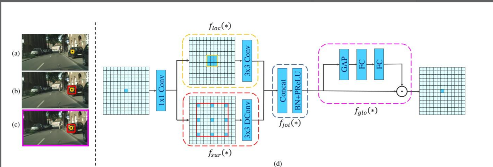

# [yolov11改进系列]基于yolov11引入轻量级下采样ContextGuided的python源码+训练源码

> FL1623863129 于 2025-06-07 08:02:14 发布 阅读量925 收藏 22 点赞数 28 公开
> 文章链接：https://blog.csdn.net/FL1623863129/article/details/148486217

【ContextGuided介绍】

### 1. ContextGuideBlock

#### 1.1 简介

摘要： 随着在移动设备上应用语义分割模型的需求迅速增长，当前的顶尖网络由于参数量巨大，不适合移动设备使用，而其他小内存模型则遵循分类网络的原则，忽略了语义分割的固有特征。为了解决这个问题，我们提出了一个轻量级且高效的语义分割网络- [上下文引导网络](https://zhida.zhihu.com/search?content_id=250005491&content_type=Article&match_order=1&q=%E4%B8%8A%E4%B8%8B%E6%96%87%E5%BC%95%E5%AF%BC%E7%BD%91%E7%BB%9C&zhida_source=entity) （ [CGNet](https://zhida.zhihu.com/search?content_id=250005491&content_type=Article&match_order=1&q=CGNet&zhida_source=entity) ）。本文首次提出CG块，改模块通过学习局部特征和周围上下文的联合特征，并进一步用全局上下文改进了这一联合特征。基于CG块，本文开发了CGNet。它在网络的所有阶段捕获上下文信息，并专门为提高分割精度而设计。CGNet还精心设计了减少参数数量和保存内存占用。在参数数量相当的情况下，提出了CGNet显著优于现有分割网络。

#### 1.2 contextguidedblock-down的基本原理

模拟人类视觉系统依赖上下文信息来理解场景。 [CGBlock](https://zhida.zhihu.com/search?content_id=250005491&content_type=Article&match_order=1&q=CGBlock&zhida_source=entity) 用于捕获局部特征，周围上下文和全局上下文，并将这些信息融合起来以提高准确性。这一模块包含以下部分：

1.  [局部特征提取器](https://zhida.zhihu.com/search?content_id=250005491&content_type=Article&match_order=1&q=%E5%B1%80%E9%83%A8%E7%89%B9%E5%BE%81%E6%8F%90%E5%8F%96%E5%99%A8&zhida_source=entity) （floc）：使用标准卷积层学习局部特征

2.  [周围上下文提取器](https://zhida.zhihu.com/search?content_id=250005491&content_type=Article&match_order=1&q=%E5%91%A8%E5%9B%B4%E4%B8%8A%E4%B8%8B%E6%96%87%E6%8F%90%E5%8F%96%E5%99%A8&zhida_source=entity) （fsur）：使用空洞/膨胀卷积层来学习更大接收野的周围上下文

3.  [联合特征提取器](https://zhida.zhihu.com/search?content_id=250005491&content_type=Article&match_order=1&q=%E8%81%94%E5%90%88%E7%89%B9%E5%BE%81%E6%8F%90%E5%8F%96%E5%99%A8&zhida_source=entity) （fjoi）：通过连接层和批量归一化（BN）以及参数化（ReLU/PReLU）操作来融合局部特征和周围上下文的输出，获取联合特征

4.  [全局上下文提取器](https://zhida.zhihu.com/search?content_id=250005491&content_type=Article&match_order=1&q=%E5%85%A8%E5%B1%80%E4%B8%8A%E4%B8%8B%E6%96%87%E6%8F%90%E5%8F%96%E5%99%A8&zhida_source=entity) （fglo）：使用全局平均池化层聚合全局上下文，并通过多层感知器来进一步提取全局上下文。然后，使用缩放层以提取的全局上下文对联合特征进行加权，以强调有用的组件并抑制无用的组件。

这个过程是自适应的，因为提取的全局上下文是基于输入图像生成的。CG Block的设计允许CGNet能够有效的从底层到顶层聚合上下文信息，并在语义层面和空间层面捕获上下文信息。

（a）FCN-shape（全卷积网络形状）：此模型遵循图像分类的设计原则，忽略了上下文信息。它可能使用一系列卷积和池化层来处理输入图像，生成输出，但没有显式地对各个层次的特征周围上下文进行建模

（b）FCN-CM（全卷积网络-上下文模块）：此模型只在编码阶段后捕获上下文信息，通过执行一个上下文模块来从语义层次提取上下文信息

（c）CGNet（上下文引导网络）：捕获所有阶段的上下文特征，从语义层次何空间层次两方面进行

#### 局部特征提取器：floc(*)

是上下文引导块（CG block）的一个组成 部分，专门用于学习输入数据中的局部特征。在cgnet的设计中，这个局部特征提取器通过标准的3*3卷积层实现，其目的是从图像中的局部区域提取特征。这些局部特征随后与周围上下文特征结合，形成了网络对各个区域的全面理解，这对于语义分割尤为重要。

CGNet使用的局部特征提取器与周围上下文提取器（fsur（*））一起工作，确保模型不仅能够理解每个像素或局部区域的信息，而且还能理解这些区域在整体上下文中的关系。这种提取器能够捕捉到的细节和局部变化信息对于精确地分类图像中的每个像素至关重要，特别是在需要细粒度预测的任务重，如在复杂场景中区分不同的物体和表面。

CGNet的结构设计还包括减少参数数量，其中局部特征提取器和周围上下文提取器采用了通道卷积（channel-wise convolutions），以减少跨通道的计算成本并大幅节约内存。这种设计允许CGNet即使在资源受限的环境中（如移动设备）也能有效运行，同时保持高准确率和实时性。

#### 周围上下文提取器 (fsur(*))

1. 提取更广泛的上下文：周围上下文提取器使用扩展卷积（例如空洞卷积）来增加感受野的大小，从而捕获更宽广的上下文信息，这允许模型观察到更大区域的特征，而不仅仅是局部的细节

2. 辅助局部特征理解：通过结合局部特征和周围上下文，fsur(*)能够提供额外的信息，帮助模型更好地理解复杂的场景，例如，在辨识一个物体时，除了物体本身的特征外，它的周围环境也提供了重要的线索

3. 改进语义分割的准确性：研究表明，周围上下文的信息对于提高语义分割的准确性非常有益，在不同的架构实验中，引入fsur(*)都能显著提升分割的准确率

4. 在网络的所有块中使用：为了充分利用周围上下文的优势，fsur(*)在CGNet的所有块中都有应用，以保证整个网络都能受益于周围上下文信息的提取

5.  [空间金字塔池化](https://zhida.zhihu.com/search?content_id=250005491&content_type=Article&match_order=1&q=%E7%A9%BA%E9%97%B4%E9%87%91%E5%AD%97%E5%A1%94%E6%B1%A0%E5%8C%96&zhida_source=entity) ：在一些变体中，fsur(*)可能会采用空间金字塔池化来聚合不同尺度的上下文信息，这有助于模型捕捉从最小的细节到整体布局的不同层面的信息

#### 联合特征提取器 fjoi（*）

在CGNet中的作用是整合由局部特征提取器和周围上下文提取器提取的特征。这些特征分别捕捉到了输入数据的细节（局部特征）和更广阔区域的信息（周围上下文）。联合特征提取器的设计目的是为了使得网络能够同时考虑局部和上下文信息，从而提高语义分割的准确性

1. 特征融合：联合特征提取器通过连接（concatenation）操作将局部特征和周围上下文特征结合起来，形成一个综合的特征表示

2. 增强特征表示：联合后的特征通过批量归一化和参数化的线性单元等操作进行进一步的加工，以增强特征表示的能力

3. 全局上下文的整合：在某些设计中，联合特征还会与全局上下文特征结合，以利用整个输入图像的信息来进一步优化特征

联合特征提取器是上下文引导网络实现其高效语义分割能力的关键连接点，它允许网络在局部精细度和全局上下文间达到平衡

#### CGNet架构

stage1：包含连续的3*3卷积层，这些层负责提取输入图像的初步特征

stage2：由多个CG块组成，数量用M表示，每个CG块都结合了局部特征提取器和周围上下文提取器，它们一起工作以捕获更复杂的局部和上下文信息

stage3：包含更多的CG块，数量用N表示，这一阶段进一步提炼特征，以捕捉更高层次的上下文信息

1*1conv：将特征映射到目标类别的数量，为最终的上采样和分类做准备

上采样：使用上采样或逆卷积操作将特征图尺寸扩大回输入图像的尺寸

预测：最终的预测图，每个像素被分配了一个类别标签，展示了对输入图像进行语义分割的结果

#### 全局上下文提取器

在CGNet中的作用是捕获并利用整个输入图像的全局信息，以增强联合特征提取器学习到的特征，基本原理如下：

1. 全局特征汇总：全局上下文提取器通过全局平均池化（Global Average Pooling）来聚合整个特征图的全局信息。这个步骤产生一个全局特征向量，它捕获了输入图像中每个通道的平均响应

2.  [多层感知机](https://zhida.zhihu.com/search?content_id=250005491&content_type=Article&match_order=1&q=%E5%A4%9A%E5%B1%82%E6%84%9F%E7%9F%A5%E6%9C%BA&zhida_source=entity) 处理：全局特征向量随后通过一个多层感知机（Multilayer Perceptron，MLP）进一步处理。MLP能够学习特征间的复杂费线性关系，进一步细化全局上下文特征

3. 特征重标定：提取的全局上下文通过缩放层（scale layer）与联合特征结合，这个操作相当于将全局上下文信息作为权重，通道级别地重新标定联合特征，强调有用的特征部分，抑制不重要的特征部分

4. 自适应性：全局上下文提取器的操作是自适应的，因为提取的全局上下文是根据输入图像生成的，使得网络能够针对不同的图像生成定制化的全局上下文

5. 提高分割准确性：在消融研究中，使用全局上下文提取器可以提高分割的准确性。这证明了全局上下文在提升模型性能方面的价值

 

【yolov11框架介绍】

2024 年 9 月 30 日，Ultralytics 在其活动 YOLOVision 中正式发布了 YOLOv11。YOLOv11 是 YOLO 的最新版本，由美国和西班牙的 Ultralytics 团队开发。YOLO 是一种用于基于图像的人工智能的计算机模

#### Ultralytics YOLO11 概述

YOLO11 是Ultralytics YOLO 系列实时物体检测器的最新版本，以尖端的精度、速度和效率重新定义了可能性。基于先前 YOLO 版本的令人印象深刻的进步，YOLO11 在架构和训练方法方面引入了重大改进，使其成为各种计算机视觉任务的多功能选择。


#### Key Features 主要特点

- 增强的特征提取：YOLO11采用改进的主干和颈部架构，增强了特征提取能力，以实现更精确的目标检测和复杂任务性能。

- 针对效率和速度进行优化：YOLO11 引入了精致的架构设计和优化的训练管道，提供更快的处理速度并保持准确性和性能之间的最佳平衡。

- 使用更少的参数获得更高的精度：随着模型设计的进步，YOLO11m 在 COCO 数据集上实现了更高的平均精度(mAP)，同时使用的参数比 YOLOv8m 少 22%，从而在不影响精度的情况下提高计算效率。

- 跨环境适应性：YOLO11可以无缝部署在各种环境中，包括边缘设备、云平台以及支持NVIDIA [GPU](https://cloud.tencent.com/product/gpu?from_column=20065&from=20065) 的系统，确保最大的灵活性。

- 支持的任务范围广泛：无论是对象检测、实例分割、图像分类、姿态估计还是定向对象检测 (OBB)，YOLO11 旨在应对各种计算机视觉挑战。

 

​​​

##### 与之前的版本相比，Ultralytics YOLO11 有哪些关键改进？

Ultralytics YOLO11 与其前身相比引入了多项重大进步。主要改进包括：

- 增强的特征提取：YOLO11采用改进的主干和颈部架构，增强了特征提取能力，以实现更精确的目标检测。

- 优化的效率和速度：精细的架构设计和优化的训练管道可提供更快的处理速度，同时保持准确性和性能之间的平衡。

- 使用更少的参数获得更高的精度：YOLO11m 在 COCO 数据集上实现了更高的平均精度(mAP)，参数比 YOLOv8m 少 22%，从而在不影响精度的情况下提高计算效率。

- 跨环境适应性：YOLO11可以跨各种环境部署，包括边缘设备、云平台和支持NVIDIA GPU的系统。

- 支持的任务范围广泛：YOLO11 支持多种计算机视觉任务，例如对象检测、实例分割、图像分类、姿态估计和定向对象检测 (OBB)

【测试环境】

windows10 x64

ultralytics==8.3.0

torch==2.3.1

【改进流程】

##### 1. 新增ContextGuided.py实现模块（代码太多，核心模块源码请参考改进步骤.docx）然后在同级目录下面创建一个__init___.py文件写代码

from .ContextGuided import *

##### 2. 文件修改步骤

**修改tasks.py文件** 

**创建模型配置文件** 

yolo11-ContextGuided.yaml内容如下：

```cobol
# Ultralytics YOLO 🚀, AGPL-3.0 license
# YOLO11 object detection model with P3-P5 outputs. For Usage examples see https://docs.ultralytics.com/tasks/detect
 
# Parameters
nc: 80 # number of classes
scales: # model compound scaling constants, i.e. 'model=yolo11n.yaml' will call yolo11.yaml with scale 'n'
  # [depth, width, max_channels]
  n: [0.50, 0.25, 1024] # summary: 319 layers, 2624080 parameters, 2624064 gradients, 6.6 GFLOPs
  s: [0.50, 0.50, 1024] # summary: 319 layers, 9458752 parameters, 9458736 gradients, 21.7 GFLOPs
  m: [0.50, 1.00, 512] # summary: 409 layers, 20114688 parameters, 20114672 gradients, 68.5 GFLOPs
  l: [1.00, 1.00, 512] # summary: 631 layers, 25372160 parameters, 25372144 gradients, 87.6 GFLOPs
  x: [1.00, 1.50, 512] # summary: 631 layers, 56966176 parameters, 56966160 gradients, 196.0 GFLOPs
 
# YOLO11n backbone
backbone:
  # [from, repeats, module, args]
  - [-1, 1, Conv, [64, 3, 2]] # 0-P1/2
  - [-1, 1, ContextGuidedBlock_Down, [128]] # 1-P2/4
  - [-1, 2, C3k2, [256, False, 0.25]]
  - [-1, 1, ContextGuidedBlock_Down, [256]] # 3-P3/8
  - [-1, 2, C3k2, [512, False, 0.25]]
  - [-1, 1, ContextGuidedBlock_Down, [512]] # 5-P4/16
  - [-1, 2, C3k2, [512, True]]
  - [-1, 1, ContextGuidedBlock_Down, [1024]] # 7-P5/32
  - [-1, 2, C3k2, [1024, True]]
  - [-1, 1, SPPF, [1024, 5]] # 9
  - [-1, 2, C2PSA, [1024]] # 10
 
# YOLO11n head
head:
  - [-1, 1, nn.Upsample, [None, 2, "nearest"]]
  - [[-1, 6], 1, Concat, [1]] # cat backbone P4
  - [-1, 2, C3k2, [512, False]] # 13
 
  - [-1, 1, nn.Upsample, [None, 2, "nearest"]]
  - [[-1, 4], 1, Concat, [1]] # cat backbone P3
  - [-1, 2, C3k2, [256, False]] # 16 (P3/8-small)
 
  - [-1, 1, ContextGuidedBlock_Down, [256]]
  - [[-1, 13], 1, Concat, [1]] # cat head P4
  - [-1, 2, C3k2, [512, False]] # 19 (P4/16-medium)
 
  - [-1, 1, ContextGuidedBlock_Down, [512]]
  - [[-1, 10], 1, Concat, [1]] # cat head P5
  - [-1, 2, C3k2, [1024, True]] # 22 (P5/32-large)
 
  - [[16, 19, 22], 1, Detect, [nc]] # Detect(P3, P4, P5)
```

##### 3. 验证集成

git搜futureflsl/yolo-improve获取源码，然后使用新建的yaml配置文件启动训练任务：

```cobol
from ultralytics import YOLO
 
if __name__ == '__main__':
    model = YOLO('yolo11-ContextGuided.yaml')  # build from YAML and transfer weights
        # Train the model
    results = model.train(data='coco128.yaml',epochs=100, imgsz=640, batch=8, device=0, workers=1, save=True,resume=False)
```

成功集成后，训练日志中将显示ContextGuided模块的初始化信息，表明已正确加载到模型中。

<div style="text-align:center;">​​</div>

【训练说明】

第一步：首先安装好yolov11必要模块，可以参考yolov11框架安装流程，然后卸载官方版本pip uninstall ultralytics，最后安装改进的源码pip install .
第二步：将自己数据集按照dataset文件夹摆放，要求文件夹名字都不要改变
第三步：分别打开train.py,coco128.yaml和模型参数yaml文件修改必要的参数，最后执行python train.py即可训练

【提供文件】

```cobol
├── [官方源码]ultralytics-8.3.0.zip
├── train/
│   ├── coco128.yaml
│   ├── dataset/
│   │   ├── train/
│   │   │   ├── images/
│   │   │   │   ├── firc_pic_1.jpg
│   │   │   │   ├── firc_pic_10.jpg
│   │   │   │   ├── firc_pic_11.jpg
│   │   │   │   ├── firc_pic_12.jpg
│   │   │   │   ├── firc_pic_13.jpg
│   │   │   ├── labels/
│   │   │   │   ├── classes.txt
│   │   │   │   ├── firc_pic_1.txt
│   │   │   │   ├── firc_pic_10.txt
│   │   │   │   ├── firc_pic_11.txt
│   │   │   │   ├── firc_pic_12.txt
│   │   │   │   ├── firc_pic_13.txt
│   │   └── val/
│   │       ├── images/
│   │       │   ├── firc_pic_100.jpg
│   │       │   ├── firc_pic_81.jpg
│   │       │   ├── firc_pic_82.jpg
│   │       │   ├── firc_pic_83.jpg
│   │       │   ├── firc_pic_84.jpg
│   │       ├── labels/
│   │       │   ├── firc_pic_100.txt
│   │       │   ├── firc_pic_81.txt
│   │       │   ├── firc_pic_82.txt
│   │       │   ├── firc_pic_83.txt
│   │       │   ├── firc_pic_84.txt
│   ├── train.py
│   ├── yolo11-ContextGuided.yaml
│   └── 训练说明.txt
├── [改进源码]ultralytics-8.3.0.zip
├── 改进原理.docx
└── 改进流程.docx
```

【常见问题汇总】
问：为什么我训练的模型epoch显示的map都是0或者map精度很低?
回答：由于源码改进过，因此不能直接从官方模型微调，而是从头训练，这样学习特征能力会很弱，需要训练很多epoch才能出现效果。此外由于改进的源码框架并不一定能够保证会超过官方精度，而且也有可能会存在远远不如官方效果，甚至精度会很低。这说明改进的框架并不能取得很好效果。所以说对于框架改进只是提供一种可行方案，至于改进后能不能取得很好map还需要结合实际训练情况确认，当然也不排除数据集存在问题，比如数据集比较单一，样本分布不均衡，泛化场景少，标注框不太贴合标注质量差，检测目标很小等等原因
【重要说明】
我们只提供改进框架一种方案，并不保证能够取得很好训练精度，甚至超过官方模型精度。因为改进框架，实际是一种比较复杂流程，包括框架原理可行性，训练数据集是否合适，训练需要反正验证以及同类框架训练结果参数比较，这个是十分复杂且漫长的过程。