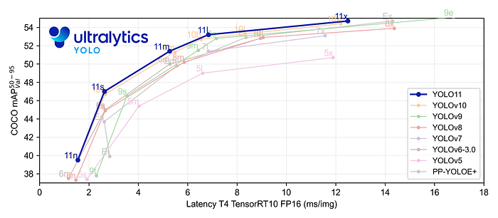

# [yolov11改进系列]基于yolov11使用可逆列网络RevColV1替换backbone用于提高小目标检测能力的python源码+训练源码

> FL1623863129 于 2025-06-07 08:49:01 发布 阅读量668 收藏 17 点赞数 25 公开
> 文章链接：https://blog.csdn.net/FL1623863129/article/details/148486612

【RevColV1介绍】

可逆列网络去发表于ICLR2022，其是一种新型的神经网络设计 **(和以前的网络结构的传播方式不太一样)** ，由多个子网络（列）通过多级 [可逆连接](https://zhida.zhihu.com/search?content_id=238698978&content_type=Article&match_order=1&q=%E5%8F%AF%E9%80%86%E8%BF%9E%E6%8E%A5&zhida_source=entity) 组成。这种设计允许在前向传播过程中特征解耦，保持总信息无压缩或丢弃。

### 1.1 RevColV1的基本原理

RevCol的主要原理和思想是利用可逆连接来设计网络结构，允许信息在网络的不同分支（列）间自由流动而不丢失。这种多列结构在前向传播过程中逐渐解耦特征，并保持全部信息，而不是进行压缩或舍弃。这样的设计提高了网络在图像分类、对象检测和语义分割等计算机视觉任务中的表现，尤其是在参数量大和数据集大时。

**RevCol的创新点我将其总结为以下几点：** 

1. 可逆连接设计：通过多个子网络（列）间的可逆连接，保证信息在前向传播过程中不丢失。 2. 特征解耦：在每个列中，特征逐渐被解耦，保持总信息而非压缩或舍弃。 3. 适用于大型数据集和参数：在大型数据集和高参数预算下表现出色。 4. 跨模型应用：可作为宏架构方式，应用于变换器或其他神经网络，改善计算机视觉和NLP任务的性能。

简单总结：RevCol通过其独特的多列结构和可逆连接设计，使得网络能够在处理信息时保持完整性，提高特征处理的效率。这种架构在数据丰富且复杂的情况下尤为有效，且可灵活应用于不同类型的神经网络模型中。

其中的创新点第四点不用叙述了，网络结构可以应用于我们的YOLOv11就是最好的印证。

 

编辑​这是论文中的图片1，展示了传统单列网络（a）与RevCol（b）的信息传播对比。在图(a)中，信息通过一个接一个的层线性传播，每层处理后传递给下一层直至输出。而在图(b)中，RevCol通过多个并行列（Col 1 到 Col N）处理信息，其中可逆连接（蓝色曲线）允许信息在列间传递，保持低级别和语义级别的信息传播。这种结构有助于整个网络维持更丰富的信息，并且每个列都能从其他列中学习到信息，增强了特征的表达和网络的学习能力 **(但是这种做法导致模型的参数量非常巨大，而且训练速度缓慢计算量比较大)。** 

#### 1.1.1 可逆连接设计

在RevCol中的可逆连接设计允许多个子网络（称为列）之间进行信息的双向流动。这意味着在前向传播的过程中，每一列都能接收到前一列的信息，并将自己的处理结果传递给下一列，同时能够保留传递过程中的所有信息。这种设计避免了在传统的深度网络中常见的信息丢失问题，特别是在网络层次较深时。因此，RevCol可以在深层网络中维持丰富的特征表示，从而提高了模型对数据的表示能力和学习效率。

 

这张图片展示了RevCol网络的不同组成部分和信息流动方式。

- 图 (a) 展示了RevNet中的一个可逆单元，标识了不同时间步长的状态。

- 图 (b) 展示了多级可逆单元，所有输入在不同级别上进行信息交换。

- 图 (c) 提供了整个可逆列网络架构的概览，其中包含了简化的多级可逆单元。

整个设计允许信息在网络的不同层级和列之间自由流动，而不会丢失任何信息，这对于深层网络的学习和特征提取是非常有益的 **(我觉得这里有点类似于Neck部分允许层级之间相互交流信息)** 。

#### 1.1.2 特征解耦

特征解耦是指在RevCol网络的每个子网络（列）中，特征通过可逆连接传递，同时独立地进行处理和学习。这样，每个列都能保持输入信息的完整性，而不会像传统的深度网络那样，在层与层之间传递时压缩或丢弃信息。随着信息在列中的前进，特征之间的关联性逐渐减弱（解耦），使得网络能够更细致地捕捉并强调重要的特征，这有助于提高模型在复杂任务上的性能和泛化能力。

 

这张图展示了RevCol网络的一个级别（Level l）的微观设计，以及特征融合模块（Fusion Block）的设计。在图（a）中，展示了 [ConvNeXt](https://zhida.zhihu.com/search?content_id=238698978&content_type=Article&match_order=1&q=ConvNeXt&zhida_source=entity) 级别的标准结构，包括下采样块和残差块。图（b）中的RevCol级别包含了融合模块、残差块和可逆操作。这里的特征解耦是通过融合模块实现的，该模块接收相邻级别的特征图。

【yolov11框架介绍】

2024 年 9 月 30 日，Ultralytics 在其活动 YOLOVision 中正式发布了 YOLOv11。YOLOv11 是 YOLO 的最新版本，由美国和西班牙的 Ultralytics 团队开发。YOLO 是一种用于基于图像的人工智能的计算机模

#### Ultralytics YOLO11 概述

YOLO11 是Ultralytics YOLO 系列实时物体检测器的最新版本，以尖端的精度、速度和效率重新定义了可能性。基于先前 YOLO 版本的令人印象深刻的进步，YOLO11 在架构和训练方法方面引入了重大改进，使其成为各种计算机视觉任务的多功能选择。



#### Key Features 主要特点

- 增强的特征提取：YOLO11采用改进的主干和颈部架构，增强了特征提取能力，以实现更精确的目标检测和复杂任务性能。

- 针对效率和速度进行优化：YOLO11 引入了精致的架构设计和优化的训练管道，提供更快的处理速度并保持准确性和性能之间的最佳平衡。

- 使用更少的参数获得更高的精度：随着模型设计的进步，YOLO11m 在 COCO 数据集上实现了更高的平均精度(mAP)，同时使用的参数比 YOLOv8m 少 22%，从而在不影响精度的情况下提高计算效率。

- 跨环境适应性：YOLO11可以无缝部署在各种环境中，包括边缘设备、云平台以及支持NVIDIA [GPU](https://cloud.tencent.com/product/gpu?from_column=20065&from=20065) 的系统，确保最大的灵活性。

- 支持的任务范围广泛：无论是对象检测、实例分割、图像分类、姿态估计还是定向对象检测 (OBB)，YOLO11 旨在应对各种计算机视觉挑战。

 

​​​

##### 与之前的版本相比，Ultralytics YOLO11 有哪些关键改进？

Ultralytics YOLO11 与其前身相比引入了多项重大进步。主要改进包括：

- 增强的特征提取：YOLO11采用改进的主干和颈部架构，增强了特征提取能力，以实现更精确的目标检测。

- 优化的效率和速度：精细的架构设计和优化的训练管道可提供更快的处理速度，同时保持准确性和性能之间的平衡。

- 使用更少的参数获得更高的精度：YOLO11m 在 COCO 数据集上实现了更高的平均精度(mAP)，参数比 YOLOv8m 少 22%，从而在不影响精度的情况下提高计算效率。

- 跨环境适应性：YOLO11可以跨各种环境部署，包括边缘设备、云平台和支持NVIDIA GPU的系统。

- 支持的任务范围广泛：YOLO11 支持多种计算机视觉任务，例如对象检测、实例分割、图像分类、姿态估计和定向对象检测 (OBB)

【测试环境】

windows10 x64

ultralytics==8.3.0

torch==2.3.1

【改进流程】

##### 1. 新增RevColV1.py实现模块（代码太多，核心模块源码请参考改进步骤.docx）然后在同级目录下面创建一个__init___.py文件写代码

from .RevColV1 import *

##### 2. 文件修改步骤

**修改tasks.py文件** 

**创建模型配置文件** 

yolo11-RevColV1.yaml内容如下：

```cobol
# Ultralytics YOLO 🚀, AGPL-3.0 license
# YOLO11 object detection model with P3-P5 outputs. For Usage examples see https://docs.ultralytics.com/tasks/detect
 
# Parameters
nc: 80 # number of classes
scales: # model compound scaling constants, i.e. 'model=yolo11n.yaml' will call yolo11.yaml with scale 'n'
  # [depth, width, max_channels]
  n: [0.50, 0.25, 1024] # summary: 319 layers, 2624080 parameters, 2624064 gradients, 6.6 GFLOPs
  s: [0.50, 0.50, 1024] # summary: 319 layers, 9458752 parameters, 9458736 gradients, 21.7 GFLOPs
  m: [0.50, 1.00, 512] # summary: 409 layers, 20114688 parameters, 20114672 gradients, 68.5 GFLOPs
  l: [1.00, 1.00, 512] # summary: 631 layers, 25372160 parameters, 25372144 gradients, 87.6 GFLOPs
  x: [1.00, 1.50, 512] # summary: 631 layers, 56966176 parameters, 56966160 gradients, 196.0 GFLOPs
 
# 共四个版本  "revcol_tiny, revcol_base, revcol_small, revcol_large, revcol_xlarge"
# YOLO11n backbone
backbone:
  # [from, repeats, module, args]
  - [-1, 1, revcol_tiny, []] # 0-4 P1/2
  - [-1, 1, SPPF, [1024, 5]] # 5
  - [-1, 2, C2PSA, [1024]] # 6
 
# YOLO11n head
head:
  - [-1, 1, nn.Upsample, [None, 2, "nearest"]]
  - [[-1, 3], 1, Concat, [1]] # cat backbone P4
  - [-1, 2, C3k2, [512, False]] # 9
 
  - [-1, 1, nn.Upsample, [None, 2, "nearest"]]
  - [[-1, 2], 1, Concat, [1]] # cat backbone P3
  - [-1, 2, C3k2, [256, False]] # 12 (P3/8-small)
 
  - [-1, 1, Conv, [256, 3, 2]]
  - [[-1, 9], 1, Concat, [1]] # cat head P4
  - [-1, 2, C3k2, [512, False]] # 15 (P4/16-medium)
 
  - [-1, 1, Conv, [512, 3, 2]]
  - [[-1, 6], 1, Concat, [1]] # cat head P5
  - [-1, 2, C3k2, [1024, True]] # 18 (P5/32-large)
 
  - [[12, 15, 18], 1, Detect, [nc]] # Detect(P3, P4, P5)
```

##### 3. 验证集成

git搜futureflsl/yolo-improve获取源码，然后使用新建的yaml配置文件启动训练任务：

```cobol
from ultralytics import YOLO
 
if __name__ == '__main__':
    model = YOLO('yolo11-RevColV1.yaml')  # build from YAML and transfer weights
        # Train the model
    results = model.train(data='coco128.yaml',epochs=100, imgsz=640, batch=8, device=0, workers=1, save=True,resume=False)
```

成功集成后，训练日志中将显示RevColV1模块的初始化信息，表明已正确加载到模型中。

<div style="text-align:center;">​​</div>

【训练说明】

第一步：首先安装好yolov11必要模块，可以参考yolov11框架安装流程，然后卸载官方版本pip uninstall ultralytics，最后安装改进的源码pip install .
第二步：将自己数据集按照dataset文件夹摆放，要求文件夹名字都不要改变
第三步：分别打开train.py,coco128.yaml和模型参数yaml文件修改必要的参数，最后执行python train.py即可训练

【提供文件】

```cobol
├── [官方源码]ultralytics-8.3.0.zip
├── train/
│   ├── coco128.yaml
│   ├── dataset/
│   │   ├── train/
│   │   │   ├── images/
│   │   │   │   ├── firc_pic_1.jpg
│   │   │   │   ├── firc_pic_10.jpg
│   │   │   │   ├── firc_pic_11.jpg
│   │   │   │   ├── firc_pic_12.jpg
│   │   │   │   ├── firc_pic_13.jpg
│   │   │   ├── labels/
│   │   │   │   ├── classes.txt
│   │   │   │   ├── firc_pic_1.txt
│   │   │   │   ├── firc_pic_10.txt
│   │   │   │   ├── firc_pic_11.txt
│   │   │   │   ├── firc_pic_12.txt
│   │   │   │   ├── firc_pic_13.txt
│   │   └── val/
│   │       ├── images/
│   │       │   ├── firc_pic_100.jpg
│   │       │   ├── firc_pic_81.jpg
│   │       │   ├── firc_pic_82.jpg
│   │       │   ├── firc_pic_83.jpg
│   │       │   ├── firc_pic_84.jpg
│   │       ├── labels/
│   │       │   ├── firc_pic_100.txt
│   │       │   ├── firc_pic_81.txt
│   │       │   ├── firc_pic_82.txt
│   │       │   ├── firc_pic_83.txt
│   │       │   ├── firc_pic_84.txt
│   ├── train.py
│   ├── yolo11-RevColV1.yaml
│   └── 训练说明.txt
├── [改进源码]ultralytics-8.3.0.zip
├── 改进原理.docx
└── 改进流程.docx
```

【常见问题汇总】
问：为什么我训练的模型epoch显示的map都是0或者map精度很低?
回答：由于源码改进过，因此不能直接从官方模型微调，而是从头训练，这样学习特征能力会很弱，需要训练很多epoch才能出现效果。此外由于改进的源码框架并不一定能够保证会超过官方精度，而且也有可能会存在远远不如官方效果，甚至精度会很低。这说明改进的框架并不能取得很好效果。所以说对于框架改进只是提供一种可行方案，至于改进后能不能取得很好map还需要结合实际训练情况确认，当然也不排除数据集存在问题，比如数据集比较单一，样本分布不均衡，泛化场景少，标注框不太贴合标注质量差，检测目标很小等等原因
【重要说明】
我们只提供改进框架一种方案，并不保证能够取得很好训练精度，甚至超过官方模型精度。因为改进框架，实际是一种比较复杂流程，包括框架原理可行性，训练数据集是否合适，训练需要反正验证以及同类框架训练结果参数比较，这个是十分复杂且漫长的过程。