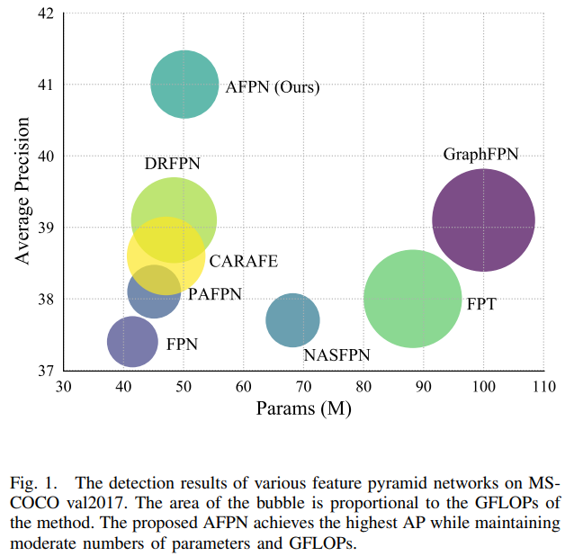
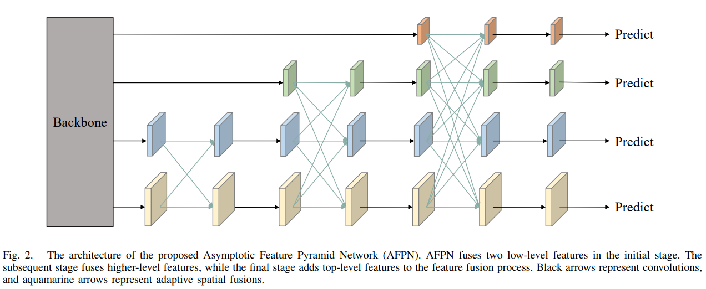
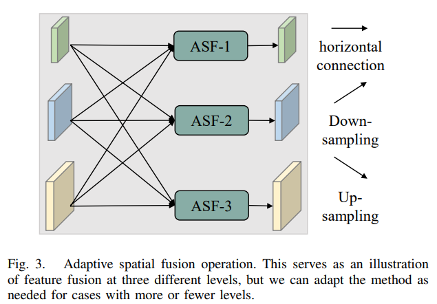
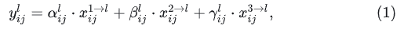

# [yolov11改进系列]基于yolov11融合改进检测头特征融合模块AFPN的python源码+训练源码

> FL1623863129 于 2025-06-07 13:36:57 发布 阅读量953 收藏 16 点赞数 17 公开
> 文章链接：https://blog.csdn.net/FL1623863129/article/details/148494399

【AFPN介绍】

### 摘要

目标检测中的特征金字塔结构，包括FPN和PAFPN，这两种结构都可以应用于一阶段和二阶段方法中，以提高目标检测的性能。FPN是最常用的特征金字塔结构，用于解决尺度变化问题，而PAFPN则通过增加自下而上的路径来补偿平均精度的不足。

本文提出了新型的 [特征金字塔网络](https://zhida.zhihu.com/search?content_id=256554080&content_type=Article&match_order=1&q=%E7%89%B9%E5%BE%81%E9%87%91%E5%AD%97%E5%A1%94%E7%BD%91%E7%BB%9C&zhida_source=entity) （AFPN），旨在支持非相邻级别的直接交互，提高目标检测任务的性能。AFPN通过融合两个相邻的低级别特征，并以渐近方式将更高级别的特征纳入融合过程中，避免了非相邻级别之间的语义鸿沟。此外，还采用了 [自适应空间融合操作](https://zhida.zhihu.com/search?content_id=256554080&content_type=Article&match_order=1&q=%E8%87%AA%E9%80%82%E5%BA%94%E7%A9%BA%E9%97%B4%E8%9E%8D%E5%90%88%E6%93%8D%E4%BD%9C&zhida_source=entity) 来缓解多目标信息冲突。与经典的特征金字塔网络相比，AFPN提供了更好的特征融合效果。 经过MS-COCO 2017验证和测试数据集的评估，实验结果表明比其他最先进的方法更具竞争力。

将AFPN用来改进YoloV8，效果如何呢？

### 论文：《AFPN：用于目标检测的 [渐近特征金字塔网络](https://zhida.zhihu.com/search?content_id=256554080&content_type=Article&match_order=1&q=%E6%B8%90%E8%BF%91%E7%89%B9%E5%BE%81%E9%87%91%E5%AD%97%E5%A1%94%E7%BD%91%E7%BB%9C&zhida_source=entity) 》

[https://arxiv.org/pdf/2306.15988v1.pdf](https://link.zhihu.com/?target=https%3A//arxiv.org/pdf/2306.15988v1.pdf) 在目标检测任务中， 多尺度特征在编码具有尺度方差的 目标方面具有重要意义。 多尺度特征提取的一种常见策略是采用经 典的自上而下和自下而上的特征金字塔网络。 然而， 这些方法存在 特征信息丢失或退化的问题， 削弱了非相邻层次的融合效果。 本文 提出了一种支持非相邻层次直接交互的渐近特征金字塔网络 (AFPN)。 AFPN首先融合两个相邻的低级特征， 然后逐渐将高级特 征纳入融合过程。 通过这种方式， 可以避免不相邻层次之间更大的 语义鸿沟。 考虑到在每个空间位置的特征融合过程中可能会出现多 目标信息冲突， 进一步利用自适应空间融合操作来缓解这些不一致 性。 我们将提出的AFPN纳入两阶段和一阶段目标检测框架， 并使 用MS-COCO 2017验证和测试数据集进行评估。 实验评估表明， 所 提出的方法比其他最先进的特征金字塔网络取得了更具竞争力的结 果。

索引术语-目标检测， 特征金字塔网络， 渐近融合， 自适应空 间融合。

### 1、介绍

目标检测是计算机视觉中的一个基本问题， 旨在检测和 定位图像或视频中的目标。 随着深度学习的出现， 目标检 测发生了范式的转变， 基于深度学习的方法成为了主导方 法。 持续的研究导致了许多新方法的发展， 表明该领域有 进一步进步的潜力。



在这里插入图片描述


基于深度学习的目标检测方法通常分为单阶段方法和两 阶段方法。 单阶段方法[1]-[3]直接从输入图像中预测物体的 类别和位置。 两阶段方法[4]-[7]则首先生成一组候选区域， 然后对这些区域进行分类和位置回归。 图像中对象大小的 不确定性会导致在单一尺度的特征提取中细节信息的丢失。 因此， 目标检测模型通常引入特征金字塔架构[8]-[15]来解 决尺度变化的问题。 其中，FPN[8]是最常用的特征金字塔 架构。 利用FPN， 一级和两级检测器都能获得更好的检测效 果。 PAFPN[9]在FPN的基础上， 在特征金字塔网络中增加 了一条自下而上的路径， 弥补了FPN的高级特性中的低级特性细节。

对于目标检测任务来说， 真正有用的特征必须包含关于 目标的细节和语义信息， 这些特征应该由一个足够深度的 神经网络来提取。 在现有的特征金字塔架构[8]、 [9]、 [16]、 [17]中， 金字塔顶部的高层特征需要通过多个中间尺度进行 传播， 并与这些尺度上的特征进行交互， 然后才能与底层 的低层特征进行融合。 在这个传播和交互的过程中， 来自 高层特征的语义信息可能会丢失或退化。 同时， PAFPN自 底向上的路径[9]带来了相反的问题:在传播和交互过程中， 底层特征的详细信息可能会丢失或退化。 在最近的研究中， GraphFPN[13]解决了仅在相邻尺度特征之间直接交互的局 限性， 并针对这个问题引入了图神经网络。 然而， 额外的 图神经网络结构显著增加了检测模型的参数和计算量， 这 超过了它的好处。

现有的特征金字塔网络通常将骨干网络生成的高级特征上采样为低级特征。然而，我们注意到HRNet[18]在整个特征提取过程中都保持着低层特征，并反复融合低层和高层特征以生成更丰富的低层特征。该方法在人体姿态估计领域表现出了突出的优势。受HRNet网络架构的启发，本文提出一种渐近特征金字塔网络(AFPN)来解决上述限制。在主干的自底向上特征提取过程中，我们通过在第一阶段结合两个不同分辨率的低级特征来启动融合过程。随着我们进展到后期阶段，我们逐渐将高级特征纳入融合过程中，最终融合骨干的顶级特征。这种融合方式可以避免不相邻层次之间存在较大的语义鸿沟。在此过程中，将低层特征与高层特征的语义信息进行融合，高层特征与低层特征的细节信息进行融合。由于它们的直接交互，避免了多级传输过程中的信息丢失或退化。在整个特征融合过程中，elementwise sum方法并不是一种有效的方法，因为在不同层次之间可能会出现同一位置的不同对象之间的矛盾。为了解决这一问题，在多级融合过程中，利用自适应空间融合操作对特征进行筛选。这使我们能够保留有用的信息进行融合。

为了评估我们的方法的性能， 我们在 [MS COCO 2017](https://zhida.zhihu.com/search?content_id=256554080&content_type=Article&match_order=1&q=MS+COCO+2017&zhida_source=entity) 数据集上使用了更快R-CNN框架。 具体来说， 我们 使用 [ResNet-50](https://zhida.zhihu.com/search?content_id=256554080&content_type=Article&match_order=1&q=ResNet-50&zhida_source=entity) 和 [ResNet-101](https://zhida.zhihu.com/search?content_id=256554080&content_type=Article&match_order=1&q=ResNet-101&zhida_source=entity) 作为主干网， 与基于fpn的更 快R-CNN相比， 它们分别提高了1.6%和2.6%。 我们将其 与其他特征金字塔网络进行了比较。 实验结果表明， 所 提出的AFPN不仅比其他最先进的特征金字塔网络具有 更强的竞争力， 而且具有最低的每秒浮点运算(FLOPs)。 此外， 我们将AFPN扩展到一级检测器。 我们在 [YOLOv5](https://zhida.zhihu.com/search?content_id=256554080&content_type=Article&match_order=1&q=YOLOv5&zhida_source=entity) 框架上实现了所提出的方法， 并以较少的参数获得了优 于基线的性能。

我们的主要贡献如下:(1)我们引入了一个渐近特征金 字塔网络(AFPN)， 它促进了非相邻层之间的直接特征融 合， 从而防止了特征信息在传输和交互过程中的丢失或 退化。 (2)为了抑制不同层次特征之间的信息矛盾， 我们 将自适应空间融合操作纳入到多层次特征融合过程中。 (3)在MS COCO 2017验证和测试数据集上的大量实验表 明， 与其他特征金字塔网络相比， 我们的方法具有更高 的计算效率， 同时获得更有竞争力的结果。

### 2、相关工作

传统的计算机视觉方法通常只从图像中提取一个尺度特征进行分析处理。这将导致对不同尺寸的物体或不同尺度的场景检测性能 较差。 研究人员已经构建了包含各种尺度特征的特征金 字塔， 克服了使用单尺度特征的局限性。 此外， 许多研 究提出了特征融合模块， 旨在增强或细化特征金字塔网 络， 进一步提升检测器的性能。

**A. 特征金字塔** FPN[8]采用自顶向下的方式将高层特征转移到低层 特征， 实现不同层次特征的融合。 但是， 在这个过程中， 高层特征并不会与低层特征融合。 为此， PAFPN[9]在 FPN的基础上增加了一条自底向上的路径， 使高层特征 在低层特征中获取细节。 与固定网络架构方法不同， NASFPN[10]使用神经架构搜索算法自动搜索最优连接结 构。 最近， 其他领域的思想也被引入到特征金字塔架构 中。 例如， FPT[12]引入了NLP领域的自注意机制， 提取 不同层次的特征， 并使用多尺度注意网络对这些特征进 行聚合。 GraphFPN[13]利用图神经网络在特征金字塔上 进行交互和信息传播。 虽然GraphFPN也促进了非相邻层 之间的直接交互， 但它对图神经网络的依赖大大增加了 参数数量和计算复杂度， FPT也存在类似的问题。 相比 之下， AFPN只引入正常的卷积分量。 因此， 我们的 AFPN在实际应用中更具有可行性和实用性。 **B. 特征融合模块** 特征融合模块通常被合并到一个预先存在的、 固定 拓扑的特征金字塔中， 以增强其特征。 也进行了一些研 究来增强特征金字塔的上采样模块。 在本文中， 不改变 特征金字塔拓扑结构的模块称为特征融合模块。 CARAFE[19]是一种通用的、 轻量级的、 高效的上采样 算子， 可以聚合大量的感受野信息。 考虑到不同层次的 特征之间可能存在矛盾的信息， ASFF[20]为不同层次的 特征添加权重， 以便有效地融合它们。 DRFPN[21]通过 合并空间细化块(SRB)和通道细化块(CRB)扩展了PAFPN [9]架构。 SRB模块利用相邻级别的上下文信息来学习上 采样点的位置和内容， 而CRB模块利用注意机制来学习 自适应信道合并策略。 与这些特征金字塔架构相比， 特 征金字塔模块可以无缝集成到广泛的现有特征金字塔架 构中， 为解决特征金字塔的各种局限性提供了一个实用 的解决方案。特征金字塔的一个限制是在特征融合时来自同一位置的不同目标的信息共存。这种限制在AFPN中尤其明显，因为它需要更多轮的特征融合。进一步，进行自适应空间融合，以有效融合不同层次的特征。

### 3、渐进特征金字塔网络

**A. 提取多层次特征** 

与许多基于特征金字塔网络的目标检测方法一样，在特征融合之前，从主干网络中提取了不同级别的特征。我们遵循 [Faster R-CNN](https://zhida.zhihu.com/search?content_id=256554080&content_type=Article&match_order=1&q=Faster+R-CNN&zhida_source=entity) [8]框架的设计，该框架从主干网络的每个特征层中提取最后一层特征，得到一组不同尺度的特征表示为$\left{C_{2}, C_{3}, C_{4}, C_{5}\right}$。为了进行特征融合，首先将低层特征$C_{2}$和$C_{3}$输入到特征金字塔网络中，然后添加$C_{4}$，最后添加$C_{5}$。在特征融合之后，产生了一组多尺度特征$\left{P_{2}, P_{3}, P_{4}, P_{5}\right}$。对于在Faster R-CNN框架上进行的实验，我们对$P_{5}$应用步长为2的卷积，然后对$P_{6}$应用步长为1的卷积来生成，确保统一的输出。最终的多尺度特征集为$\left{P_{2}, P_{3}, P_{4}, P_{5}, P_{6}\right}$，对应的特征步长为${4, 8, 16, 32, 64}$像素。需要注意的是，YOLO只将$\left{C_{3}, C_{4}, C_{5}\right}$输入到特征金字塔网络中，生成了$\left{P_{3}, P_{4}, P_{5}\right}$的输出。



在这里插入图片描述


**B. 渐近架构（Asymptotic Architecture）** 所提出的AFPN的架构如图2所示。在主干网络自下而上的特征提取过程中，AFPN渐近地融合了低级、高级和顶级特征。具体来说，AFPN最初融合了低级特征，接着融合了深层特征，最后融合了最顶层的特征，即最抽象的特征。非相邻层次之间的语义鸿沟大于相邻层次之间的语义鸿沟，尤其是底层和顶层特征之间的语义鸿沟。这导致直接使用C2、C3、C4和C5进行特征融合的效果较差。由于AFPN的架构是渐近的，这使得不同层次的特征在渐近融合过程中的语义信息更加接近，从而缓解了上述问题。例如，C2和C3之间的特征融合减小了它们的语义鸿沟。由于C3和C4是相邻层次的特征，因此减小了C2和C4之间的语义鸿沟。

为了对齐维度和准备特征融合，我们使用1 × 1卷积和双线性插值方法来上采样特征。另一方面，我们根据所需的下采样率使用不同的卷积核和步幅进行下采样。例如，我们应用一个步幅为2的2 × 2卷积实现2倍下采样，一个步幅为4的4 × 4卷积进行4倍下采样，一个步幅为8的8 × 8卷积进行8倍下采样。在特征融合之后，我们继续使用四个残差单元来学习特征，这些残差单元类似于ResNet [24]。每个残差单元包括两个3 × 3卷积。由于YOLO中只使用了三个级别的特征，因此没有8倍的上采样和8倍的下采样。



在这里插入图片描述


**C. 自适应空间融合（Adaptive Spatial Fusion）** 我们利用ASFF [20]在多级特征融合过程中为不同级别的特征赋予不同的空间权重，以增强关键级别的意义并减轻来自不同物体的矛盾信息的影响。如图3所示，我们对三个级别的特征进行融合。令 $x_{i j}^{n \rightarrow l}$ 表示从第n级到第l级的特征向量在位置（i，j）处的值。通过多级特征的自适应空间融合，得到的结果特征向量记为 $y_{i j}^{l}$，它由特征向量 $x_{i j}^{1 \rightarrow l}$、$x_{i j}^{2 \rightarrow l}$ 和 $x_{i j}^{3 \rightarrow l}$ 的线性组合定义如下：

 

其中$\alpha_{i j}^{l}$、$\beta_{i j}^{l}$和$\gamma_{i j}^{l}$表示第l级三个级别特征的空间权重，满足约束条件$\alpha_{i j}^{l}+\beta_{i j}^{l}+\gamma_{i j}^{l}=1$。考虑到AFPN每个阶段融合特征数量的差异，我们实现了特定阶段的自适应空间融合模块数量。

【yolov11框架介绍】

2024 年 9 月 30 日，Ultralytics 在其活动 YOLOVision 中正式发布了 YOLOv11。YOLOv11 是 YOLO 的最新版本，由美国和西班牙的 Ultralytics 团队开发。YOLO 是一种用于基于图像的人工智能的计算机模

#### Ultralytics YOLO11 概述

YOLO11 是Ultralytics YOLO 系列实时物体检测器的最新版本，以尖端的精度、速度和效率重新定义了可能性。基于先前 YOLO 版本的令人印象深刻的进步，YOLO11 在架构和训练方法方面引入了重大改进，使其成为各种计算机视觉任务的多功能选择。


#### Key Features 主要特点

- 增强的特征提取：YOLO11采用改进的主干和颈部架构，增强了特征提取能力，以实现更精确的目标检测和复杂任务性能。

- 针对效率和速度进行优化：YOLO11 引入了精致的架构设计和优化的训练管道，提供更快的处理速度并保持准确性和性能之间的最佳平衡。

- 使用更少的参数获得更高的精度：随着模型设计的进步，YOLO11m 在 COCO 数据集上实现了更高的平均精度(mAP)，同时使用的参数比 YOLOv8m 少 22%，从而在不影响精度的情况下提高计算效率。

- 跨环境适应性：YOLO11可以无缝部署在各种环境中，包括边缘设备、云平台以及支持NVIDIA [GPU](https://cloud.tencent.com/product/gpu?from_column=20065&from=20065) 的系统，确保最大的灵活性。

- 支持的任务范围广泛：无论是对象检测、实例分割、图像分类、姿态估计还是定向对象检测 (OBB)，YOLO11 旨在应对各种计算机视觉挑战。

 

​​​

##### 与之前的版本相比，Ultralytics YOLO11 有哪些关键改进？

Ultralytics YOLO11 与其前身相比引入了多项重大进步。主要改进包括：

- 增强的特征提取：YOLO11采用改进的主干和颈部架构，增强了特征提取能力，以实现更精确的目标检测。

- 优化的效率和速度：精细的架构设计和优化的训练管道可提供更快的处理速度，同时保持准确性和性能之间的平衡。

- 使用更少的参数获得更高的精度：YOLO11m 在 COCO 数据集上实现了更高的平均精度(mAP)，参数比 YOLOv8m 少 22%，从而在不影响精度的情况下提高计算效率。

- 跨环境适应性：YOLO11可以跨各种环境部署，包括边缘设备、云平台和支持NVIDIA GPU的系统。

- 支持的任务范围广泛：YOLO11 支持多种计算机视觉任务，例如对象检测、实例分割、图像分类、姿态估计和定向对象检测 (OBB)

【测试环境】

windows10 x64

ultralytics==8.3.0

torch==2.3.1

【改进流程】

##### 1. 新增AFPNHead.py实现模块（代码太多，核心模块源码请参考改进步骤.docx）然后在同级目录下面创建一个__init___.py文件写代码

from .AFPNHead import *

##### 2. 文件修改步骤

**修改tasks.py文件** 

**创建模型配置文件** 

yolo11-AFPNHead.yaml内容如下：

```cobol
# Ultralytics YOLO 🚀, AGPL-3.0 license
# YOLO11 object detection model with P3-P5 outputs. For Usage examples see https://docs.ultralytics.com/tasks/detect
 
# Parameters
nc: 80 # number of classes
scales: # model compound scaling constants, i.e. 'model=yolo11n.yaml' will call yolo11.yaml with scale 'n'
  # [depth, width, max_channels]
  n: [0.50, 0.25, 1024] # summary: 319 layers, 2624080 parameters, 2624064 gradients, 6.6 GFLOPs
  s: [0.50, 0.50, 1024] # summary: 319 layers, 9458752 parameters, 9458736 gradients, 21.7 GFLOPs
  m: [0.50, 1.00, 512] # summary: 409 layers, 20114688 parameters, 20114672 gradients, 68.5 GFLOPs
  l: [1.00, 1.00, 512] # summary: 631 layers, 25372160 parameters, 25372144 gradients, 87.6 GFLOPs
  x: [1.00, 1.50, 512] # summary: 631 layers, 56966176 parameters, 56966160 gradients, 196.0 GFLOPs
 
# YOLO11n backbone
backbone:
  # [from, repeats, module, args]
  - [-1, 1, Conv, [64, 3, 2]] # 0-P1/2
  - [-1, 1, Conv, [128, 3, 2]] # 1-P2/4
  - [-1, 2, C3k2, [256, False, 0.25]]
  - [-1, 1, Conv, [256, 3, 2]] # 3-P3/8
  - [-1, 2, C3k2, [512, False, 0.25]]
  - [-1, 1, Conv, [512, 3, 2]] # 5-P4/16
  - [-1, 2, C3k2, [512, True]]
  - [-1, 1, Conv, [1024, 3, 2]] # 7-P5/32
  - [-1, 2, C3k2, [1024, True]]
  - [-1, 1, SPPF, [1024, 5]] # 9
  - [-1, 2, C2PSA, [1024]] # 10
 
# YOLO11n head
head:
  - [-1, 1, nn.Upsample, [None, 2, "nearest"]]
  - [[-1, 6], 1, Concat, [1]] # cat backbone P4
  - [-1, 2, C3k2, [512, False]] # 13
 
  - [-1, 1, nn.Upsample, [None, 2, "nearest"]]
  - [[-1, 4], 1, Concat, [1]] # cat backbone P3
  - [-1, 2, C3k2, [256, False]] # 16 (P3/8-small)
 
  - [-1, 1, Conv, [256, 3, 2]]
  - [[-1, 13], 1, Concat, [1]] # cat head P4
  - [-1, 2, C3k2, [512, False]] # 19 (P4/16-medium)
 
  - [-1, 1, Conv, [512, 3, 2]]
  - [[-1, 10], 1, Concat, [1]] # cat head P5
  - [-1, 2, C3k2, [1024, True]] # 22 (P5/32-large)
  # 64 可以更换为 128 256
  - [[16, 19, 22], 1, AFPNHead, [nc, 64]] # Detect(P3, P4, P5)
```

##### 3. 验证集成

git搜futureflsl/yolo-improve获取源码，然后使用新建的yaml配置文件启动训练任务：

```cobol
from ultralytics import YOLO
 
if __name__ == '__main__':
    model = YOLO('yolo11-AFPNHead.yaml')  # build from YAML and transfer weights
        # Train the model
    results = model.train(data='coco128.yaml',epochs=100, imgsz=640, batch=8, device=0, workers=1, save=True,resume=False)
```

成功集成后，训练日志中将显示AFPNHead模块的初始化信息，表明已正确加载到模型中。

<div style="text-align:center;">​​</div>

【训练说明】

第一步：首先安装好yolov11必要模块，可以参考yolov11框架安装流程，然后卸载官方版本pip uninstall ultralytics，最后安装改进的源码pip install .
第二步：将自己数据集按照dataset文件夹摆放，要求文件夹名字都不要改变
第三步：分别打开train.py,coco128.yaml和模型参数yaml文件修改必要的参数，最后执行python train.py即可训练

【提供文件】

```cobol
├── [官方源码]ultralytics-8.3.0.zip
├── train/
│   ├── coco128.yaml
│   ├── dataset/
│   │   ├── train/
│   │   │   ├── images/
│   │   │   │   ├── firc_pic_1.jpg
│   │   │   │   ├── firc_pic_10.jpg
│   │   │   │   ├── firc_pic_11.jpg
│   │   │   │   ├── firc_pic_12.jpg
│   │   │   │   ├── firc_pic_13.jpg
│   │   │   ├── labels/
│   │   │   │   ├── classes.txt
│   │   │   │   ├── firc_pic_1.txt
│   │   │   │   ├── firc_pic_10.txt
│   │   │   │   ├── firc_pic_11.txt
│   │   │   │   ├── firc_pic_12.txt
│   │   │   │   ├── firc_pic_13.txt
│   │   └── val/
│   │       ├── images/
│   │       │   ├── firc_pic_100.jpg
│   │       │   ├── firc_pic_81.jpg
│   │       │   ├── firc_pic_82.jpg
│   │       │   ├── firc_pic_83.jpg
│   │       │   ├── firc_pic_84.jpg
│   │       ├── labels/
│   │       │   ├── firc_pic_100.txt
│   │       │   ├── firc_pic_81.txt
│   │       │   ├── firc_pic_82.txt
│   │       │   ├── firc_pic_83.txt
│   │       │   ├── firc_pic_84.txt
│   ├── train.py
│   ├── yolo11-AFPNHead.yaml
│   └── 训练说明.txt
├── [改进源码]ultralytics-8.3.0.zip
├── 改进原理.docx
└── 改进流程.docx
```

【常见问题汇总】
问：为什么我训练的模型epoch显示的map都是0或者map精度很低?
回答：由于源码改进过，因此不能直接从官方模型微调，而是从头训练，这样学习特征能力会很弱，需要训练很多epoch才能出现效果。此外由于改进的源码框架并不一定能够保证会超过官方精度，而且也有可能会存在远远不如官方效果，甚至精度会很低。这说明改进的框架并不能取得很好效果。所以说对于框架改进只是提供一种可行方案，至于改进后能不能取得很好map还需要结合实际训练情况确认，当然也不排除数据集存在问题，比如数据集比较单一，样本分布不均衡，泛化场景少，标注框不太贴合标注质量差，检测目标很小等等原因
【重要说明】
我们只提供改进框架一种方案，并不保证能够取得很好训练精度，甚至超过官方模型精度。因为改进框架，实际是一种比较复杂流程，包括框架原理可行性，训练数据集是否合适，训练需要反正验证以及同类框架训练结果参数比较，这个是十分复杂且漫长的过程。